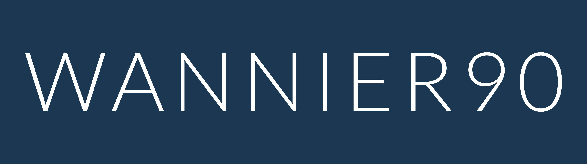

  

# Wannier90

**Wannier90 is an open-source code for generating maximally-localised generalised
Wannier functions and using them to compute advanced electronic properties of
materials with high efficiency and accuracy.**

| I want to…                | Go to |
| ------------------------- | --- |
| Learn what Wannier90 does | [wannier.org](https://www.wannier.org) · [Features](https://wannier.org/features/) |
| **Install it**            | [README.install](README.install) — CMake or GNU Make |
| **Read the manual**       | [wannier90.readthedocs.io](https://wannier90.readthedocs.io/) |
| **Follow the tutorials**  | [Tutorial instructions](https://wannier90.readthedocs.io/en/latest/tutorials/preliminaries/) · [Tutorial files](tutorials/) |
| See what changed          | [CHANGELOG.md](CHANGELOG.md) |
| Ask a question            | [Mailing list](https://lists.quantum-espresso.org/mailman/listinfo/wannier) (subscribe before posting) · [Archives](https://www.mail-archive.com/wannier@lists.quantum-espresso.org/maillist.html) · [More support resources](https://wannier.org/support/) |
| Report a bug              | [Issues](https://github.com/wannier-developers/wannier90/issues) · [FAQ](https://github.com/wannier-developers/wannier90/wiki/FAQ) |
| Contribute code           | [CONTRIBUTING.md](CONTRIBUTING.md) |

## Documentation

- [Full documentation](https://wannier90.readthedocs.io/) — [Introduction](https://wannier90.readthedocs.io/en/latest/user_guide/introduction/)
- **Input parameters:** [`wannier90.x`](https://wannier90.readthedocs.io/en/latest/user_guide/wannier90/parameters/) · [`postw90.x`](https://wannier90.readthedocs.io/en/latest/user_guide/postw90/postw90params/)
- [Projections](https://wannier90.readthedocs.io/en/latest/user_guide/wannier90/projections/) · [File formats](https://wannier90.readthedocs.io/en/latest/user_guide/wannier90/files/)
- [Library mode](https://wannier90.readthedocs.io/en/latest/user_guide/wannier90/library_mode/)

## Using Wannier90 as a library

Since version 4.0, the functionality of the standalone `wannier90.x` executable is
also available through a library interface and an electronic-structure code can
drive Wannierisation in memory instead of writing and re-reading files. The
calling code sets options, then passes pointers to its own overlap, projection and
eigenvalue arrays (no large matrix is duplicated) and calls disentanglement, MLWF
optimisation, plotting and transport directly. The library runs in parallel with MPI
with the same performance as the standalone code (the overlap matrices are distributed
over k-points), and every library call returns an error code instead of aborting, so
the host code keeps control of its own error handling.

**Note**: Wannier90 is distributed under **LGPLv2.1-or-later** (meaning, among other
things, that linking the dynamic library with your code does not impose the GPL on it).

- **Documentation:** [Library mode](https://wannier90.readthedocs.io/en/latest/user_guide/wannier90/library_mode/) — [Using the library](https://wannier90.readthedocs.io/en/latest/user_guide/wannier90/library_mode/#using-the-library) · [Compiling and linking](https://wannier90.readthedocs.io/en/latest/user_guide/wannier90/library_mode/#compiling-and-linking)
- **Fortran:** serial and MPI examples in [`test-suite/library-mode-test/`](test-suite/library-mode-test/) ([`demo.F90`](test-suite/library-mode-test/demo.F90))
- **C / C++:** [C interface](https://wannier90.readthedocs.io/en/latest/user_guide/wannier90/library_mode/#c-interface), header [`src/wannier90.h`](src/wannier90.h), example in [`test-suite/library-mode-test-C-interface/`](test-suite/library-mode-test-C-interface/)
- **Python:** [Python interface](https://wannier90.readthedocs.io/en/latest/user_guide/wannier90/library_mode/#python-interface) generated with [f90wrap](https://github.com/jameskermode/f90wrap); examples in [`wrap/`](wrap/) (`serial-example.py`, `mpi-example.py`, `example-dos.py`)

## For developers

- [CONTRIBUTING.md](CONTRIBUTING.md) — coding style, documentation requirements, and how pull requests are handled
- [`test-suite/README.md`](test-suite/README.md) — how to run the tests and how to add new ones
- [Code overview](https://wannier90.readthedocs.io/en/latest/user_guide/wannier90/code_overview/) · [FORD source-code documentation](https://wannier.org/ford/index.html)
- [CHANGELOG.md](CHANGELOG.md)

## How to cite

Please cite the following paper in any publications arising from the use of
this code:

> G. Pizzi, V. Vitale, R. Arita, S. Blügel, F. Freimuth, G. Géranton, M. Gibertini,
> D. Gresch, C. Johnson, T. Koretsune, J Ibañez-Azpiroz, H. Lee, J.M. Lihm,
> D. Marchand, A. Marrazzo, Y. Mokrousov, J.I. Mustafa, Y. Nohara, Y. Nomura,
> L. Paulatto, S. Poncé, T. Ponweiser, J. Qiao, F. Thöle, S.S. Tsirkin,
> M. Wierzbowska, N. Marzari, D. Vanderbilt, I. Souza, A.A. Mostofi, J.R. Yates,
> Wannier90 as a community code: new features and applications,
> [J. Phys. Cond. Matt. 32, 165902](https://doi.org/10.1088/1361-648X/ab51ff) (2020)

Older versions of the code, and references for the method

If you are using versions 2.x of the code, cite instead:

> A.A. Mostofi, J.R. Yates, G. Pizzi, Y.S. Lee, I. Souza,
> D Vanderbilt, N Marzari, *An updated version of wannier90: A tool for
> obtaining maximally-localised Wannier functions*,
> [Comput. Phys. Commun. 185, 2309 (2014)](http://doi.org/10.1016/j.cpc.2014.05.003)

For the method please cite:

> N. Marzari and D. Vanderbilt,
> *Maximally Localized Generalised Wannier Functions for Composite Energy Bands*,
> [Phys. Rev. B 56 12847 (1997)](http://dx.doi.org/10.1103/PhysRevB.56.12847)

> I. Souza, N. Marzari and D. Vanderbilt,
> *Maximally Localized Wannier Functions for Entangled Energy Bands*,
> [Phys. Rev. B 65 035109 (2001)](http://dx.doi.org/10.1103/PhysRevB.65.035109)

> Nicola Marzari, Arash A. Mostofi, Jonathan R. Yates, Ivo Souza,
> David Vanderbilt,
> *Maximally localized Wannier functions: Theory and applications*,
> [Rev. Mod. Phys. 84, 1419 (2012)](http://dx.doi.org/10.1103/RevModPhys.84.1419)

**Note**: **BibTeX** entries for all the references above can be downloaded from the
["Please cite" section of the Wannier90 homepage](https://www.wannier.org), e.g.,
[this BibTeX file](https://wannier.org/bibtex/Pizzi2020.bib) for the main citation above.

## Licence

The Wannier90 code is licensed under LGPLv2.1 or later.
You can read the licence text in the [LICENSE](LICENSE) file in the root directory
of the Wannier90 distribution.

## Authors and contributors

The full list of authors and contributors of Wannier90 is given in the
[AUTHORS.md](AUTHORS.md) file.
