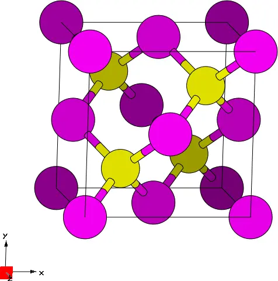
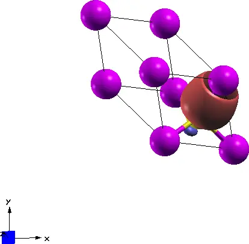
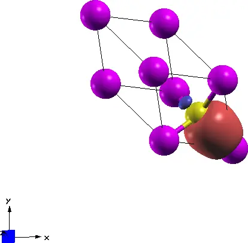
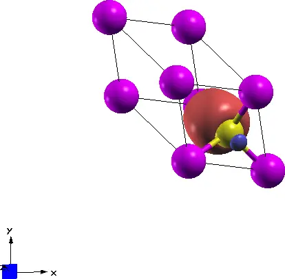
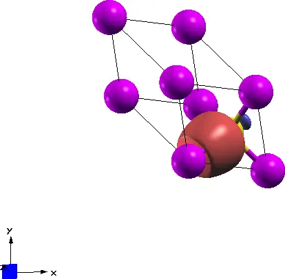
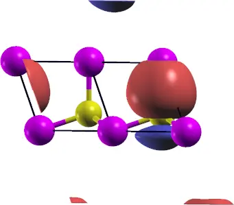
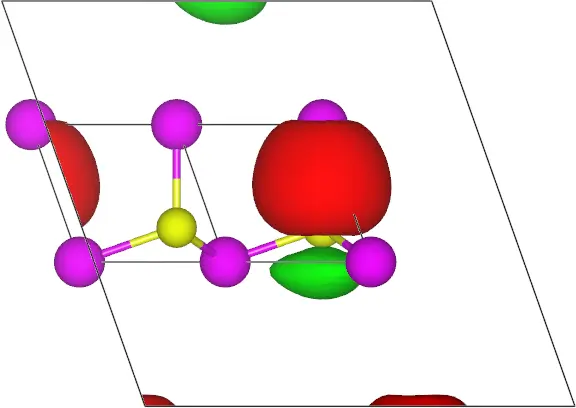

# 1: Gallium Arsenide &#151; MLWFs for the valence bands

- Outline: *Obtain and plot MLWFs for the four valence bands of GaAs.*

<figure markdown="span">
{ width="250" }
<figcaption markdown="span"  id="fig1-1">Unit cell of GaAs crystal plotted with the XCrySDen program.</figcaption>
</figure>

1. *Inspect the output file `gaas.wout`.*

    [Table 1](#tab1-1) shows the converged values (after 20 iterations) for a $2\times2\times2$ $\mathbf{k}$-point mesh of the total spread functional $\Omega$ and its three components, i.e. the gauge-invariant component $\Omega_{\text{I}}$, the off-diagonal component of the gauge-dependent part $\Omega_{\text{OD}}$, and the diagonal component of the gauge-dependent part $\Omega_{\text{D}}$, respectively. These can be found at the end of the `gaas.wout` file, from the line starting with `Final State`. You will find the MLWF centres and their spreads together with the information on the spread functional components as reported below, and summarized in [Table 1](#tab1-1).

    ```text title="Output file"
     Final State
      WF centre and spread    1  ( -0.866253,  1.973841,  1.973841 )     1.11672024
      WF centre and spread    2  ( -0.866253,  0.866253,  0.866253 )     1.11672024
      WF centre and spread    3  ( -1.973841,  1.973841,  0.866253 )     1.11672024
      WF centre and spread    4  ( -1.973841,  0.866253,  1.973841 )     1.11672024
      Sum of centres and spreads ( -5.680188,  5.680188,  5.680188 )     4.46688098

             Spreads (Ang^2)       Omega I      =     3.956862958
            ================       Omega D      =     0.008030049
                                   Omega OD     =     0.501987969
        Final Spread (Ang^2)       Omega Total  =     4.466880976
      -----------------------------------------------------------------------------
    ```

    The geometric centre lies along the Ga-As bond, slightly closer to As than Ga. To see this, we introduce a measure $\beta$ defined as

    $$\beta \triangleq \frac{d_{\text{Ga-MLWF}}}{d_{\text{Ga-As}}},$$

    where $d_{\text{Ga-MLWF}}$ is the distance of the Ga atom placed in the origin and the MLWF centre (along the Ga-As bond), and $d_{\text{Ga-As}}$ is the Ga-As bond length, cf. Ref. [@marzarivanderbilt1997]. A value of 0.5 corresponds to the MLWF centre being equidistant from the Ga atom and As atom. In our case, we find:

    $$\beta = \frac{d_{\text{Ga-MLWF(2)}}}{d_{\text{Ga-As}}} = \frac{0.866253\sqrt{3}}{1.4200\sqrt{3}} \approx 0.61 .$$

    Maximum RAM allocated for the wannierisation was 0.06Mb.

    <a id="tab1-1"></a>
    **Table 1.** Converged values of the components of spread functional and their sum, given in Å$^2$. Here $\beta$ is the distance of the Ga atom placed in the origin and the MLWF centre (along the Ga-As bond) as a fraction of the Ga-As bond length $2.4595$ Å.

    | MP mesh | $\Omega$ | $\Omega_{\text{I}}$ | $\Omega_{\text{OD}}$ | $\Omega_{\text{D}}$ | $\beta$ |
    |---|---|---|---|---|---|
    | $2\times2\times2$ | 4.467 | 3.957 | 0.502 | 0.008 | 0.610 |

2. *Plot the MLWFs.*

    In [Figure 2](#fig1-2) are shown the four valence MLWFs as plotted by XCrySDen, where we used the following parameters in the `Tools` &rarr; `Data Grid` section:

    !!! note "XCrySDen: `Tools` &rarr; `Data Grid`"
        ```text
        Degree of triCubic Spline = 3;
        Isovalue = 0.95;
        Render +/- isovalue = yes
        ```

    <figure markdown="span">
    <div class="grid-figure" markdown="1">
    { width="150" }
    { width="150" }
    { width="150" }
    { width="150" }
    </div>
    <figcaption markdown="span"  id="fig1-2">Four valence MLWFs for the Ga-As system plotted using the XCrySDen visualisation program: a. 1st, b. 2nd, c. 3rd, and d. 4th valence MLWF.</figcaption>
    </figure>

    Extra: *Plot the 3rd MLWFs in a supercell of size 3. Choose a low value for the isosurface (say 0.5). Can you explain what you see?*

    With XCrySDen we can also plot the 3rd MLWF to check its periodicity. The period in each direction is given by the spacing used to sample the first irreducible Brillouin zone, i.e. the $\mathbf{k}$-point mesh. We used a $2\times2\times2$ $\mathbf{k}$-point mesh, hence we expect to find a periodic image of our MLWF in a supercell which is 2 times larger than the unit cell along each direction. This is shown in [Figure 3](#fig1-3), where the 3rd MLWF has been plotted using both the XCrySDen program and the VESTA program.

<figure markdown="span">
<div class="grid-figure" markdown="1">
{ width="320" }
{ width="320" }
</div>
<figcaption markdown="span"  id="fig1-3">3rd MLWF with a supercell value of 3 and for an isovalue of 0.5 using a. XCrySDen and b. VESTA.</figcaption>
</figure>
