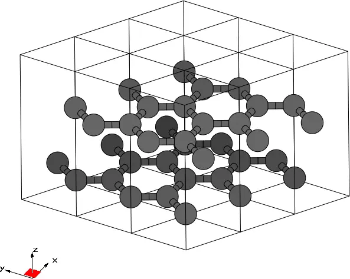
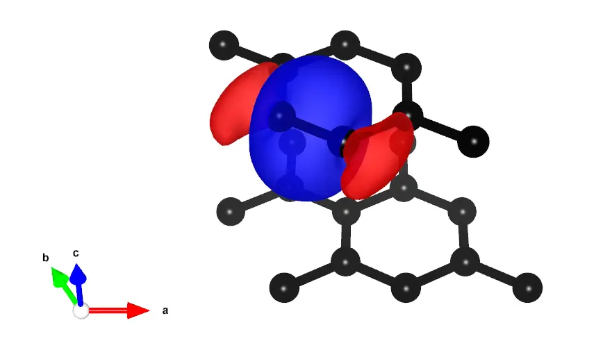
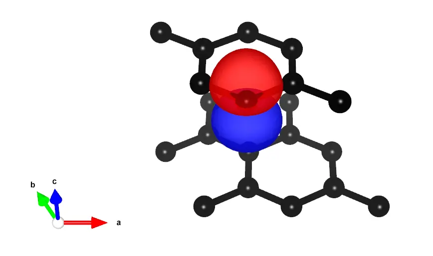
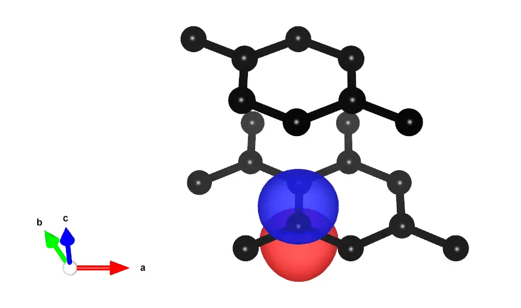

# 10: Graphite

- Outline: *Obtain MLWFs for the graphite (AB, Bernal).*

<figure markdown="span">
{ width="250" }
<figcaption markdown="span"  id="fig10-1">$3\times3\times1$
supercell of graphite plotted with the XCrySDen program.</figcaption>
</figure>

- Items 1-5: *Compute the MLWFs.*

    Converged values for the total spread functional and its components are
    shown in [Table 1](#tab10-1). Three MLWFs, one $\sigma$ and two $p_z$ on
    different layers are shown in [Figure 2](#fig10-2) a., b. and c.
    respectively.

    <figure markdown="1">

    |  |  |  |
    |:-:|:-:|:-:|
    | { width="220" } | { width="220" } | { width="220" } |

    <figcaption markdown="span"  id="fig10-2">MLWFs for graphite. a.
    $\sigma$-like MLWF centred on a C-C bond. b. $p_z$-like MLWF on the
    top layer. c. $p_z$-like MLWF on the bottom layer.</figcaption>
    </figure>

    
    **Table 1.** Converged values of the components of spread functional and their
    sums for graphite (AB, Bernal) in Å$^2$.

    | $\Omega$ | $\Omega_{\text{I}}$ | $\Omega_{\text{OD}}$ | $\Omega_{\text{D}}$ | $N_{\mathrm{iter}}$ |
    |---|---|---|---|---|
    | 7.3809 | 5.7641 | 1.5874 | 0.0293 | 100 |
