# 11: Silicon &#151; Valence and low-lying conduction states

<figure markdown="span">
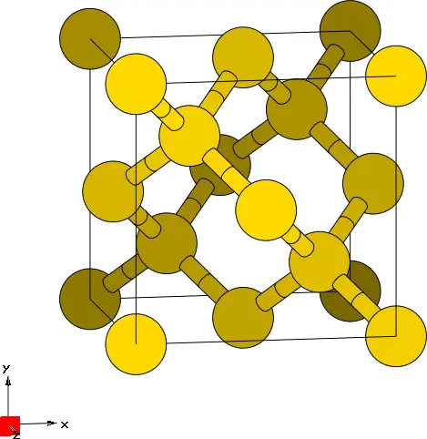{ width="250" }
<figcaption markdown="span"  id="fig11-1">Unit cell of Silicon crystal plotted with the XCrySDen program.</figcaption>
</figure>

## Valence States

- Outline: *Obtain MLWFs for the valence bands of silicon.*

**1-5.** *Inspect the output file `silicon.wout`. The total spread converges to its minimum value after just a few iterations. Note that the geometric centre of each MLWF lies at the centre of the Si-Si bond. Note also that the memory requirement for the minimisation of the spread is very low as the MLWFs are defined by just the $4\times4$ unitary matrices $U(\mathbf{k})$.*

Below a snippet from the `silicon.wout` output file

```text title="Output file"
 Final State
  WF centre and spread    1  ( -0.674701,  0.674701, -0.674701 )     1.59185520
  WF centre and spread    2  ( -0.674701, -0.674701,  0.674701 )     1.59185520
  WF centre and spread    3  (  0.674701,  0.674701,  0.674701 )     1.59185520
  WF centre and spread    4  (  0.674701, -0.674701, -0.674701 )     1.59185520
  Sum of centres and spreads ( -0.000000,  0.000000,  0.000000 )     6.36742081

         Spreads (Ang^2)       Omega I      =     5.801375426
        ================       Omega D      =     0.000000000
                               Omega OD     =     0.566045385
    Final Spread (Ang^2)       Omega Total  =     6.367420811
 ------------------------------------------------------------------------------
```

Memory estimates may be found in the `MEMORY ESTIMATE` section of the `silicon.wout` file.

```text title="Output file"
 *============================================================================*
 |                              MEMORY ESTIMATE                               |
 |         Maximum RAM allocated during each phase of the calculation         |
 *============================================================================*
 |                        Disentanglement            1.57 Mb                  |
 |                            Wannierise:            0.47 Mb                  |

```

Converged values for the total spread functional and its components are shown in [Table 1](#tab11-1).

<a id="tab11-1"></a>
**Table 1.** Converged values of the components of spread functional and their sum, given in Å$^2$.

| MP mesh | $\Omega$ | $\Omega_{\text{I}}$ | $\Omega_{\text{OD}}$ | $\Omega_{\text{D}}$ |
|---|---|---|---|---|
| $4\times4\times4$ | 6.3674 | 5.8014 | 0.5660 | 0.0000 |

*Plot the MLWFs*

The four MLWFs with $\sigma$ character describing the valence manifold of Si are shown in [Figure 2](#fig11-2) (panels a, b, c, and d, respectively).

<figure markdown="span">
<div class="grid-figure" markdown="1">
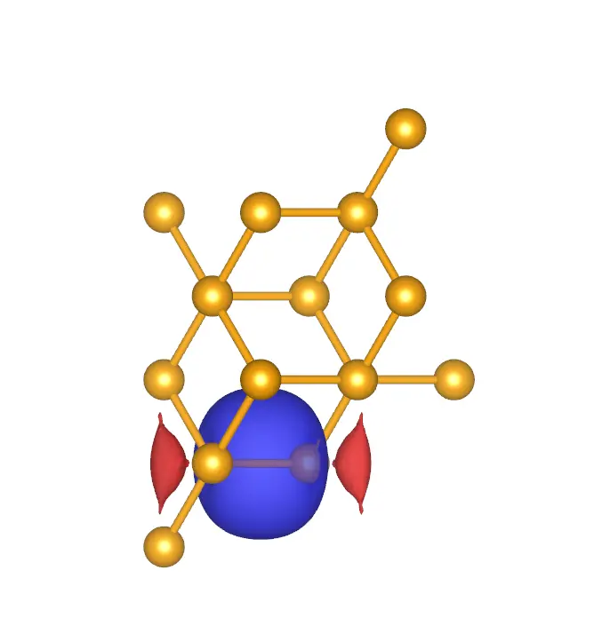{ width="150" }
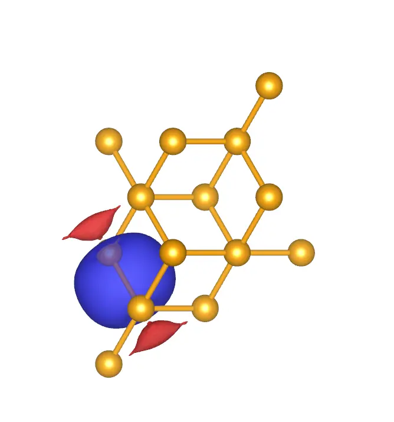{ width="150" }
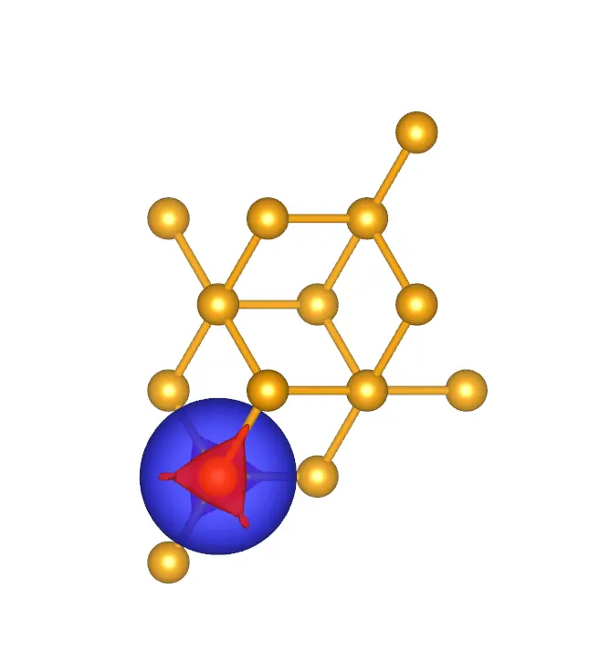{ width="150" }
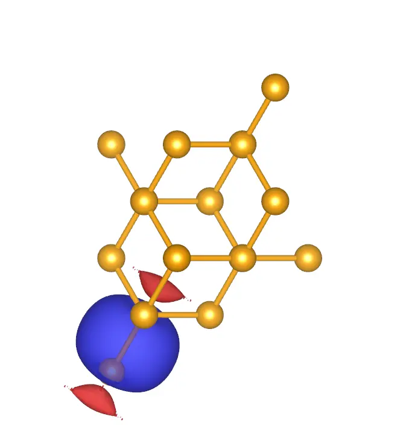{ width="150" }
</div>
<figcaption markdown="span"  id="fig11-2">Four MLWFs for the valence manifold of Si: a. MLWF 1, b. MLWF 2, c. MLWF 3, and d. MLWF 4.</figcaption>
</figure>

## Valence + Conduction States

- Outline: *Obtain MLWFs for the valence and low-lying conduction-band states of Si. Plot the interpolated bandstructure. Apply a scissors correction to the conduction bands.*

*Inspect the output file `silicon.wout`. The minimisation of the spread occurs in a two-step procedure. First, we minimise $\Omega_{\text{I}}$ -- this is the extraction of the optimal subspace in the disentanglement procedure. Then, we minimise $\Omega_{\text{D}} + \Omega_{\text{OD}}$.*

Converged values for the total spread functional and its components are shown in [Table 2](#tab11-2). The two groups of four MLWFs with $sp3$ character are shown in [Figure 3](#fig11-3)

```text title="Output file"
                   Extraction of optimally-connected subspace
                   ------------------------------------------
 +---------------------------------------------------------------------+<-- DIS
 |  Iter     Omega_I(i-1)      Omega_I(i)      Delta (frac.)    Time   |<-- DIS
 +---------------------------------------------------------------------+<-- DIS
       1      12.97640155      12.44630235       4.259E-02      0.00    <-- DIS
       .		.					.				.			 .

      79      12.33580893      12.33580893      -6.531E-11      0.23    <-- DIS
      80      12.33580893      12.33580893      -5.241E-11      0.23    <-- DIS

             <<<      Delta < 1.000E-10  over  3 iterations     >>>
             <<< Disentanglement convergence criteria satisfied >>>

        Final Omega_I    12.33580893 (Ang^2)

 +----------------------------------------------------------------------------+
```

```text title="Output file"
 Final State
  WF centre and spread    1  (  1.807167,  1.807167,  1.807167 )     2.01695824
  WF centre and spread    2  (  1.807167,  0.891636,  0.891636 )     2.01695823
  WF centre and spread    3  (  0.891636,  1.807167,  0.891636 )     2.01695823
  WF centre and spread    4  (  0.891636,  0.891636,  1.807167 )     2.01695824
  WF centre and spread    5  (  0.226733,  0.226733,  0.226733 )     2.37014516
  WF centre and spread    6  (  0.226733, -0.226733, -0.226733 )     2.37014508
  WF centre and spread    7  ( -0.226733,  0.226733, -0.226733 )     2.37014515
  WF centre and spread    8  ( -0.226733, -0.226733,  0.226733 )     2.37014514
  Sum of centres and spreads (  5.397608,  5.397608,  5.397608 )    17.54841346

         Spreads (Ang^2)       Omega I      =    12.335808933
        ================       Omega D      =     0.177593840
                               Omega OD     =     5.035010692
    Final Spread (Ang^2)       Omega Total  =    17.548413465
 ------------------------------------------------------------------------------
```

<a id="tab11-2"></a>
**Table 2.** Converged values of the components of spread functional and their sum, given in Å$^2$.

| MP mesh | $\Omega$ | $\Omega_{\text{I}}$ | $\Omega_{\text{OD}}$ | $\Omega_{\text{D}}$ |
|---|---|---|---|---|
| $4\times4\times4$ | 17.54841 | 12.3358 | 5.03501 | 0.17759 |

<figure markdown="span">
<div class="grid-figure" markdown="1">
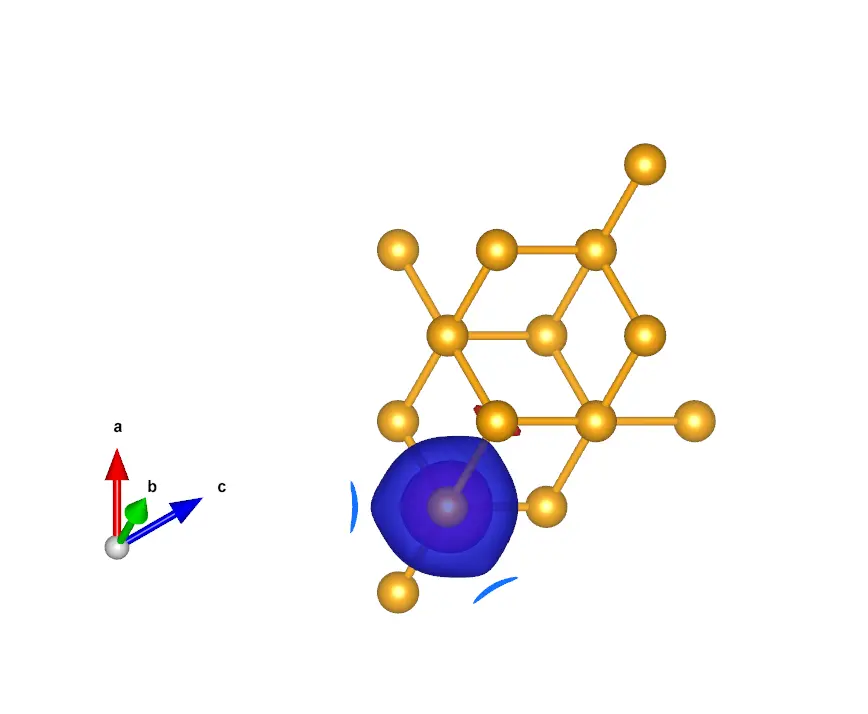{ width="150" }
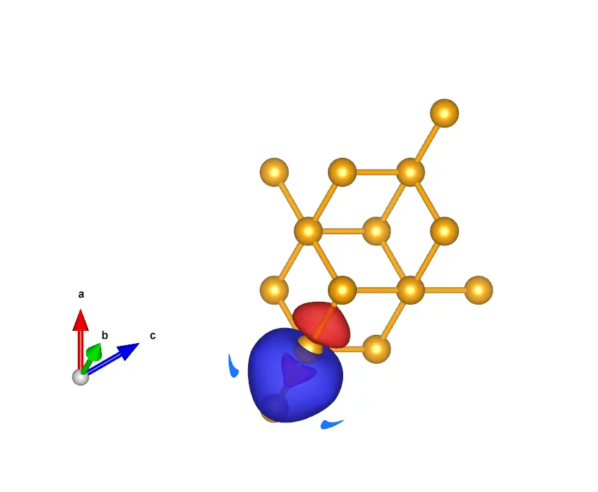{ width="150" }
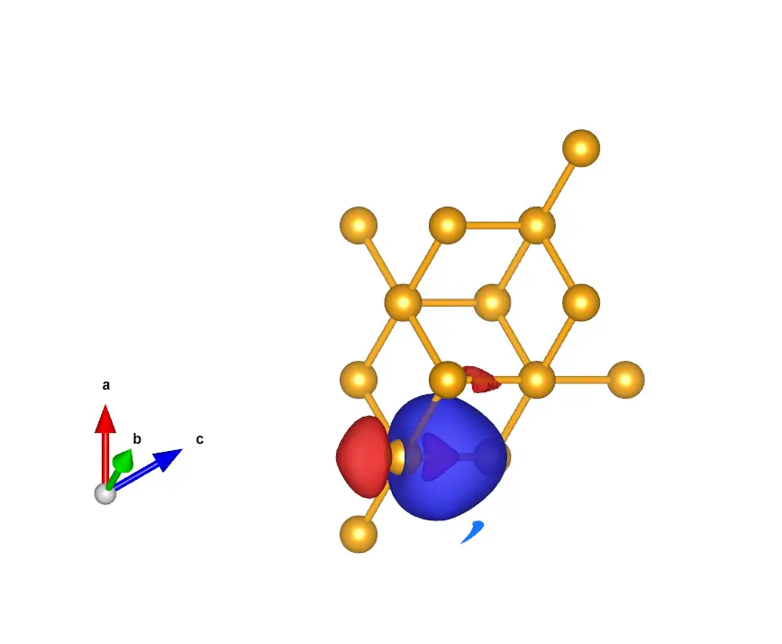{ width="150" }
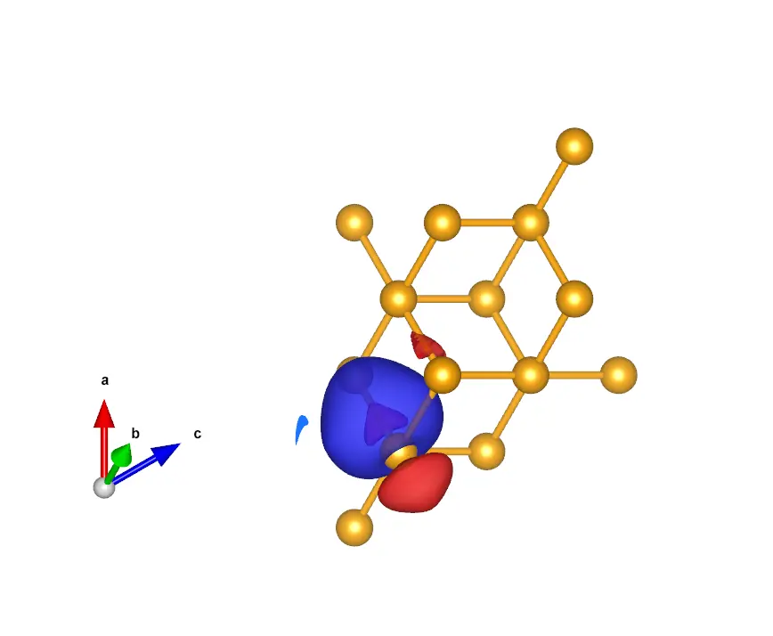{ width="150" }
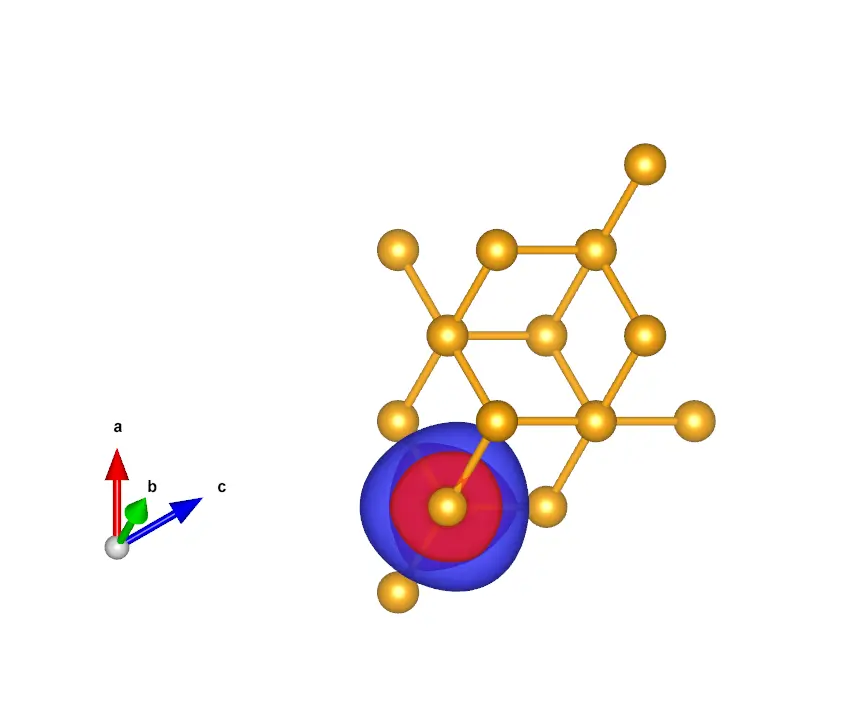{ width="150" }
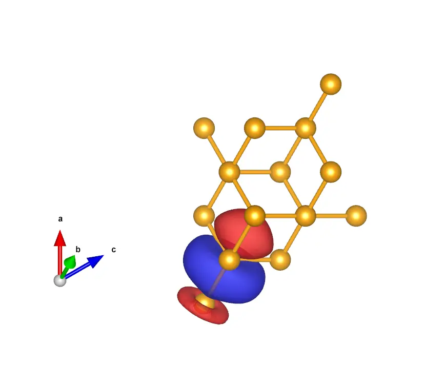{ width="150" }
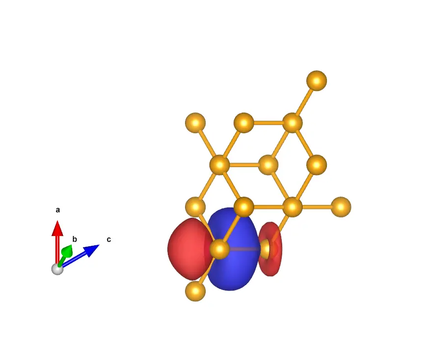{ width="150" }
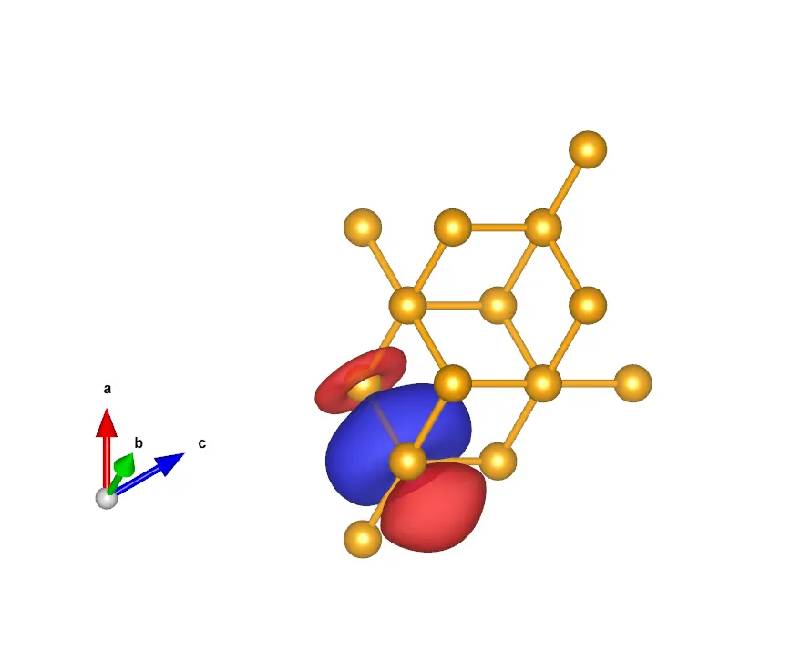{ width="150" }
</div>
<figcaption markdown="span"  id="fig11-3">Eight MLWFs with $sp3$ character, four on each Si atom in the unit cell.</figcaption>
</figure>

*Plot the bandstructure.*

The interpolated bandstructure is given in [Figure 4](#fig11-4).

<figure markdown="span">
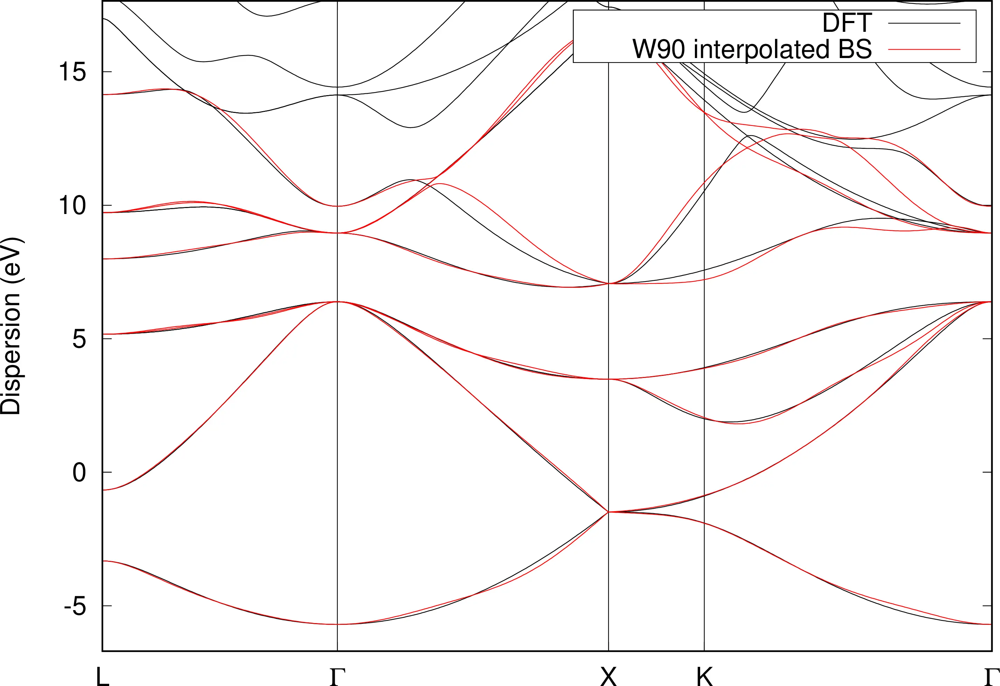{ width="600" }
<figcaption markdown="span"  id="fig11-4">Bandstructure of silicon from DFT calculation (solid black) and from Wannier interpolation (solid red).</figcaption>
</figure>

## Further ideas

- *Compare the Wannier-interpolated bandstructure with the full pwscf bandstructure with a finer $k$-point grid.*

    Result for a $8\times8\times8$ mesh is shown in [Figure 5](#fig11-5).

    <figure markdown="span">
    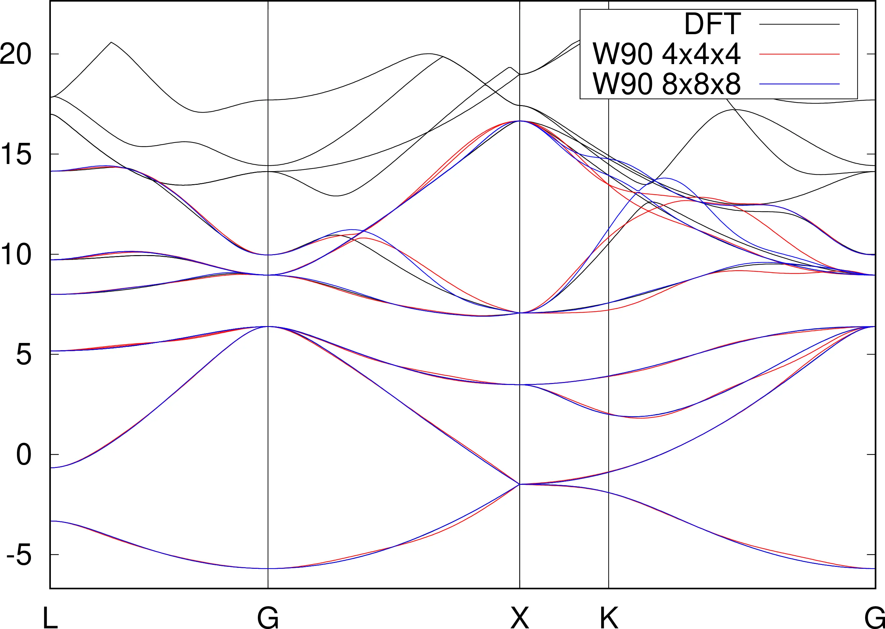{ width="600" }
    <figcaption markdown="span"  id="fig11-5">Bandstructure of silicon from DFT calculation (solid black) and from Wannier interpolation with a $4\times4\times4$ mesh (solid red) and $8\times8\times8$ mesh (solid blue).</figcaption>
    </figure>

- *Compute four MLWFs spanning the low-lying conduction states.*

    The MLWFs spanning the 4 low-lying conduction states are shown in [Figure 6](#fig11-6). The initial projections were 4 $sp3$ on the Si atom at (0,0,0).

    <figure markdown="span">
    <div class="grid-figure" markdown="1">
    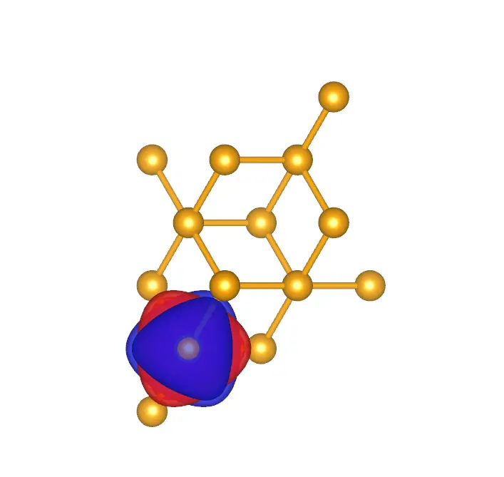{ width="150" }
    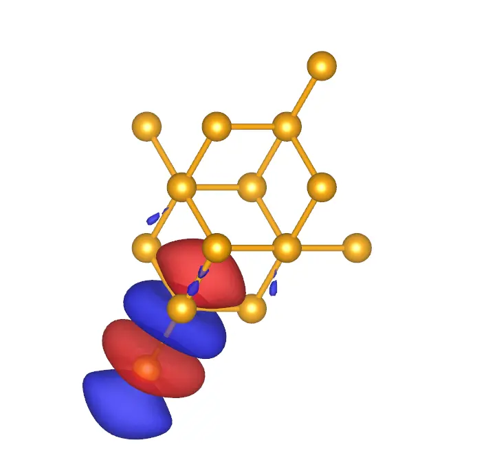{ width="150" }
    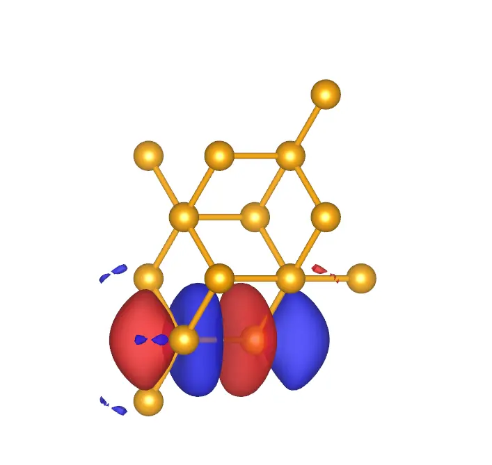{ width="150" }
    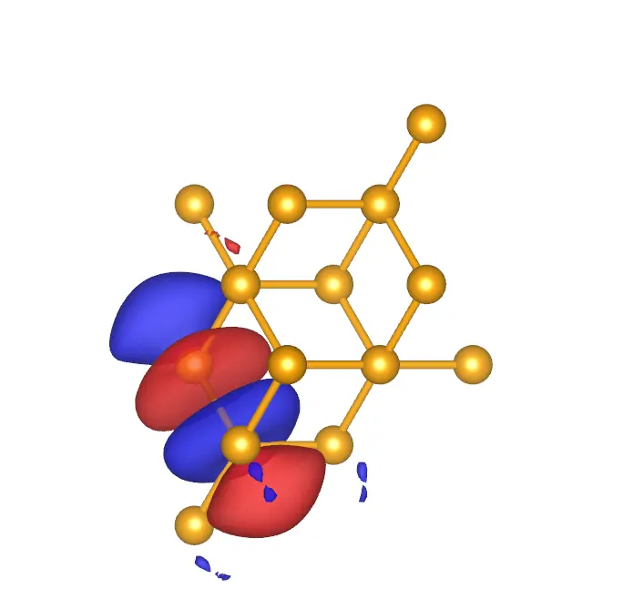{ width="150" }
    </div>
    <figcaption markdown="span"  id="fig11-6">Four MLWFs spanning the low-lying conduction states of Si: a. MLWF 1, b. MLWF 2, c. MLWF 3, and d. MLWF 4.</figcaption>
    </figure>
