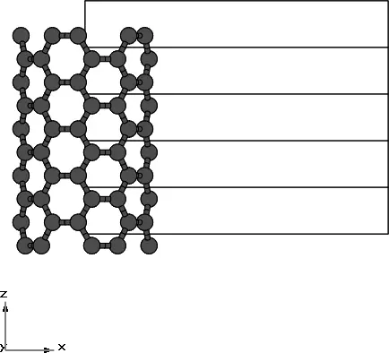
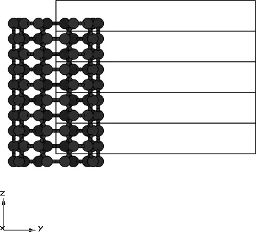
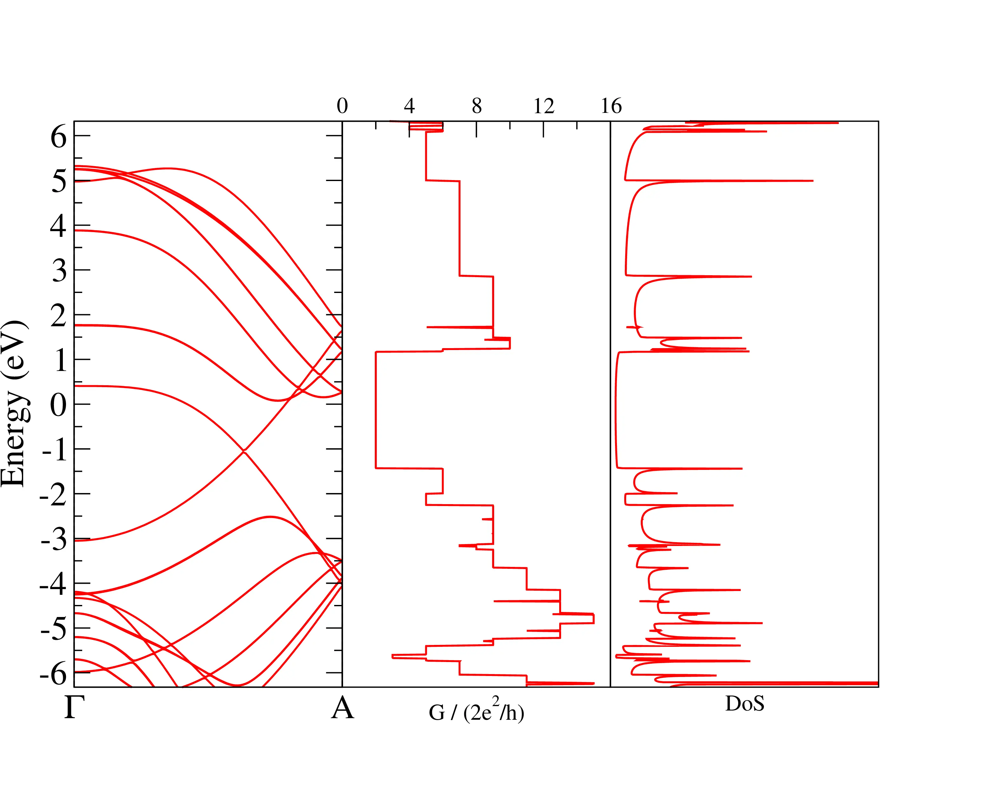

# 13: (5,5) Carbon Nanotube &#151; Transport properties

- Outline: *Obtain the bandstructure, quantum conductance and density of states of a metallic (5,5) carbon nanotube.*

<figure markdown="span">
<div class="grid-figure" markdown="1">
{ width="220" }
{ width="220" }
</div>
<figcaption markdown="span"  id="fig13-1">5 unit cells for the carbon nanotube system from a. side view and b. prospective top view plotted with the XCrySDen program.</figcaption>
</figure>

1. *Run pwscf and `wannier90`. Inspect the output file `cnt55.wout`. The minimisation of the spread occurs in a two-step procedure. First, we minimise $\Omega_I$. Then, we minimise $\Omega_D + \Omega_{OD}$.*

    Below, an extract from the `.wout` file showing a summary of the disentanglement procedure (minimisation of $\Omega_I$)

    ```text title="Output file"
                       Extraction of optimally-connected subspace
                       ------------------------------------------
     +---------------------------------------------------------------------+<-- DIS
     |  Iter     Omega_I(i-1)      Omega_I(i)      Delta (frac.)    Time   |<-- DIS
     +---------------------------------------------------------------------+<-- DIS
           1      33.96797815      33.91073784       1.688E-03      0.00    <-- DIS
           2      33.92937273      33.90274574       7.854E-04      0.02    <-- DIS
           .        .                    .                .             .
           .        .                    .                .             .

          45      33.89889125      33.89889125       4.172E-11      0.50    <-- DIS
          46      33.89889125      33.89889125       1.626E-11      0.51    <-- DIS

                 <<<      Delta < 1.000E-10  over  3 iterations     >>>
                 <<< Disentanglement convergence criteria satisfied >>>

            Final Omega_I    33.89889125 (Ang^2)

     +----------------------------------------------------------------------------+
    ```

    Below, an extract from the `.wout` file showing the final state for the minimisation of $\Omega_D + \Omega_{OD}$

    ```text title="Output file"
         Final State
      WF centre and spread    1  ( -6.875141,  7.935472,  7.937658 )     0.65233309
      WF centre and spread    2  (  4.748245,  7.935472,  7.937658 )     0.65234300
      WF centre and spread    3  (  5.809324,  6.097678,  7.937658 )     0.65186298
      WF centre and spread    4  (  7.816785, -7.396927,  7.648002 )     1.20135958
      WF centre and spread    5  (  7.816785, -7.396927, -7.648002 )     1.20135948
      WF centre and spread    6  (  7.936083,  7.324218, -7.937658 )     0.60992987
      WF centre and spread    7  (  7.935073, -6.095184,  7.937658 )     0.65161009
      WF centre and spread    8  (  6.874208, -6.712573,  7.937658 )     0.61134798
      WF centre and spread    9  (  6.874224,  6.850489, -7.648754 )     1.20500764
      WF centre and spread   10  ( -7.936214,  6.097679,  7.937658 )     0.65186256
      WF centre and spread   11  (  5.813353, -6.095183,  7.937658 )     0.65160955
      WF centre and spread   12  (  6.874224,  6.850489,  7.648754 )     1.20500766
      WF centre and spread   13  (  5.812342,  7.324217,  7.937658 )     0.60993084
      WF centre and spread   14  (  5.931632, -7.396946,  7.648001 )     1.20136423
      WF centre and spread   15  (  5.931632, -7.396946, -7.648001 )     1.20136424
      Sum of centres and spreads ( 71.362557,  7.925029, 55.563607 )    12.95829277

             Spreads (Ang^2)       Omega I      =    10.455434168
            ================       Omega D      =     0.000000000
                                   Omega OD     =     2.502858604
        Final Spread (Ang^2)       Omega Total  =    12.958292772
     ------------------------------------------------------------------------------
    ```

2. *Note that the initial $p_z$ projections on the carbon atoms are oriented in the radial direction with respect to the nanotube axis.*

    ```vi title="Input file"
    Begin Projections

    Ang

    c=   3.3780, -0.7128, -0.6157 :pz :z=  3.3780, -0.7128,  0.0000 :x=0,0,1
    ```

3. *The interpolated bandstructure is written to `cnt55_band.agr`*

    To plot the interpolated bands, the quantum conductance and the Density of States as shown in Fig. 6 in the `wannier90` tutorial, one can use the `xmgrace` program.

!!! note "XMGRACE tutorial"
    Run the `xmgrace` plotting program from command line as

    ```text
    $ > xmgrace
    ```

    Before importing the data to be plotted, we have to reorganize the layout by selecting

    ```text
    Edit &rarr; Arrange graphs...
    ```

    here we can generate a grid of graphs by selecting the number of columns and rows from the drop menus. For this particular example, we want to increase the number of columns to 3, i.e. `Cols: 3` and leave the number of rows to 1 in the `Matrix` section. Moreover, we don't want any gap between the graphs so we also need to modify the value of `Hgap/width` in the bottom `Spacing` section, i.e `Hgap/width 0`. Once we have generated the three graphs we need to import the data. This can be achieved by

    ```text
    Data &rarr; Import &rarr; ASCII...
    ```

    The three files to import are `cnt_band.agr`, `cnt_qc.dat` and `cnt_dos.dat`, respectively. For each file we need to select the graph in the `Read to graph:` section, i.e. `G(0), G(1)` and `G(2)`, respectively.

    In order to flip the x-axis with the y-axis, one need to perform the following

    ```text
    Data &rarr; Transformations &rarr; Evaluate expressions...
    ```

    In the `Formula:` section write

    ```text
    s1.x=s0.y; s1.y=s0.x
    ```

    and then click `apply`.

<figure markdown="span">
{ width="600" }
<figcaption markdown="span"  id="fig13-2">Reproduction of Fig. 6 in the `wannier90` tutorial.</figcaption>
</figure>
