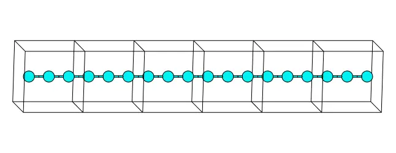
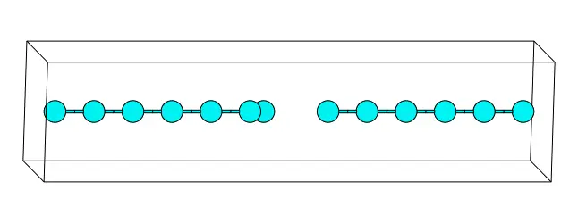
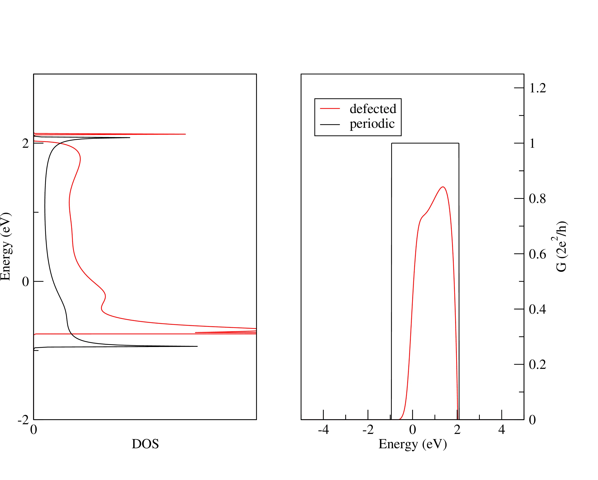

# 14: Linear Sodium Chain &#151; Transport properties

- Outline: *Compare the quantum conductance of a periodic linear chain of Sodium
    atoms with that of a defected chain*

<figure markdown="1">

|  |  |
|:-:|:-:|
| { width="320" } | { width="320" } |

<figcaption markdown="span"  id="fig14-1">$6\times1\times1$
supercell of a periodic linear sodium chain (left panel) and unit
cell of a defected linear sodium chain (right panel) plotted with
the XCrySDen program. The former consists of 2 Na atoms per unit
cell (6 unit cells have been drawn for comparison with the defected
system). The latter consists of 13 Na atoms per unit cell.</figcaption>
</figure>

**1-2.** *Run pwscf and wannier90 for the periodic and defected systems.*

**3.** *Compare the quantum conductance of the periodic (bulk) calculation with
the defected (LCR) calculation.*

The quantum conductance and the DOS are shown in [Figure 2](#fig14-2).

<figure markdown="span">
{ width="700" }
<figcaption markdown="span"  id="fig14-2">DOS (left) and quantum
conductance (right) of periodic (solid black) and defected (solid
red) Sodium linear chain.</figcaption>
</figure>
