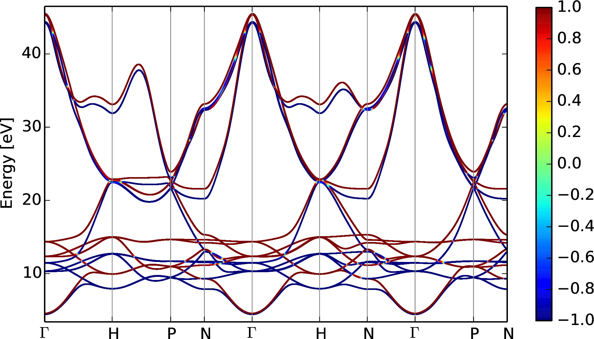
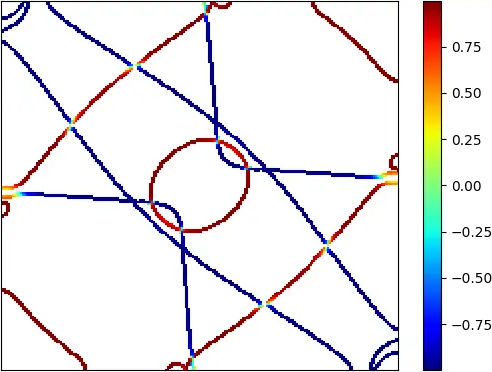
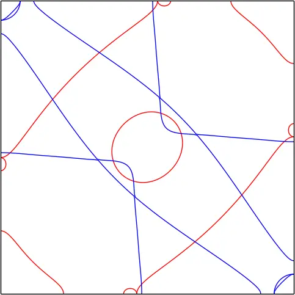
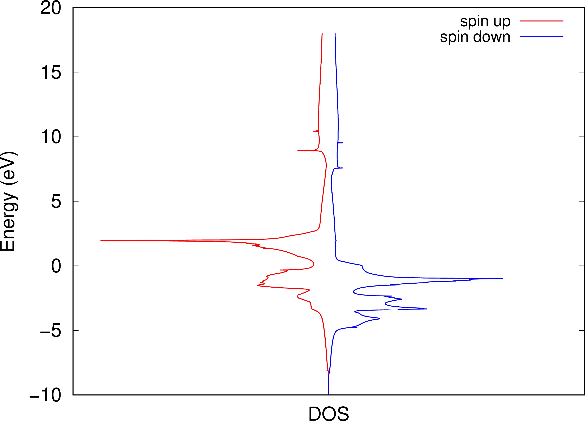
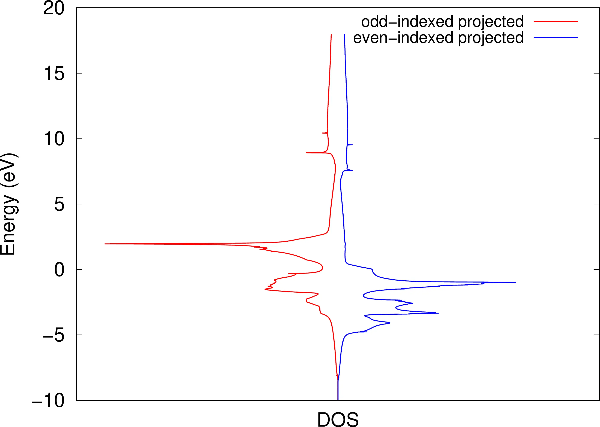

# 17: Iron &#151; Spin-orbit-coupled bands and Fermi-surface contours

- Outline: *Plot the spin-orbit-coupled bands of ferromagnetic bcc Fe. Plot the Fermi-surface contours on a plane in the Brillouin zone.*

<figure markdown="span">
{ width="250" }
<figcaption markdown="span" id="fig17-1">Unit cell of Iron crystal plotted with the XCrySDen program.</figcaption>
</figure>

**1-6.** Compute the MLWFs and compute the energy eigenvalues and spin expectation values.

The final state for all the 18 MLWFs is

```text title="Output file"
 Final State
  WF centre and spread    1  ( -0.709848,  0.000000,  0.000000 )     1.08973288
  WF centre and spread    2  ( -0.685480, -0.000000,  0.000000 )     1.10285536
  WF centre and spread    3  (  0.709848, -0.000000,  0.000000 )     1.08973288
  WF centre and spread    4  (  0.685480, -0.000000,  0.000000 )     1.10285536
  WF centre and spread    5  ( -0.000000, -0.709848,  0.000000 )     1.08973287
  WF centre and spread    6  (  0.000000, -0.685480,  0.000000 )     1.10285536
  WF centre and spread    7  (  0.000000,  0.709848,  0.000000 )     1.08973288
  WF centre and spread    8  (  0.000000,  0.685480,  0.000000 )     1.10285536
  WF centre and spread    9  (  0.000000, -0.000000, -0.709835 )     1.08977307
  WF centre and spread   10  (  0.000000, -0.000000, -0.685503 )     1.10302800
  WF centre and spread   11  ( -0.000000, -0.000000,  0.709835 )     1.08977304
  WF centre and spread   12  (  0.000000, -0.000000,  0.685503 )     1.10302800
  WF centre and spread   13  ( -0.000000, -0.000000, -0.000000 )     0.43232470
  WF centre and spread   14  ( -0.000000, -0.000000, -0.000000 )     0.41118748
  WF centre and spread   15  (  0.000000,  0.000000, -0.000000 )     0.43232470
  WF centre and spread   16  (  0.000000,  0.000000, -0.000000 )     0.41118748
  WF centre and spread   17  ( -0.000000,  0.000000,  0.000000 )     0.43232866
  WF centre and spread   18  ( -0.000000,  0.000000,  0.000000 )     0.41119649
  Sum of centres and spreads (  0.000000,  0.000000,  0.000000 )    15.68650457

         Spreads (Ang^2)       Omega I      =    11.898334117
        ================       Omega D      =     0.031570932
                               Omega OD     =     3.756599523
    Final Spread (Ang^2)       Omega Total  =    15.686504572
 ------------------------------------------------------------------------------
```

*To plot the bands using `python`*

```bash title="Terminal"
$> python Fe-bands.py
```

The interpolated band structure of Fe with spin-orbit interaction using the module `kpath` is shown in [Figure 2](#fig17-2). The color scheme is used to show the expectation value of the spin operator $\hat{S}_z$ in units of $\hbar/2$.

<figure markdown="span">
{ width="550" }
<figcaption markdown="span" id="fig17-2">`wannier90` interpolated bands of Fe computed from a DFT calculation with spin-orbit interaction. Colour-scheme shows the expectation value $\langle \hat{S}_z \rangle$ in units of $\hbar/2$.</figcaption>
</figure>

*Next we plot the Fermi-surface contours on the (010) plane $k_y = 0$, using the `kslice` module.*

<figure markdown="span">
<div class="grid-figure" markdown="1">
{ width="320" }
{ width="240" }
</div>
<figcaption markdown="span" id="fig17-3">Fermi-surface contours on the (010) plane ($k_y=0$): a. with spin-orbit coupling (`kslice` module); b. without spin-orbit coupling.</figcaption>
</figure>

## Further ideas

- *Redraw the Fermi surface contours on the (010) plane starting from a calculation without spin-orbit coupling (SOC), by adding to the input files `iron_{up,down}.win` in [Example 8](tutorial_solution_8.md).*

    The Fermi surface contours on the (010) plane without SOC are shown in [Figure 3](#fig17-3)-b.

- *For a spinor calculation we can still spin-decompose the DOS.*

<figure markdown="span">
<div class="grid-figure" markdown="1">
{ width="320" }
{ width="320" }
</div>
<figcaption markdown="span" id="fig17-4">Spin-decomposed DOS (panel a) with spin-up (red) and spin-down (blue) components. Projected DOS on odd-indexed MLWFs (red) and even-indexed (blue).</figcaption>
</figure>
