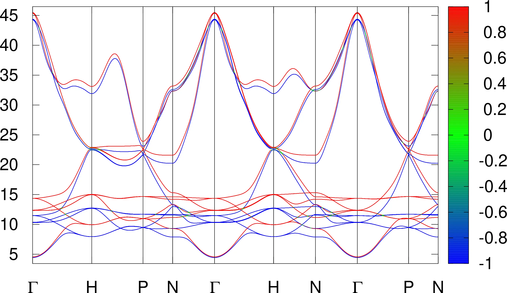
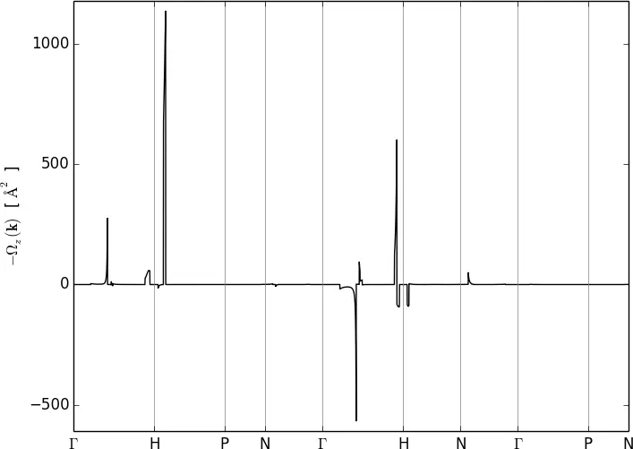
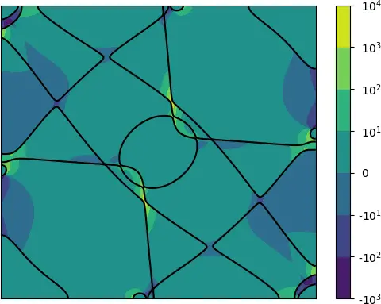
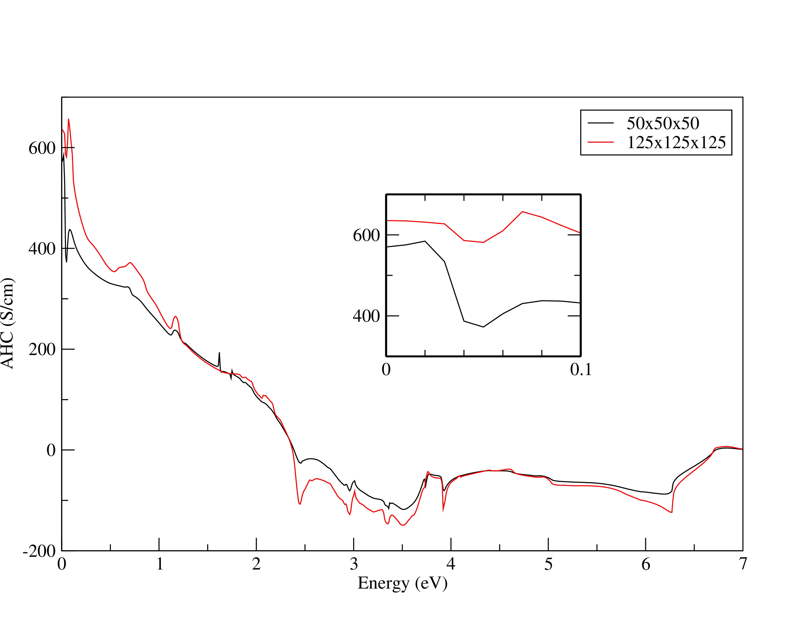
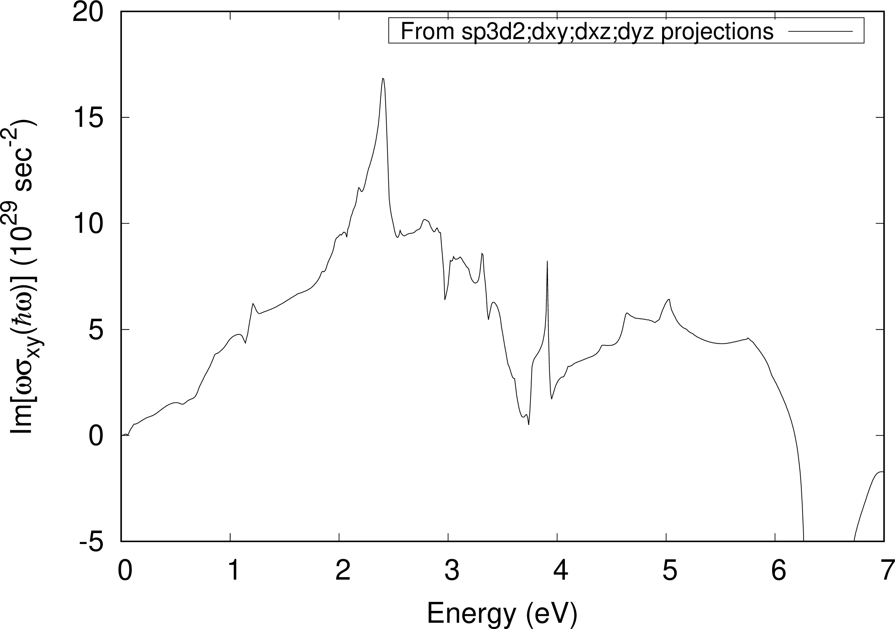
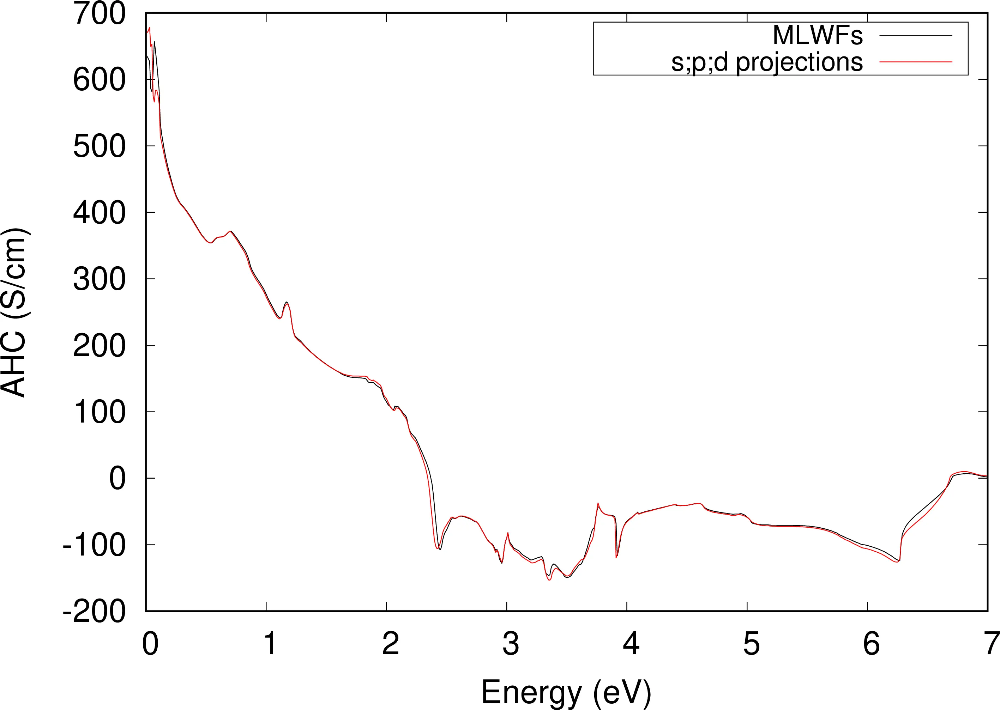
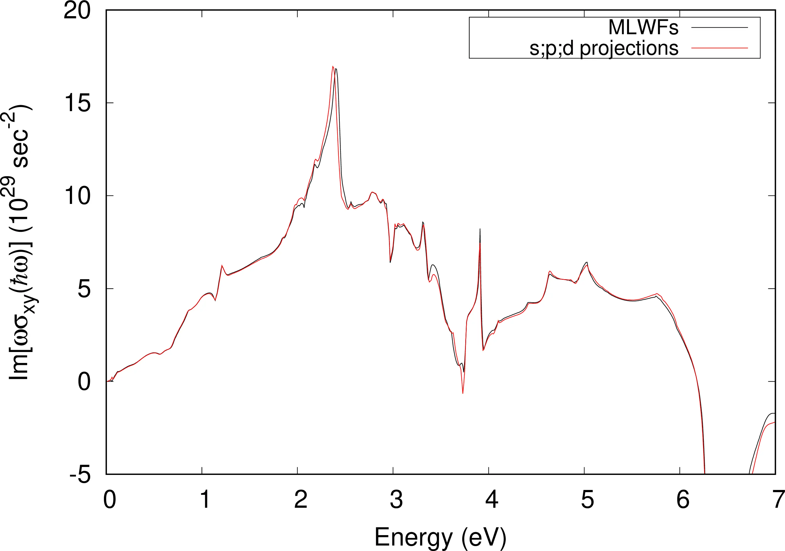

# 18: Iron &#151; Berry curvature, anomalous Hall conductivity and optical conductivity

- Outline: *Calculate the Berry curvature, anomalous Hall conductivity, and (magneto)optical conductivity of ferromagnetic bcc Fe with spin-orbit coupling. In preparation for this example it may be useful to read Ref. [@PhysRevLett92] and Ch. 11 of the User Guide.*

1-6. *Compute the MLWFs and compute the energy eigenvalues and spin expectation values.*

These are the same six steps of [Tutorial solution 17](tutorial_solution_17.md) and therefore the results are not going to be showed here again.

## Berry curvature plots

*The Berry curvature $\Omega_{\alpha\beta}(\mathbf{k})$ of the occupied states is defined in Eq. (11.18) of the User Guide. Plot the Berry curvature component $\Omega_z(\mathbf{k}) = \Omega_{xy}(\mathbf{k})$ along the magnetization direction.*

The Fermi energy should be $12.6283$ eV. With this value we obtain the energy bands and the Berry curvature component $\Omega_z(\mathbf{k}) = \Omega_{xy}(\mathbf{k})$ along high-symmetry points shown in [Figure 1](#fig18-1) and [Figure 2](#fig18-2). Eq. (11.18) of the User Guide is reported below for completeness.

$$\Omega_{\alpha\beta}(\mathbf{k}) = \sum_{n}^{occ} f_{n\mathbf{k}}\Omega_{n,\alpha\beta},$$

with

$$\Omega_{n,\alpha\beta} = \varepsilon_{\alpha\beta\gamma}\Omega_{n,\gamma} = -2\;\mathrm{Im}\langle \nabla_{k_\alpha}u_{n\mathbf{k}} \vert \nabla_{k_\beta}u_{n\mathbf{k}} \rangle,$$

where the Greek letters indicate Cartesian coordinates, $\varepsilon_{\alpha\beta\gamma}$ is the Levi-Civita antisymmetric tensor, and $\vert u_{n\mathbf{k}}\rangle$s are the cell-periodic Bloch functions.

<figure markdown="span">
{ width="600" }
<figcaption markdown="span"  id="fig18-1">Band structure of Fe along symmetry lines &Gamma;-H-P-N-&Gamma;-H-N-&Gamma;-P-N.</figcaption>
</figure>

<figure markdown="span">
{ width="550" }
<figcaption markdown="span"  id="fig18-2">Berry curvature $\Omega_z(\mathbf{k})$ in Fe along symmetry lines.</figcaption>
</figure>

*Combine the plot of the Fermi lines on the $k_y$ plane with a heat-map plot of (minus) the Berry curvature*

The plot of the Fermi lines with a colour-map of $-\Omega_z(k_x,0,k_z)$ is shown in [Figure 3](#fig18-3).

<figure markdown="span">
{ width="450" }
<figcaption markdown="span"  id="fig18-3">(Colour online) Calculated total Berry curvature $-\Omega_z(\mathbf{k})$ in the plane $k_y=0$ (note log scale). Intersections of the Fermi surface with this plane are shown.</figcaption>
</figure>

## Anomalous Hall conductivity

*AHC converges rather slowly with k-point sampling, and a $25 \times 25 \times 25$ does not yield a well-converged value. Compare the converged AHC value with those obtained in Refs. [@PhysRevB74] and [@PhysRevLett92].*

The *x,y,z*-components of the AHC for a $25\times25\times25$ BZ mesh are shown in the snippet below. The converged result reported in Refs. [@PhysRevB74] and [@PhysRevLett92] for the *z*-component is 756.76 ($(\Omega \mathrm{cm})^{-1}$). Hence, a $25\times25\times25$ BZ mesh clearly gives a very inaccurate value ($\sim 36.4\%$ error). Even with adaptive refinement the error is still very large ($\sim 31.7\%$). It is worth to note that the adaptive refinement slightly breaks the symmetry and gives non-zero values for the *x*-component and *y*-component, although these are opposite in sign.

```text title="Without adaptive refinement"
 Properties calculated in module  b e r r y
 ------------------------------------------

   * Anomalous Hall conductivity

 Interpolation grid: 25 25 25

 Fermi energy (ev):   12.6283

 AHC (S/cm)       x          y          z
 ==========    -0.0000     0.0000   554.6437


 Total Execution Time          59.112 (sec)
```

```text title="With adaptive refinement"
 Properties calculated in module  b e r r y
 ------------------------------------------

   * Anomalous Hall conductivity

 Regular interpolation grid: 25 25 25
   Adaptive refinement grid: 5 5 5
       Refinement threshold: Berry curvature >100.00 bohr^2
  Points triggering refinement:   42( 0.27%)

 Fermi energy (ev):   12.6283

 AHC (S/cm)       x          y          z
 ==========     2.4602    -2.4602   574.2950
```

Since these are quite demanding calculations, we only report the value of the AHC for a $125\times125\times125$ BZ mesh with a $5\times5\times5$ adaptive refinement grid (see snippet below). The value for the *z*-component is 729.8276 $(\Omega \mathrm{cm})^{-1}$, which is in much closer agreement with the converged result from Refs. [@PhysRevB74] and [@PhysRevLett92]. Also, the magnitude of *x,y*-component is greatly reduced as expected.

```text title="125x125x125 BZ mesh with a 5x5x5 adaptive refinement grid"
 Properties calculated in module  b e r r y
 ------------------------------------------

   * Anomalous Hall conductivity

 Regular interpolation grid: 125 125 125
   Adaptive refinement grid: 5 5 5
       Refinement threshold: Berry curvature >100.00 Ang^2
  Points triggering refinement: 1818( 0.09%)

 Fermi energy (ev):   12.6283

 AHC (S/cm)       x          y          z
 ==========    -0.2775     0.2775   729.8276
```

*The Wannier-interpolation formula for the Berry curvature comprises three terms, denoted $J0$, $J1$, and $J2$ in Ref. [@PhysRevB85].*

From Ref. [@PhysRevB74]

$$-2\;\mathrm{Im} G_{\alpha\beta} = J0 + J1 + J2,$$

where

$$G_{\alpha\beta} = Tr[(\partial_\alpha \hat{P})\hat{Q}\hat{H}\hat{Q}(\partial_\beta\hat{P})]$$

The three components $J0, J1$ and $J2$ for the $k$-point sampling of $125\times125\times125$ and a $5\times5\times5$ adaptive refinement grid are shown in the snippet below

```text title="Output file"
 J0 term :      0.0002    -0.0002     2.8479
 J1 term :      0.0004    -0.0004    18.4855
 J2 term :     -0.2782     0.2782   708.4942
 -------------------------------------------
```

## Optical conductivity

*The optical conductivity tensor of bcc Fe with magnetization along $\hat{\mathbf{z}}$ has the form*

$$\mathbf{\sigma} = \mathbf{\sigma}_\mathrm{S} + \mathbf{\sigma}_{\mathrm{A}} =
\begin{pmatrix}
\sigma_{xx} & 0                       & 0 \\
 0          & \sigma_{yy}=\sigma_{xx}  & 0 \\
 0          &  0                     & \sigma_{zz}
\end{pmatrix} + \begin{pmatrix} 0 & \sigma_{xy} & 0 \\ -\sigma_{yx} & 0 & 0 \\ 0 & 0 & 0 \end{pmatrix}$$

*The DC AHC calculated earlier corresponds to $\sigma_{xy}$ in the limit $\omega \rightarrow 0$. At finite frequency $\sigma_{xy} = -\sigma_{yx}$ acquires an imaginary part which describes magnetic circular dichroism (MCD). Compute the complex optical conductivity for $\hbar\omega$ up to $7$ eV*

The plot for the ac AHC is shown in [Figure 4](#fig18-4).

<figure markdown="span">
{ width="550" }
<figcaption markdown="span"  id="fig18-4">Plot of the real part of the complex optical conductivity with a $50\times50\times50$ $k$-point mesh (black) and $125\times125\times125$ $k$-point mesh (red). The inset is a magnification of the region [0-0.1] eV.</figcaption>
</figure>

*Compare the $\omega \rightarrow 0$ limit of $\sigma_{xy}$ with the result obtained earlier by integrating the Berry curvature.*

The result obtained by integrating the Berry curvature is 729.83 $(\Omega \mathrm{cm})^{-1}$ and the $\omega \rightarrow 0$ limit of the complex optical conductivity is $669.37$ $(\Omega \mathrm{cm})^{-1}$.

*Plot the MCD spectrum.*

The plot of the magnetic circular dichroism is shown in [Figure 5](#fig18-5).

<figure markdown="span">
{ width="550" }
<figcaption markdown="span"  id="fig18-5">The magnetic circular dichroism from interpolation of the Kubo-Greenwood formula.</figcaption>
</figure>

## Further ideas

*Recompute the AHC and optical spectra of bcc Fe using projected s, p, and d-type Wannier functions instead of the hybridrised MLWFs (see Example 8), and compare the results.*

First we have to modify the projection block in the input file `Fe.win` as did in [Tutorial solution 8](tutorial_solution_8.md)

```vi title="Input file"
begin projections
Fe:s;p;d
end projections
```

Then we need to re-do points 3,4 and 6.

Below there is the extract from the output file `Fe.wpout`. The result obtained from $s,p$ and $d$ projections for the $z$ component, i.e. $\sigma_{xy}$, of the AHC is exactly the same as the one obtained from $sp_3d_2,d_{xy},d_{xz}$, and $d_{yz}$ projections. Plot of AHC and MCD are shown in [Figure 6](#fig18-6).

```text title="With adaptive refinement"
 Properties calculated in module  b e r r y
 ------------------------------------------

   * Anomalous Hall conductivity

 Regular interpolation grid: 25 25 25
   Adaptive refinement grid: 5 5 5
       Refinement threshold: Berry curvature >100.00 bohr^2
  Points triggering refinement:   42( 0.27%)

 Fermi energy (ev):   12.6283

 AHC (S/cm)       x          y          z
 ==========
 J0 term :      0.0006    -0.0006    -2.9033
 J1 term :      0.0032    -0.0032    10.0566
 J2 term :      2.4564    -2.4564   567.1417
 -------------------------------------------
 Total   :      2.4602    -2.4602   574.2950
```

<figure markdown="span">
<div class="grid-figure" markdown="1">
{ width="320" }
{ width="320" }
</div>
<figcaption markdown="span"  id="fig18-6">Left panel: Anomalous Hall conductivity. Right panel: Magnetic circular dichroism for $\hbar\omega$ up to $7$ eV, starting from $s;p;d$ initial projections.</figcaption>
</figure>
