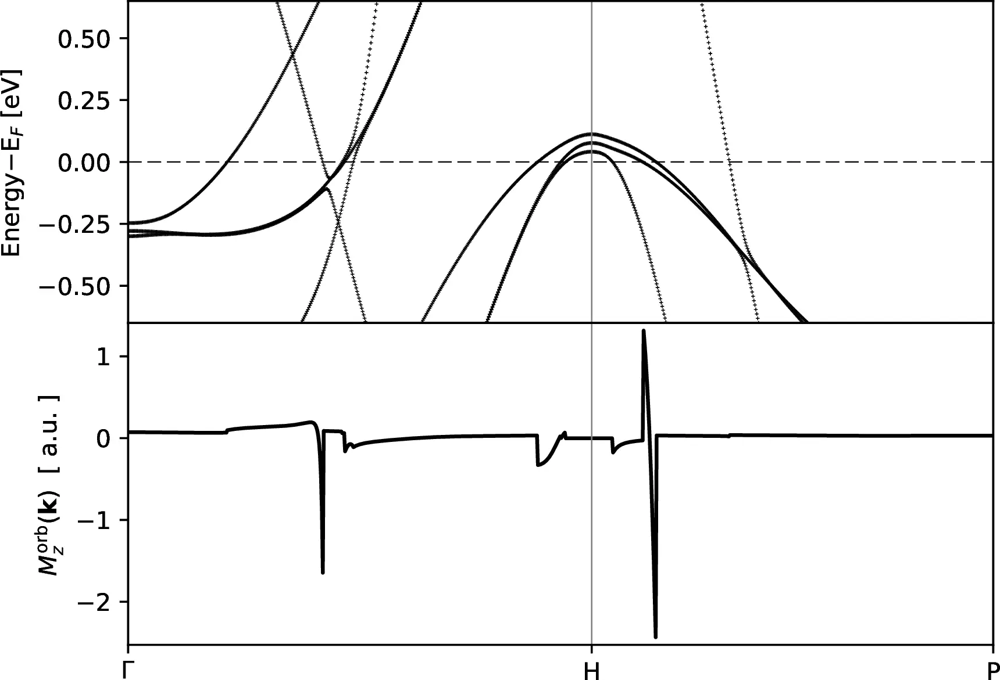
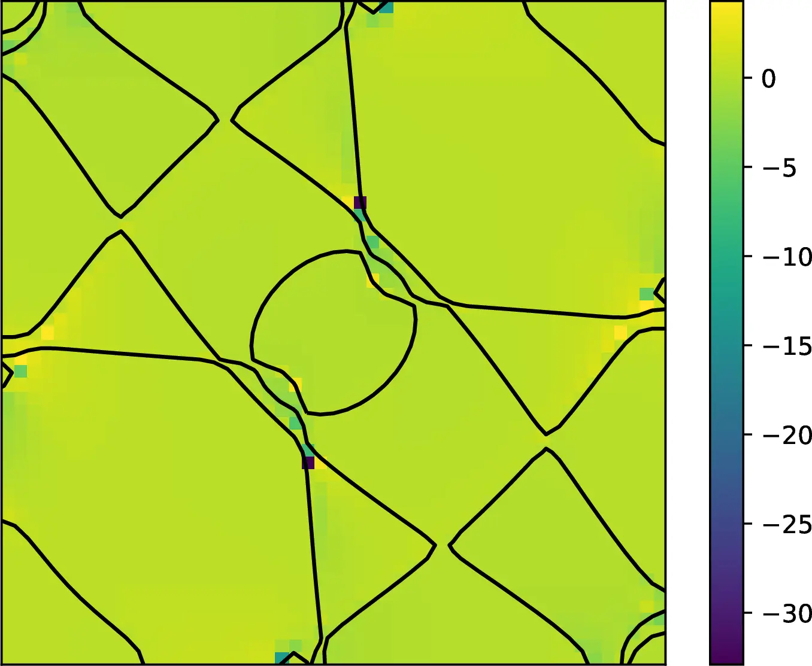

# 19: Iron &#151; Orbital magnetization

- Outline: *Calculate the orbital magnetization of ferromagnetic bcc Fe by
    Wannier interpolation.*

- 1-6: These are the same steps performed for
    [Example 17](tutorial_solution_17.md) and
    [Example 18](tutorial_solution_18.md). Hence, they are not repeated here.

- *The orbital magnetization is computed as the BZ integral of the quantity
    $\mathbf{M}^{\mathrm{orb}}(\mathbf{k})$ defined in Eq. (12.20) of the User
    Guide.*

    Below we report Eq. (11.20) from the User Guide, and the total orbital
    magnetization as the integral of $\mathbf{M}^{\mathrm{orb}}(\mathbf{k})$
    over the BZ

    $$
    \begin{align}
    \mathbf{M}^{\mathrm{orb}}(\mathbf{k}) & =
    \sum_{n}\frac{1}{2}f_{n\mathbf{k}}\;\mathrm{Im} \langle
    \nabla_{\mathbf{k}}u_{n\mathbf{k}} \vert \times (H_\mathbf{k} +
    \epsilon_\mathbf{k} - 2\epsilon_{\mathrm{F}}) \vert \nabla_\mathbf{k}
    u_{n\mathbf{k}} \rangle \\
    \mathbf{M}^{\mathrm{orb}}_{\mathrm{tot}} & =
    V\int\,\frac{\mathrm{d}\mathbf{k}}{(2\pi)^3}
    \mathbf{M}^{\mathrm{orb}}(\mathbf{k})
    \end{align}
    $$

    The two snippets below show the components of the total orbital
    magnetization computed according to the second equation above, and the spin
    magnetisation from the DFT calculation respectively

    ```text title="From Fe.wpout"
     Properties calculated in module  b e r r y
     ------------------------------------------

       * Orbital magnetization

     Interpolation grid: 25 25 25

     Fermi energy (ev) =   12.628300

     M_orb (bohr magn/cell)        x          y          z
     ======================
        Local circulation :      0.0000    -0.0000     0.0935
     Itinerant circulation:      0.0000     0.0000    -0.0180
     --------------------------------------------------------
                  Total   :      0.0000    -0.0000     0.0755
    ```

    ```text title="From scf.out"
         total magnetization       =     0.00    -0.00    -2.22 Bohr mag/cell
         absolute magnetization    =     2.34 Bohr mag/cell
    ```

- *Plot $\mathbf{M}^{\mathrm{orb}}(\mathbf{k})$ along high-symmetry lines and
    compare the result with Fig. 2 of Ref. [@PhysRevB85].*

    Before comparing the result of our calculation with the result in Fig. 2 of
    Ref. [@PhysRevB85], we need to fix a unit-conversion problem in the python
    script `Fe-bands+morb_z.py`. In fact, the units of
    $\mathbf{M}^{\mathrm{orb}}(\mathbf{k})$ are not Ry$\cdot$Å$^2$ as stated in
    the python script but eV$\cdot$Å$^2$ instead (as also stated in the User
    Guide). Moreover, in Ref. [@PhysRevB85]
    $\mathbf{M}^{\mathrm{orb}}(\mathbf{k})$ is given in atomic units, i.e.
    Hartree$\cdot$bohr radii$^2$. In order to have a meaningful comparison we
    need to modify the python script accordingly. Open `Fe-bands+morb_z.py` and
    modify the following lines

    ```py
    data = np.loadtxt('Fe-morb.dat')
    x=data[:,0]
    y=data[:,3]
    ```

    as

    ```py
    data = np.loadtxt('Fe-morb.dat')
    x=data[:,0]
    y=data[:,3] * 0.131234
    ```

    where $0.131234$ is the conversion factor from eV$\cdot$Å$^2$ to a.u. We
    also need to modify the label for the y-axis from

    ```py
    pl.ylabel(r'$M^{\rm{orb}}_z(\mathbf{k})$  [ Ry$\cdot\AA^2$ ]')
    ```

    to

    ```py
    pl.ylabel(r'$M^{\rm{orb}}_z(\mathbf{k})$  [ a.u. ]')
    ```

    Now we can run the python script

    ```text
    > python Fe-bands+morb_z.py
    ```

    and look at the plot, here shown in [Figure 1](#fig19-1). The difference
    between the quantities in the two plot is roughly the $-\frac{1}{2}$ factor
    due to the two different definitions of $\mathbf{M}^{\mathrm{orb}}$.

    <figure markdown="span">
    { width="550" }
    <figcaption markdown="span" id="fig19-1">Plot of
    $\mathbf{M}^{\mathrm{orb}}(\mathbf{k})$ calculated by Wannier
    interpolation along the path &Gamma;&ndash;H&ndash;P in the
    Brillouin zone.</figcaption>
    </figure>

    *Plot $\mathbf{M}^{\mathrm{orb}}(\mathbf{k})$ together with the Fermi
    contours on the (010) BZ plane*

    <figure markdown="span">
    { width="650" }
    <figcaption markdown="span" id="fig19-2">Plot of
    $\mathbf{M}^{\mathrm{orb}}(\mathbf{k})$ together with the Fermi
    contours on the (010) BZ plane.</figcaption>
    </figure>
