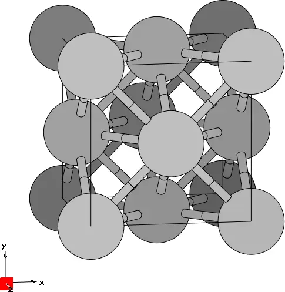
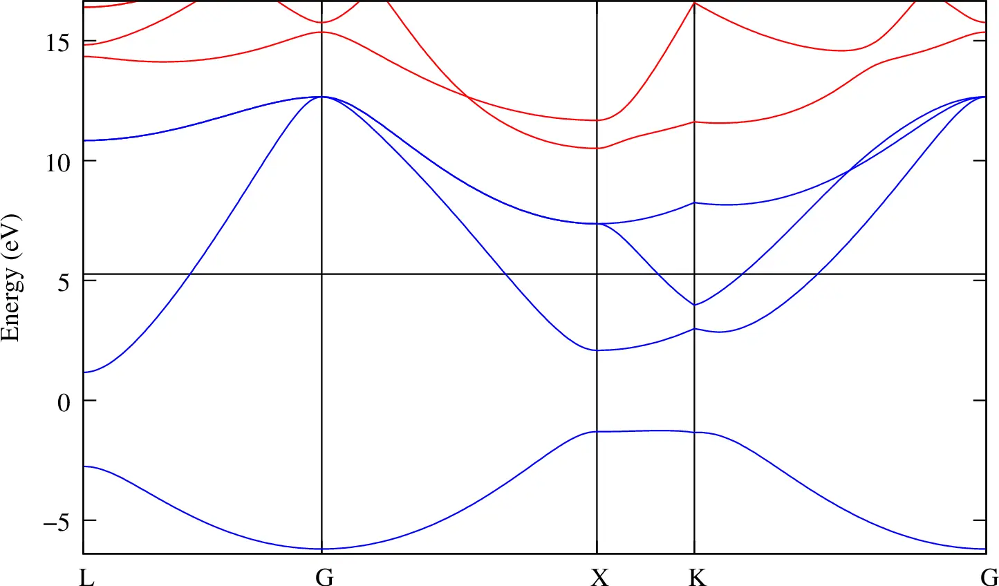
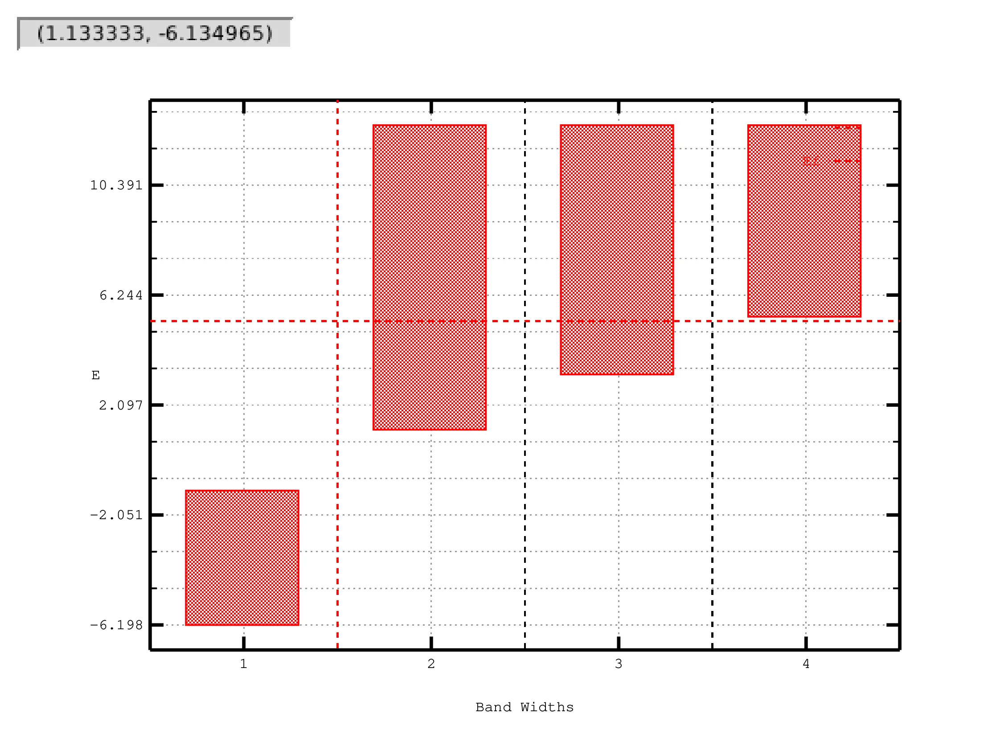
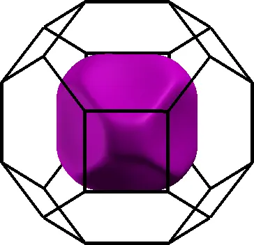

# 2: Lead &#151; Wannier-interpolated Fermi surface

- Outline: *Obtain MLWFs for the four lowest states in lead. Use Wannier
    interpolation to plot the Fermi surface.*

<figure markdown="span">
{ width="250" }
<figcaption markdown="span"  id="fig2-1">Unit cell of lead crystal
plotted with the XCrySDen program.</figcaption>
</figure>

1. *Inspect the output file `lead.wout`.*

    A summary of the wannierisation is given in [Table 1](#tab2-1). At the end
    of the `.wout` file you should find the info on the final state of the
    minimization as

    ```text title="Output file"
     Final State
      WF centre and spread    1  (  0.397070,  0.397070,  0.397070 )     1.93781315
      WF centre and spread    2  (  0.397070, -0.397070, -0.397070 )     1.93781315
      WF centre and spread    3  ( -0.397070,  0.397070, -0.397070 )     1.93781315
      WF centre and spread    4  ( -0.397070, -0.397070,  0.397070 )     1.93781315
      Sum of centres and spreads (  0.000000, -0.000000, -0.000000 )     7.75125261

             Spreads (Ang^2)       Omega I      =     6.039099038
            ================       Omega D      =     0.007065754
                                   Omega OD     =     1.705087819
        Final Spread (Ang^2)       Omega Total  =     7.751252611
     ------------------------------------------------------------------------------
    ```

    <a id="tab2-1"></a>
    **Table 1.** Converged values of the components of spread functional and
    their sum, given in Å$^2$.

    | MP mesh | $\Omega$ | $\Omega_{\text{I}}$ | $\Omega_{\text{OD}}$ | $\Omega_{\text{D}}$ |
    |---|---|---|---|---|
    | $4\times4\times4$ | 7.751 | 6.039 | 0.007 | 1.705 |

2. *Use Wannier interpolation to generate the Fermi surface of lead.*

    As can be seen from the bandstructure plot in the `wannier90` tutorial, that
    we report here, cf. [Figure 2](#fig2-2), the four lower valence bands are
    separated in energy from the higher conduction states (there is however an
    indirect band gap). The Fermi level lies somewhere in the middle of the
    manifold making crystalline lead a metal. As a results, the states belonging
    to these manifold will have partial occupancy. We can see that 2 bands are
    entirely below and above the Fermi level, respectively. Hence, no Fermi
    surface can be plotted from these bands. On the other hand, the two central
    bands do cross the Fermi energy level and the corresponding Fermi surfaces
    are shown in [Figure 3](#fig2-3).

    <figure markdown="span">
    { width="450" }
    <figcaption markdown="span"  id="fig2-2">Bandstructure of lead
    showing the position of the Fermi level. Only the lowest four bands
    are included in the calculation.</figcaption>
    </figure>

    <figure markdown="1">

    |  |  |  |
    |:-:|:-:|:-:|
    | { width="280" } | { width="220" } | { width="220" } |

    <figcaption markdown="span"  id="fig2-3">Fermi surfaces for band 2
    and band 3 in lead. The value of the Fermi energy is 5.2676 eV, and
    it was obtained from the first principle calculation, with a
    $4\times4\times4$ $\mathbf{k}$-point mesh. To calculate the band
    energies and to plot Fermi surfaces, Wannier interpolation was
    employed on a dense mesh in the Brillouin zone consisting of $50^3$
    points.</figcaption>
    </figure>
