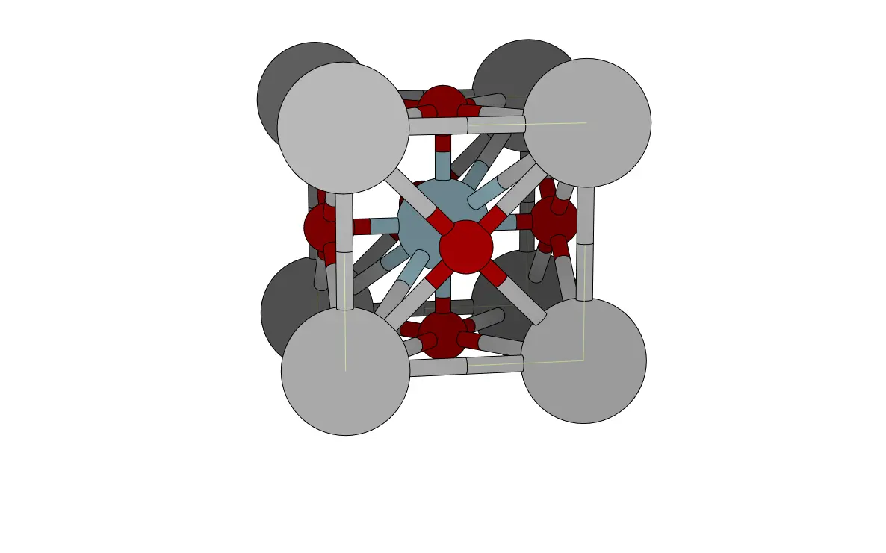
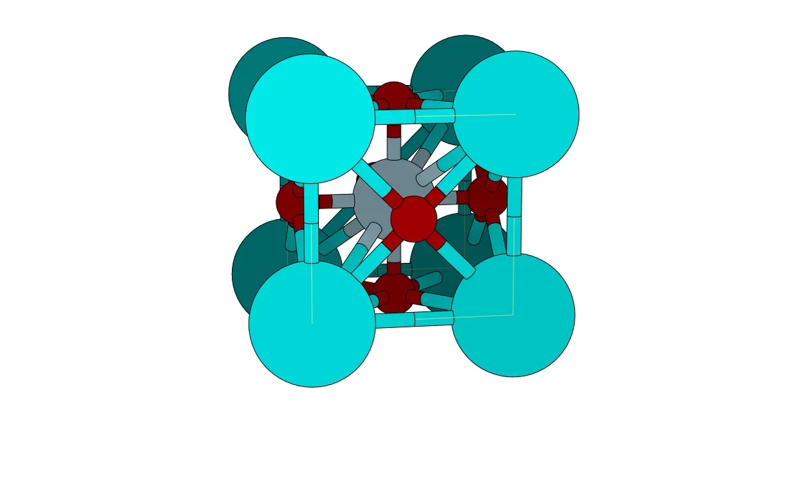
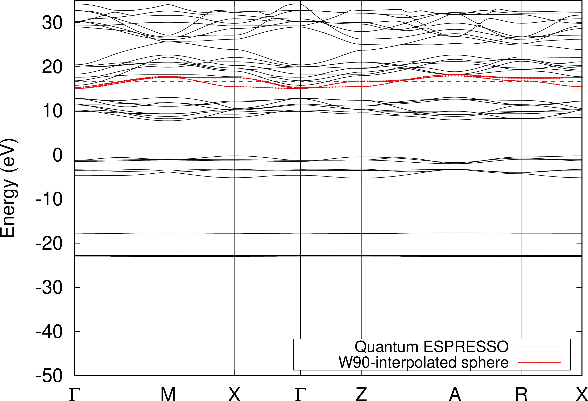
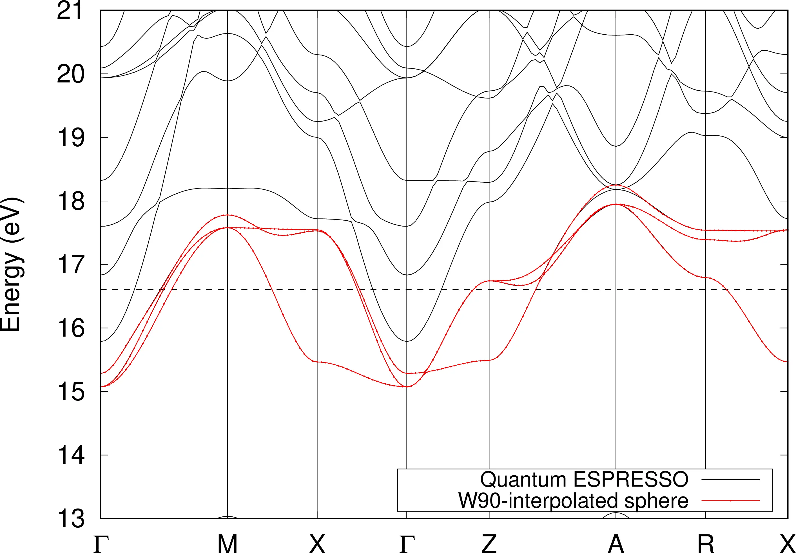
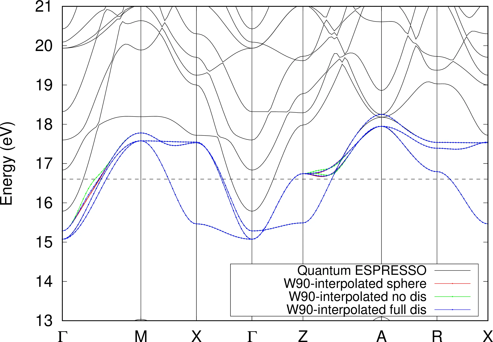
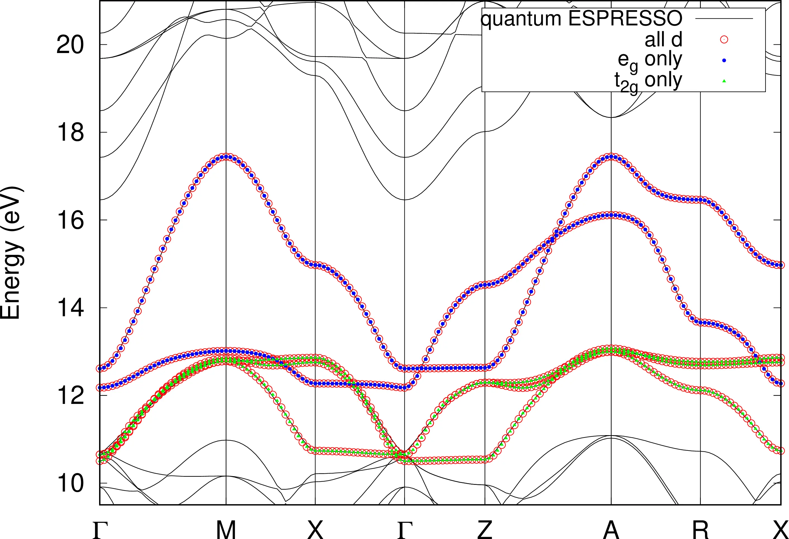

# 20: Disentanglement restricted inside spherical regions of $k$ space

## LaVO$_3$

- Outline: *Obtain disentangled MLWFs for strained LaVO$_3$.*

<figure markdown="span">
<div class="grid-figure" markdown="1">
{ width="320" }
{ width="320" }
</div>
<figcaption markdown="span"  id="fig20-1">Left: atomic structure of epitaxially-strained (tetragonal) LaVO$_3$. Right: atomic structure of epitaxially-strained (tetragonal) SrMnO$_3$. Both structures have been plotted with the XCrySDen program.</figcaption>
</figure>

- 1-5: *These are the usual steps to generate MLWFs and are not reported here.*

*Inspect the output file `LaVO3.wout`. In the initial summary, you will see that the disentanglement was performed only within one sphere of radius 0.2 around the point `A = (0.5, 0.5, 0.5)` in reciprocal space:*

```text title="Output file"
 *------------------------------- DISENTANGLE --------------------------------*
 |  Using band disentanglement                :                 T             |


	...

 |  Number of spheres in k-space              :                 1             |
 |   center n.   1 :     0.500   0.500   0.500,    radius   =   0.200         |
```

*Compare the band structure that `wannier90` produced with the one obtained using Quantum ESPRESSO.*

To obtain the band structure from the Quantum ESPRESSO calculation we can use the `bands.x` program available at [http://www.tcm.phy.cam.ac.uk/~jry20/bands.html](http://www.tcm.phy.cam.ac.uk/~jry20/bands.html), see mini-tutorial at the end of Example 6. Here, we only report the `.inp` file used to generate the $k$-point mesh for the non-scf calculation

```text title="bands.x input file LaVO3.inp"
7.03 0.00 0.00
0.00 7.03 0.00
0.00 0.00 7.6627

30

G       0.00000  0.00000  0.00000  M       0.50000  0.50000  0.00000
M       0.50000  0.50000  0.00000  X       0.50000  0.00000  0.00000
X       0.50000  0.00000  0.00000  G       0.00000  0.00000  0.00000
G       0.00000  0.00000  0.00000  Z       0.00000  0.00000  0.50000
Z       0.00000  0.00000  0.50000  A       0.50000  0.50000  0.50000
A       0.50000  0.50000  0.50000  R       0.50000  0.00000  0.50000
R       0.50000  0.00000  0.50000  X       0.50000  0.00000  0.00000
```

Remember to add the following line to the `.bands` file in order to show the eigenvalues at each $k$-point.

```vi title="Input file"
verbosity = 'high'
```

Plot of the interpolated band structure is shown in [Figure 2](#fig20-2). In the top panel, the full band structure is shown. In the bottom panel a magnification around the Fermi energy is shown (similar to Figure 9 in the `wannier90` tutorial).

<figure markdown="span">
<div class="grid-figure" markdown="1">
{ width="600" }
</div>
<div class="grid-figure" markdown="1">
{ width="600" }
</div>
<figcaption markdown="span"  id="fig20-2">Top panel: full band structure of epitaxially-strained (tetragonal) LaVO$_3$ along the $\Gamma$-M-X-$\Gamma$-Z-A-R-X from DFT calculation (solid black) and interpolation from `wannier90` (red dots). Bottom panel: magnification around Fermi energy $16.6049$ eV (dashed line). The disentanglement was performed only for $k$-points within a sphere of radius 0.2 $\mathrm{Å}^{-1}$ centred in A.</figcaption>
</figure>

## Further ideas

- *Try to obtain the Wannier functions using the standard disentanglement procedure ...*

    Plots of the band structure of LaVO$_3$ with full disentanglement and no disentanglement are shown in [Figure 3](#fig20-3). These are plotted against the Quantum ESPRESSO band structure (solid black lines) and the `wannier90`-interpolated one with disentanglement performed only within a sphere centred in A (red dots). We see that the other two methods diverge from the DFT calculation in region of $k$-space where the bands of interest are not entangled with other unwanted bands. For example, in the zone between $\Gamma$ and M and Z and A the interpolated bands with full disentanglement and no disentanglement diverge substantially from the DFT calculation.

<figure markdown="span">
{ width="600" }
<figcaption markdown="span"  id="fig20-3">Comparison of interpolated band structure of epitaxially-strained (tetragonal) LaVO$_3$ with disentanglement on a sphere of radius 0.2 $\mathrm{Å}^{-1}$ centred in A (red dots), full disentanglement (blue dots) and no disentanglement (green dots). Fermi energy is shown with a dashed line.</figcaption>
</figure>

- *In order to illustrate all possible cases, it is instructive to apply this method to SrMnO$_3$ ...*

    Plots of the interpolated bands for the different cases are shown in [Figure 4](#fig20-4). In this case, the disentanglement for all the Mn-3d-derived states (empty red circles in [Figure 4](#fig20-4)) is only necessary around the $\Gamma$ point, as for all the other points and lines the bands of interest are well separated from other bands lower in energy. However, if we only consider the $e_g$ states (solid blue circles in [Figure 4](#fig20-4)) then the situation is different as these states are entangled with the $t_{2g}$ states around X. Of course the $t_{2g}$ states (solid green cones in [Figure 4](#fig20-4)) are entangled with $e_g$ states around X and with lower-lying states at $\Gamma$.

<figure markdown="span">
{ width="600" }
<figcaption markdown="span"  id="fig20-4">`wannier90`-interpolated bands of SrMnO$_3$. From only $t_{2g}$ states (solid green cones), from only $e_g$ states (solid blue circles), or all Mn-3d-derived states ($t_{2g} + e_g$) (empty red circles).</figcaption>
</figure>
