# 21: Gallium Arsenide &#151; Symmetry-adapted Wannier functions

- Outline: *Obtain symmetry-adapted Wannier functions out of four valence bands of GaAs. For the theoretical background of the symmetry-adapted Wannier functions, see R. Sakuma, Phys. Rev. B **87**, 235109 (2013).*

<figure markdown="span">
{ width="250" }
<figcaption markdown="span"  id="fig21-1">Unit cell of GaAs crystal plotted with the XCrySDen program.</figcaption>
</figure>

1-3: These are common to all calculations, and they have already been performed in previous examples. Hence, no results are shown here.

The space group of GaAs is $F{-}43m$ (sequential number 276 in the International Tables for Crystallography, Vol. A). In our example the Ga atom is placed at the origin, whose Wyckoff letter is $a$ and its multiplicity is $4$. The site symmetry group of $a$ is ${-}43m$, which is isomorphous to the full point group of the crystal, also known as $T_d^2$. This is due to the fact that $F{-}43m$ is symmorphic. Hence, $a$ contains 24 symmetry operations (see [Table 1](#tab21-1)). The As atom is placed at (0.25,0.25,0.25) in fractional coordinates, whose Wyckoff letter is $c$ and its multiplicity is 4. It also contains 24 symmetry operations (see [Table 2](#tab21-2)).

<a id="tab21-1"></a>
**Table 1.** 24 symmetry operations for the Wyckoff position $4a$ in $-43m$ [@bilbaocrystserver].

| | | | | | |
|---|---|---|---|---|---|
| x,y,z | -x, -y, z | -x,y,-z | x,-y,-z | z,x,y | z,-x,-y |
| -z,-x,y | -z,x,-y | y,z,x | -y,z,-x | y,-z,-x | -y,-z,x |
| y,x,z | -y,-x,z | y,-x,-z | -y,x,-z | x,z,y | -x,z,-y |
| -x,-z,y | x,-z,-y | z,y,x | z,-y,-x | -z,y,-x | -z,-y,x |

<a id="tab21-2"></a>
**Table 2.** 24 symmetry operations for the Wyckoff position $4c$ in $-43m$ [@bilbaocrystserver].

| | | | |
|---|---|---|---|
| x,y,z | -x+1/2,-y+1/2, z | -x+1/2,y,-z+1/2 | x,-y+1/2,-z+1/2 |
| z,x,y | z,-x+1/2,-y+1/2 | -z+1/2,-x+1/2,y | -z+1/2,x,-y+1/2 |
| y,z,x | -y+1/2,z,-x+1/2 | y,-z+1/2,-x+1/2 | -y+1/2,-z+1/2,x |
| y,x,z | -y+1/2,-x+1/2,z | y,-x+1/2,-z+1/2 | -y+1/2,x,-z+1/2 |
| x,z,y | -x+1/2,z,-y+1/2 | -x+1/2,-z+1/2,y | x,-z+1/2,-y+1/2 |
| z,y,x | z,-y+1/2,-x+1/2 | -z+1/2,y,-x+1/2 | -z+1/2,-y+1/2,x |

The list of site-symmetry operations may be found in the `.sym` file and in the output file `pw2wan.out`. In the latter, the list is in the section relative to the computation of the $D_{mn}$ matrix (see Ref. [@Sakuma]).

## One $s$-like Wannier function centred at Ga

1-5: *Compute the symmetry-adapted MLWF.*

The ${-}43m$ site-symmetry group is isomorphous to $T_d^2$. From the table of characters of $T_d^2$ we find 5 irreducible representations (*irrep*). The irrep with character $A_1$ is a one-dimensional representation, whose eigenfunction is spherically symmetric. Hence, a single $s$-like orbital in (0,0,0) may be used. However, this is not enough as the choice of the initial guess must also be compatible with the symmetry of the bands. In fact, if we tried to wannierise only the lowest band, excluding all the other bands (this can be done by changing the input file as `num_wann = 1, num_bands = 1` and `exclude_bands = 1-5, 7-19`), the resulting $1\times1$ $U(\mathbf{k})$ could not fulfill Eq. 19 in Ref. [@Sakuma]. Similarly, if we tried to wannierise only the three top bands.

```vi title="Input file"
begin projections

f= 0.0, 0.0, 0.0 : s

end projections
```

```text title="Output file"
  ----------------
  *** Compute DMN
  ----------------

  Number of symmetry operators =    24
```

<figure markdown="span">
<div class="grid-figure" markdown="1">
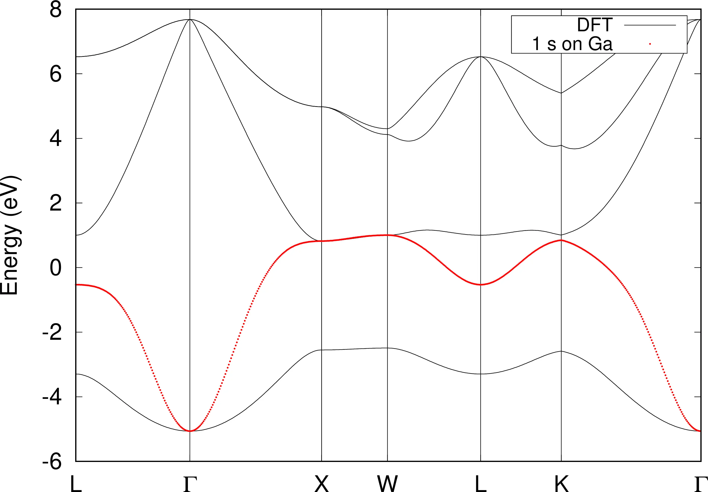{ width="550" }
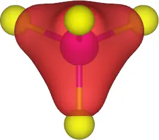{ width="200" }
</div>
<figcaption markdown="span"  id="fig21-2">One $s$-like symmetry-adapted Wannier function centred on the Gallium atom in GaAs: a. Wannier-interpolated band, b. Sym.Ad. MLWF.</figcaption>
</figure>

## Three $p$-like Wannier functions centred at Ga

1-5: *Compute the symmetry-adapted MLWFs.*

Another representation of ${-}43m$, namely $T_2$, has dimension 3. Its eigenfunctions are linear functions proportional to $x,y,z$. Hence, we can use three $p$-like orbitals ($p_x,p_y,p_z$) centred at (0,0,0).

```vi title="Input file"
begin projections

f= 0.0, 0.0, 0.0 : p

end projections
```

<figure markdown="span">
<div class="grid-figure" markdown="1">
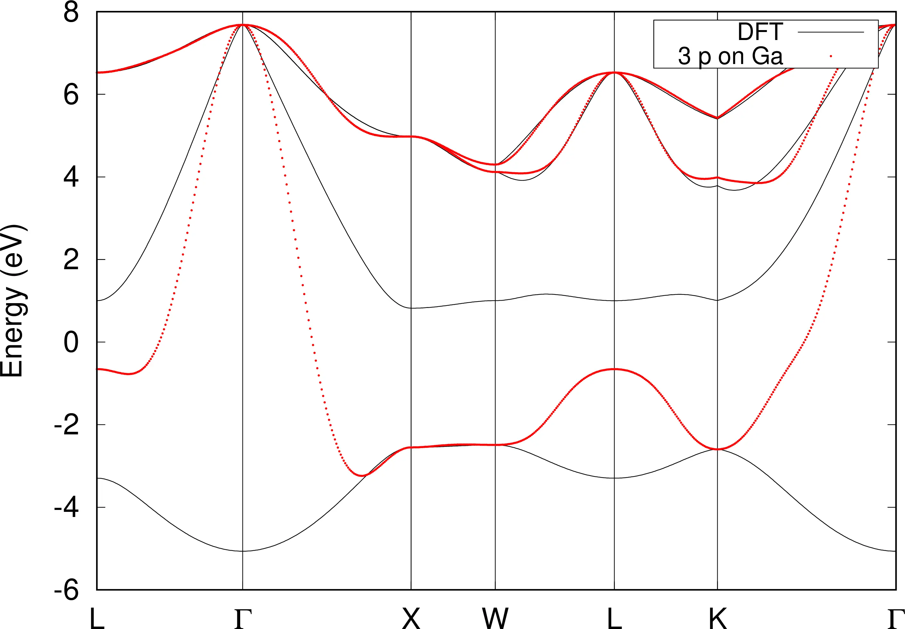{ width="550" }
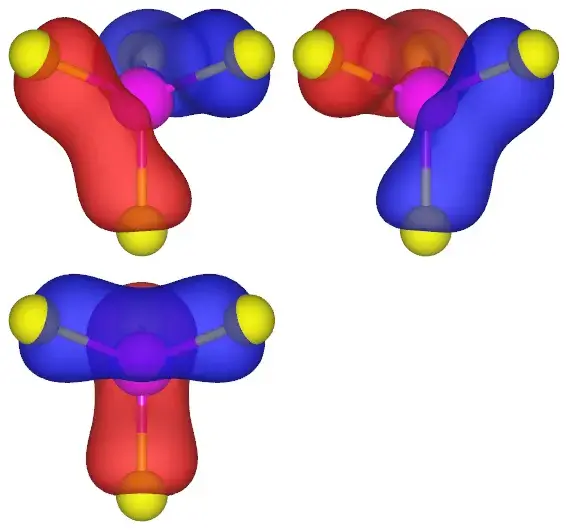{ width="380" }
</div>
<figcaption markdown="span"  id="fig21-3">Three $p$-like symmetry-adapted Wannier functions centred on the Gallium atom in GaAs: a. Wannier-interpolated band, b. Sym.Ad. MLWFs.</figcaption>
</figure>

## One $s$-like and three $p$-like Wannier functions centred at Ga

1-5: *Compute the symmetry-adapted MLWFs.*

We can construct also construct a representation of dimension $4=3+1$ for the 4 valence bands by specifying 1 $s$-like orbital and 3 $p$-like orbitals on Ga, which corresponds to the irreducible representations $A_1$ and $T_2$ respectively. However, it would not be possible to

```vi title="Input file"
begin projections

f= 0.0, 0.0, 0.0 : s

f= 0.0, 0.0, 0.0 : p

end projections
```

<figure markdown="span">
<div class="grid-figure" markdown="1">
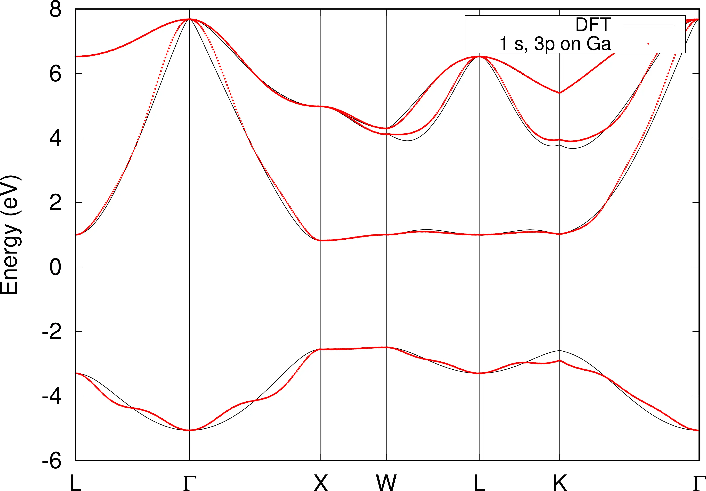{ width="550" }
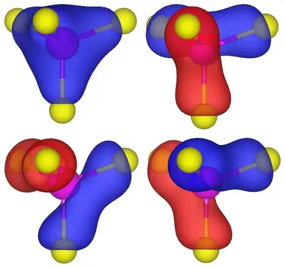{ width="380" }
</div>
<figcaption markdown="span"  id="fig21-4">One $s$-like and three $p$-like Wannier functions centred on the Gallium atom in GaAs: a. Wannier-interpolated band, b. Sym.Ad. MLWFs.</figcaption>
</figure>

## One $s$-like and three $p$-like Wannier functions centred at As

The site-symmetry group for the As anion centred at $(0.25,0.25,0.25)$ is ${-}43m$ as well and we can perform the same analysis done for the Ga cation. Contrary to the Ga case, for the As anion it is possible to wannierise the bottom band from one $s$-like orbital centred at $(0.25,0.25,0.25)$ and the top three bands from three $p$-like orbitals centred at $(0.25,0.25,0.25)$ (see [Figure 6](#fig21-6)).

1-5: *Compute the symmetry-adapted MLWFs.*

```vi title="Input file"
begin projections

f=0.25,0.25,0.25 : s

f=0.25,0.25,0.25 : p

end projections
```

<figure markdown="span">
<div class="grid-figure" markdown="1">
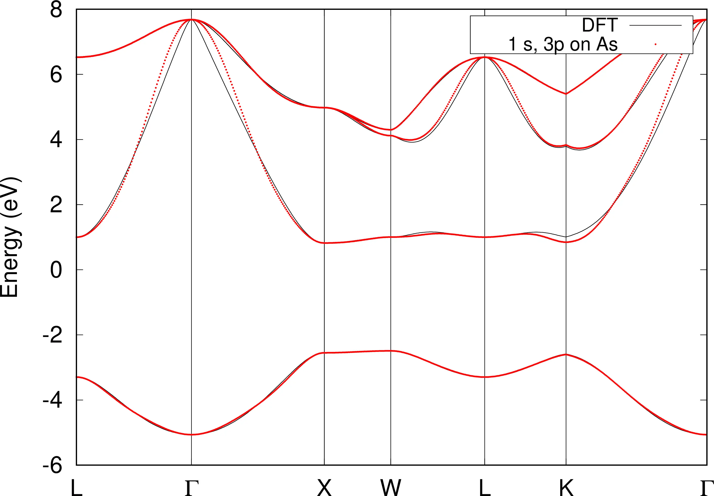{ width="550" }
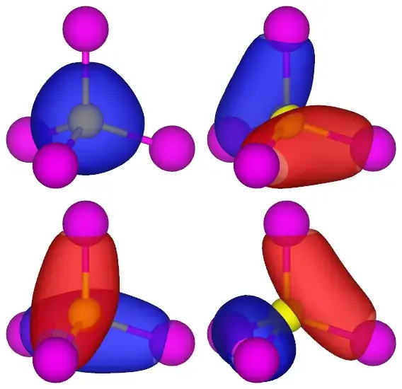{ width="380" }
</div>
<figcaption markdown="span"  id="fig21-5">One $s$-like and three $p$-like Wannier functions centred on the Arsenic atom in GaAs: a. Wannier-interpolated band, b. Sym.Ad. MLWFs.</figcaption>
</figure>

<figure markdown="span">
<div class="grid-figure" markdown="1">
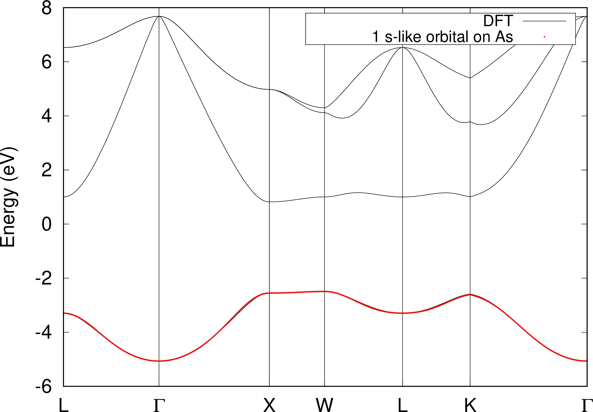{ width="650" }
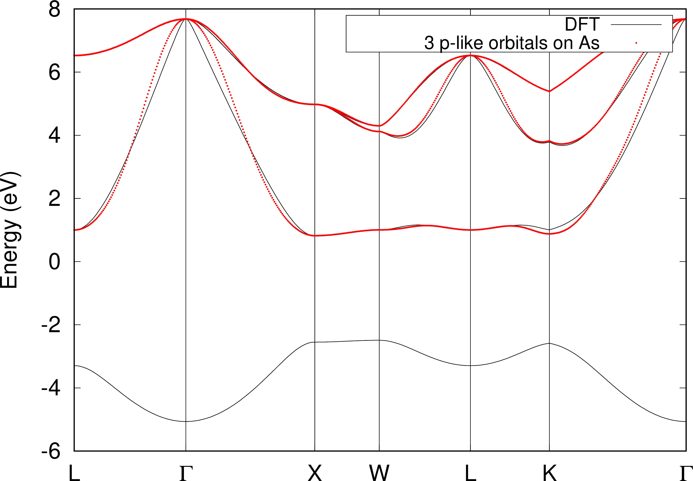{ width="650" }
</div>
<figcaption markdown="span"  id="fig21-6">Interpolated `wannier90` bands of GaAs starting from a. one $s$-like centred on the Arsenic anion and b. three $p$-like orbitals centred on the Arsenic anion, respectively.</figcaption>
</figure>

## Four $s$-like Wannier functions centred on the four Ga-As bonds

From a group-theoretical point of view, the case of four $s$-like functions centred on four covalent bonds, correspond to the *irrep* $A_{1g}$ of the site-symmetry group $.3m$ of the Wyckoff position $e$. There are 6 symmetry operations for each equivalent position (0.125, 0.125, 0.125), (0.125, 0.125, -.375), (-.375, 0.125, 0.125) and (0.125, -.375, 0.125). The combined 24 symmetry operations turn out to be exactly that of the full ${-}43m$ group.

1-5: *Compute the symmetry-adapted MLWFs.*

```vi title="Input file"
begin projections

f= 0.125, 0.125, 0.125: s

f= 0.125, 0.125, -.375: s

f= -.375, 0.125, 0.125: s

f= 0.125, -.375, 0.125: s

end projections
```

<figure markdown="span">
<div class="grid-figure" markdown="1">
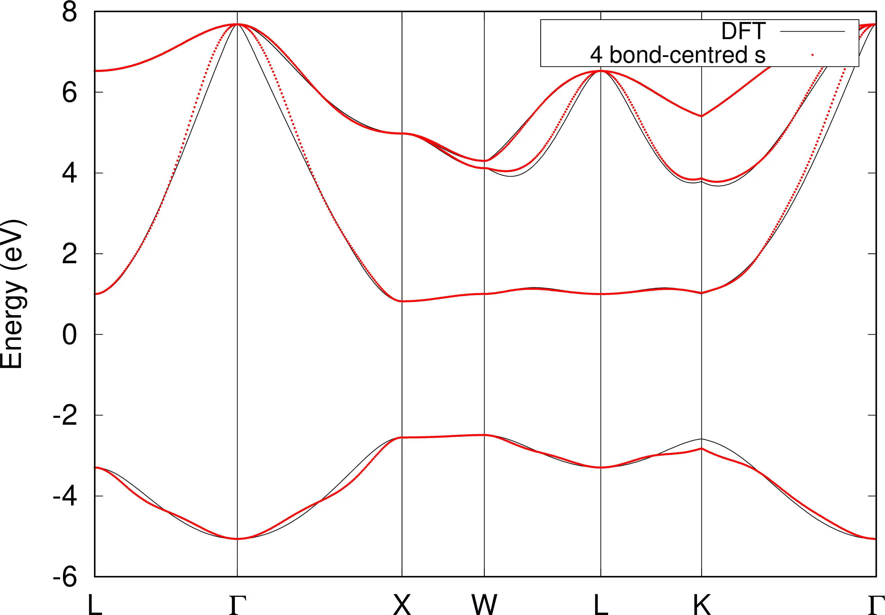{ width="550" }
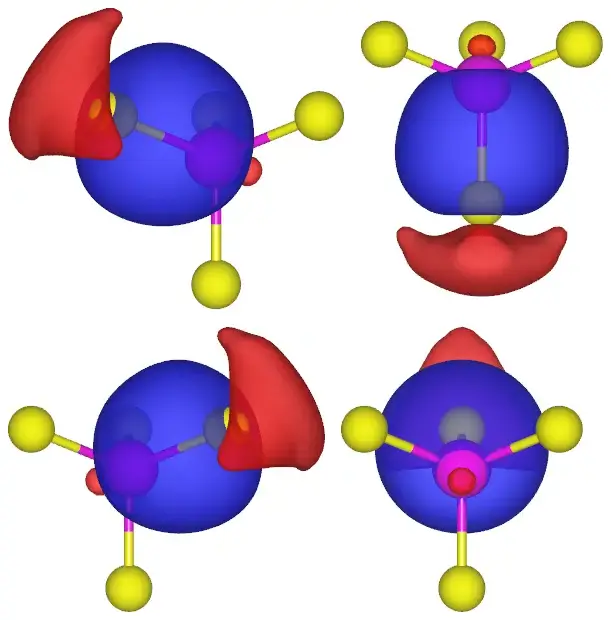{ width="380" }
</div>
<figcaption markdown="span"  id="fig21-7">Four $sp_3$-like symmetry-adapted Wannier functions centred on the Ga-As bonds in GaAs: a. Wannier-interpolated band, b. $s,p_x,p_y,p_z$.</figcaption>
</figure>
