# 22: Copper &#151; Symmetry-adapted Wannier function

- Outline: *Obtain symmetry-adapted Wannier functions for Cu. By
    symmetry-adapted mode, for example, we can make atomic centered s-like
    Wannier function, which is not possible in the usual procedure to create
    maximally localized Wannier functions. For the theoretical background of the
    symmetry-adapted Wannier functions, see R. Sakuma, Phys. Rev. **B** 87,
    235109 (2013).*

<figure markdown="span">
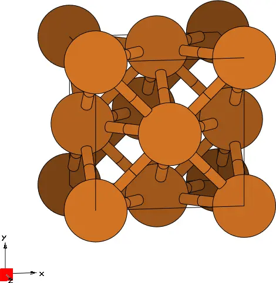{ width="250" }

<figcaption markdown="span"  id="fig22-1">Unit cell of Copper
crystal.</figcaption>

</figure>

*Each directory creates $s$-like symmetry-adapted Wannier function centered at
different position on top of atomic centered $d$-like Wannier functions.*

Below it is reported the README file from the example directory

```text title="README file"
# Symmetry-adapted mode

Additional input in Cu.win file
  site_symmetry = .true.   (default value is .false.)
  symmetrize_eps = 1d-9    (default value is 1d-3   )

Additional input in Cu.pw2wan file
  write_dmn = .true.

Working directories
  s_at_0.00 : s-like Wannier function centered at (0,0,0)       + atomic-centered d-like WFs
  s_at_0.25 : s-like Wannier function centered at (1/4,1/4,1/4) + atomic-centered d-like WFs
  s_at_0.50 : s-like Wannier function centered at (1/2,1/2,1/2) + atomic-centered d-like WFs

In s_at_0.25, we use an additional flag "read_sym = .true." to customize the symmetry operations
to be used.
We exclude the inversion symmetry to create s-like Wannier function centered at (1/4,1/4,1/4).
Information on symmetry operations without inversion symmetry is taken from GaAs calculation.
See more detailed discussion in R. Sakuma, Phys. Rev. B 87, 235109 (2013).
```

The space group of Cu is $Fm{-}3m$ (sequential number 225 in the International
Tables for Crystallography, Vol. A).

## $s$-like Wannier function centred at the origin

1-5: *Compute the symmetry-adapted MLWFs.*

In this example both the $s$-orbital and $d$-orbitals is placed at the origin,
whose Wyckoff letter is $a$ and its multiplicity is $4$. The site symmetry group
of $a$ is $m{-}3m$, which is isomorphous to the full point group of the crystal,
known as $O_h$ and it contains 48 symmetry operations. The six MLWFs obtained by
placing both the initial $s$-orbital and the $d$-orbitals on the Cu atom are
shown in [Figure 2](#fig22-2).

<figure markdown="1">

|  |  |  |  |  |  |
|:-:|:-:|:-:|:-:|:-:|:-:|
| 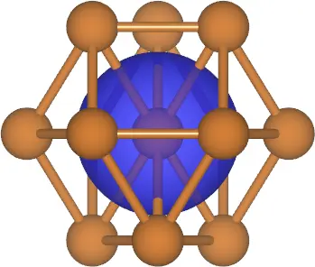{ width="150" } | 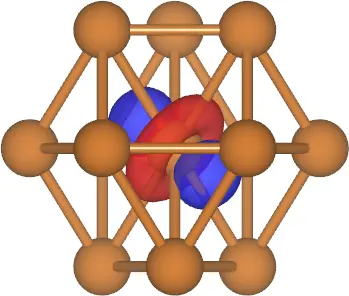{ width="150" } | 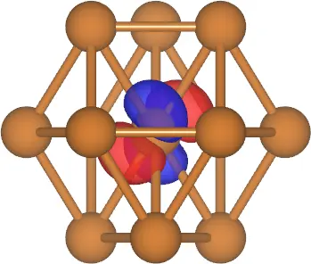{ width="150" } | 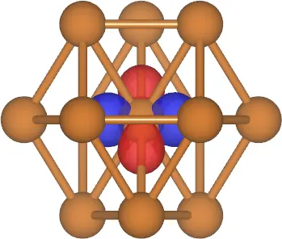{ width="150" } | 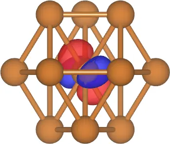{ width="150" } | 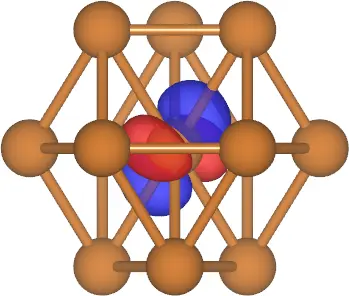{ width="150" } |

<figcaption markdown="span"  id="fig22-2">Six symmetry-adapted
MLWFs in Cu. The initial $s$-orbital is placed at the origin: a.
$s$-like WF, b. $e_{g}$-like WF, c. $e_{g}$-like WF, d.
$t_{2g}$-like WF, e. $t_{2g}$-like WF, f. $t_{2g}$-like WF.</figcaption>
</figure>

## $s$-like Wannier function centred at (0.25,0.25,0.25)

1-5: *Compute the symmetry-adapted MLWFs.*

In this example the $s$-orbital is placed at (0.25,0.25,0.25), whose Wyckoff
letter is $c$ and its multiplicity is $8$. The site symmetry group of $c$ is
${-}43m$, which is not isomorphous to the full point group of the crystal
($O_h$). This site symmetry group contains only 24 symmetry operations, i.e. it
comes from $O_h$ when inversion is removed. This is the reason why the flag
`read_sym =.true.` in the `.pw2wan` file and an additional input is required,
namely `Cu.sym`. In fact, this file is not automatically generated by
`pw2wannier90.x` but is given as input to be read. The six MLWFs obtained by
placing the initial $s$-orbital at (0.25,0.25,0.25) and the $d$-orbitals on the
Cu atom are shown in [Figure 3](#fig22-3).

<figure markdown="1">

|  |  |  |  |  |  |
|:-:|:-:|:-:|:-:|:-:|:-:|
| 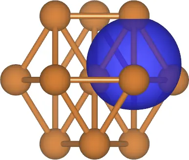{ width="150" } | 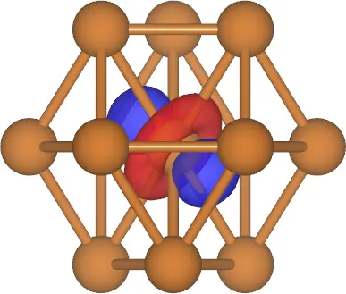{ width="150" } | 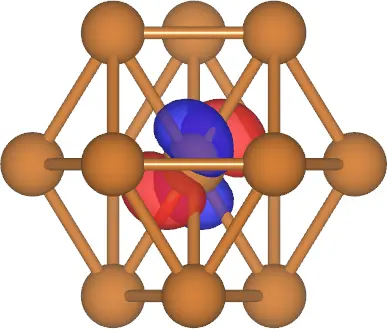{ width="150" } | 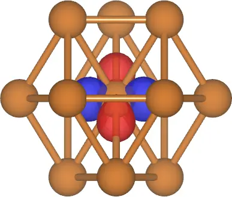{ width="150" } | 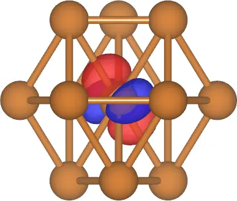{ width="150" } | 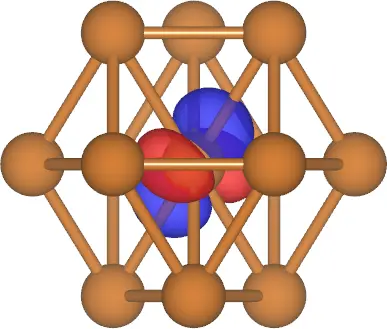{ width="150" } |

<figcaption markdown="span"  id="fig22-3">Six symmetry-adapted
MLWFs in Cu. The initial $s$-orbital is placed at (0.25,0.25,0.25):
a. $s$-like WF, b. $e_{g}$-like WF, c. $e_{g}$-like WF, d.
$t_{2g}$-like WF, e. $t_{2g}$-like WF, f. $t_{2g}$-like WF.</figcaption>
</figure>

## $s$-like Wannier function centred at (0.5,0.5,0.5)

1-5: *Compute the symmetry-adapted MLWFs.*

In this example the $s$ orbital is placed at (0.5,0.5,0.5), whose Wyckoff letter
is $b$ and its multiplicity is $4$. The site symmetry group of $c$ is $m{-}3m$,
which is isomorphous to the full point group of the crystal ($O_h$). Hence, no
additional input file is needed in this case. The six MLWFs obtained by placing
the initial $s$-orbital at (0.5,0.5,0.5) and the $d$-orbitals on the Cu atom are
shown in [Figure 4](#fig22-4).

<figure markdown="1">

|  |  |  |  |  |  |
|:-:|:-:|:-:|:-:|:-:|:-:|
| 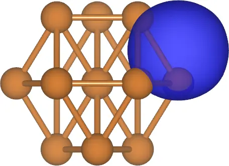{ width="150" } | 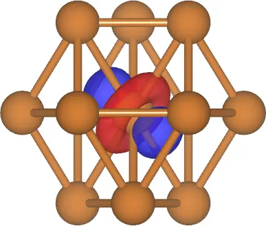{ width="150" } | { width="150" } | 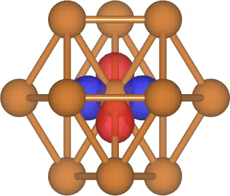{ width="150" } | 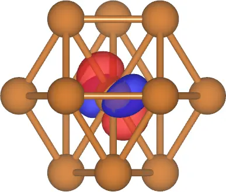{ width="150" } | 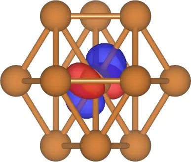{ width="150" } |

<figcaption markdown="span"  id="fig22-4">Six symmetry-adapted
MLWFs in Cu. The initial $s$-orbital is placed at (0.5,0.5,0.5): a.
$s$-like WF, b. $e_{g}$-like WF, c. $e_{g}$-like WF, d.
$t_{2g}$-like WF, e. $t_{2g}$-like WF, f. $t_{2g}$-like WF.</figcaption>
</figure>
