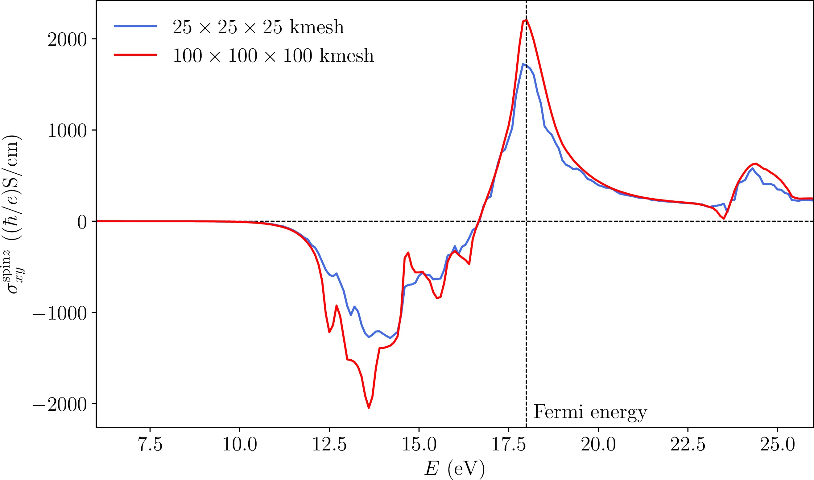
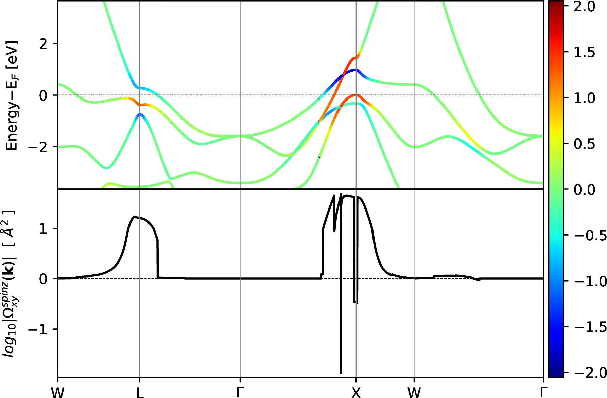
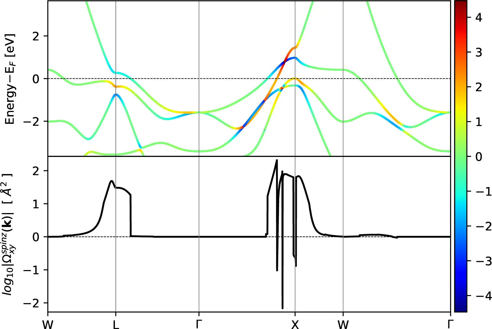
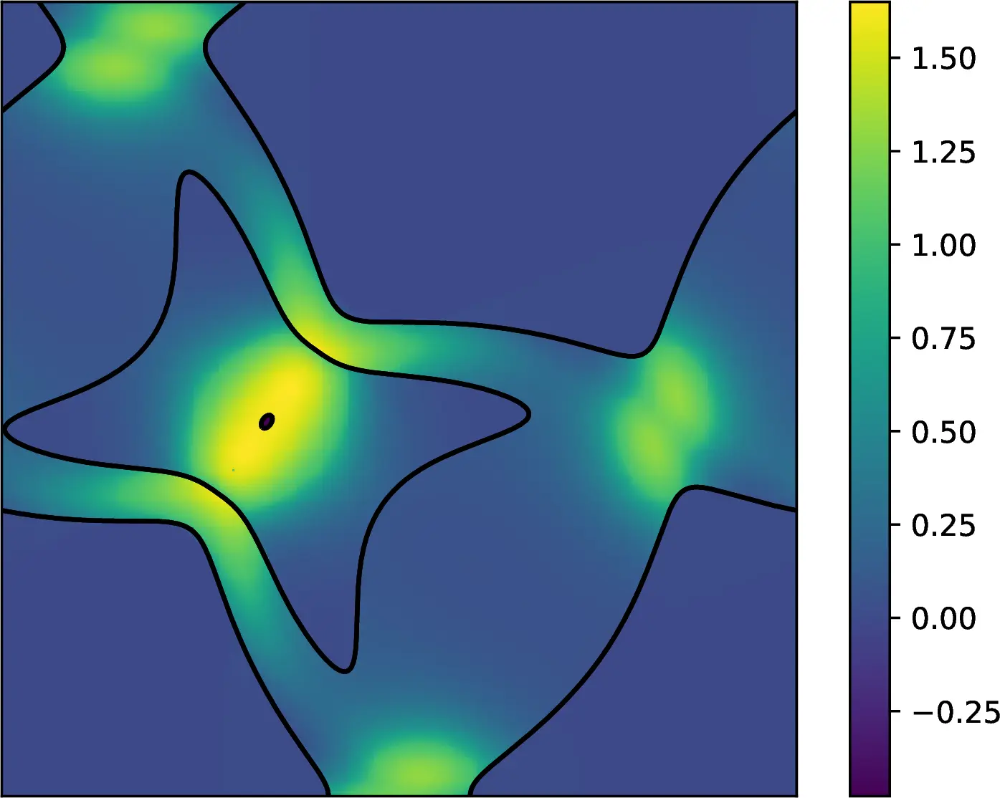
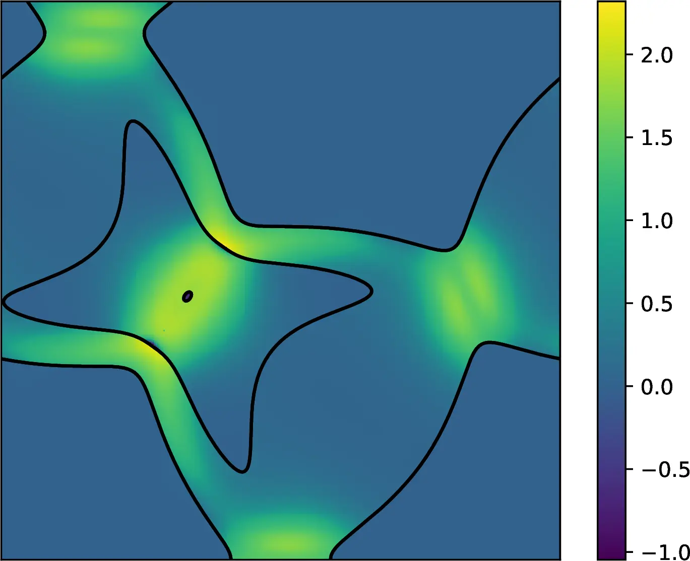

# 29: Platinum &#151; Spin Hall conductivity

- Outline: *Calculate spin Hall conductivity (SHC) and plot Berry curvature-like term of fcc Pt considering spin-orbit coupling. To gain a better understanding of this example, it is suggested to read Ref. [@qiao-prb2018] for a detailed description of the theory and Ch. 12.5 of the User Guide.*

- 1-6: *Compute the MLWFs, spin Hall conductivity and `kpath`, `kslice` plots.*

## Spin Hall conductivity

*SHC converges rather slowly with k-point sampling, and a $25 \times 25 \times 25$ kmesh does not yield a well-converged value. To get a converged SHC value, increase the density of kmesh and then compare the converged result with those obtained in Refs. [@qiao-prb2018] and [@guo-prl2008].*

The file `Pt-shc-fermiscan.dat` contains the calculated SHC. The SHC for a $25\times25\times25$ kmesh are shown in the snippet below.

```text title="25×25×25 kmesh"
#No.   Fermi energy(eV)   SHC((hbar/e)*S/cm)
   1     6.000000    0.00000000E+00
...
 120    17.900000    0.17230482E+04
 121    18.000000    0.17054542E+04
...
 201    26.000000    0.22665760E+03
```

The calculated Fermi energy obtained from `Quantum ESPRESSO` is $17.9919$ eV. It may vary among different calculations due to the differences between versions of `Quantum ESPRESSO` or compilers, and these may lead to deviations from the following results. However, the difference should be acceptable and the calculated SHC should be essentially the same.

The SHC at the Fermi energy is 1705 $(\hbar/e)\mathrm{S/cm}$. The converged results reported in Refs. [@qiao-prb2018] and [@guo-prl2008] are around 2200 $(\hbar/e)\mathrm{S/cm}$. Hence, a $25\times25\times25$ kmesh clearly gives an inaccurate value ($\sim 22.5\%$ error).

Since these are quite demanding calculations, we only report the value of the SHC for a $100\times100\times100$ kmesh (see snippet below). The value for the SHC at Fermi energy is 2207 $(\hbar/e)\mathrm{S/cm}$, which is in much closer agreement with the converged result from Refs. [@qiao-prb2018] and [@guo-prl2008].

```text title="100×100×100 kmesh"
#No.   Fermi energy(eV)   SHC((hbar/e)*S/cm)
   1     6.000000    0.00000000E+00
...
 120    17.900000    0.21899191E+04
 121    18.000000    0.22066678E+04
...
 201    26.000000    0.24919920E+03
```

To complete the previous discussions, we also compare the Fermi energy scan plots of the two calculations as shown in [Figure 1](#fig29-1).

<figure markdown="span">
{ width="550" }
<figcaption markdown="span"  id="fig29-1">Fermi energy scan plots for calculations with $25\times25\times25$ kmesh and $100\times100\times100$ kmesh.</figcaption>
</figure>

The `seedname.wpout` will print the percentage of $k$-points which have been calculated at the moment, as well as the corresponding calculation time, as shown in the following snippet.

```text title="Pt.wpout"
 Properties calculated in module  b e r r y
 ------------------------------------------

   * Spin Hall Conductivity

     Fermi energy scan

 Calculation started
 -------------------------------
   k-points       wall      diff
  calculated      time      time
  ----------      ----      ----
       0%          0.0       0.0
      10%         22.7      22.7
      20%         36.5      13.8
      30%         50.4      14.0
      40%         64.4      14.0
      50%         78.4      14.0
      60%         92.5      14.1
      70%        106.5      14.0
      80%        120.4      13.9
      90%        134.2      13.8
     100%        147.9      13.7


 Interpolation grid: 25 25 25

 Using adaptive smearing
       adptive smearing prefactor    1.414
       adptive smearing max width    1.000 eV
```

This might be helpful as you can roughly estimate the total computational time of your calculation, or it might give credence to the code that it is actually functioning :). Note this report is merely based on the "root" computation node. It is accurate if the `postw90` is run in serial, or the load on each node is balanced if running in parallel. However, the estimation is rough if loads are not balanced among nodes. This may happen if the performance of nodes in your cluster are not identical, or adaptive kmesh refinements are triggered so some nodes may compute much more $k$-points than others. Besides, if you are careful enough, you may find the diff time of 10% is much larger than later ones. This is caused by some done-once-and-for-all computations carried out at the beginning, thus later computations are much faster.

## Berry curvature-like term plots

*The band-projected Berry curvature-like term $\Omega_{n,\alpha\beta}^{\text{spin} \gamma}(\mathbf{k})$ is defined as Eq. (12.22) in the User Guide.*

*Plot the band structure of Pt and color it by the magnitude of its band-projected Berry curvature-like term $\Omega_{n,xy}^{\text{spin}z}(\mathbf{k})$, and plot the k-resolved Berry curvature-like term $\Omega_{xy}^{\text{spin}z}(\mathbf{k})$ along the same path in the BZ.*

With Fermi energy set as 17.9919 eV we obtain the energy bands colored by the $\Omega_{n,\alpha\beta}^{\text{spin} \gamma}(\mathbf{k})$ and the $k$-resolved Berry curvature-like term $\Omega_{xy}^{\text{spin}z}(\mathbf{k})$ along high-symmetry lines as shown in [Figure 2](#fig29-2), which contains two plots calculated with different fixed smearing width.

<figure markdown="span">
<div class="grid-figure" markdown="1">
{ width="340" }
{ width="340" }
</div>
<figcaption markdown="span"  id="fig29-2">Top panels: Band structure of Pt along symmetry lines W-L-&Gamma;-X-W-&Gamma;, colored by the $\Omega_{n,xy}^{\text{spin}z}(\mathbf{k})$. Bottom panels: $k$-resolved Berry curvature-like term $\Omega_{xy}^{\text{spin}z}(\mathbf{k})$ along the symmetry lines.</figcaption>
</figure>

*Combine the plot of the Fermi lines on the $(k_x,k_y)$ plane with a heatmap plot of the Berry curvature-like term of spin Hall conductivity.*

The plots of the Fermi lines with a heatmap of $\Omega_{xy}^{\text{spin}z}(k_x,k_y,0)$ are shown in [Figure 3](#fig29-3).

<figure markdown="span">
<div class="grid-figure" markdown="1">
{ width="340" }
{ width="340" }
</div>
<figcaption markdown="span"  id="fig29-3">Calculated $k$-resolved Berry curvature-like term $\Omega_{xy}^{\text{spin}z}(\mathbf{k})$ in the plane $k_z=0$ (note the magnitude of $\Omega_{xy}^{\text{spin}z}(\mathbf{k})$ is in log scale). Intersections of the Fermi surface with this plane are shown as black lines.</figcaption>
</figure>
