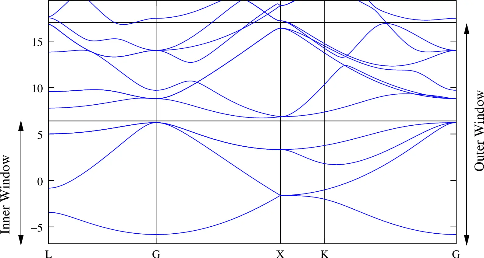
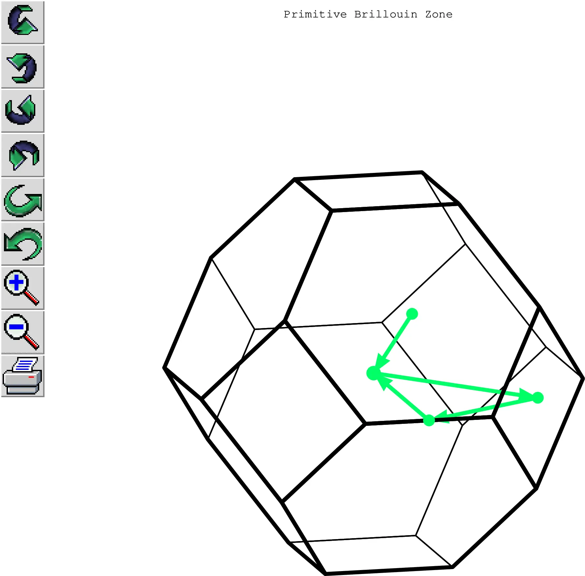
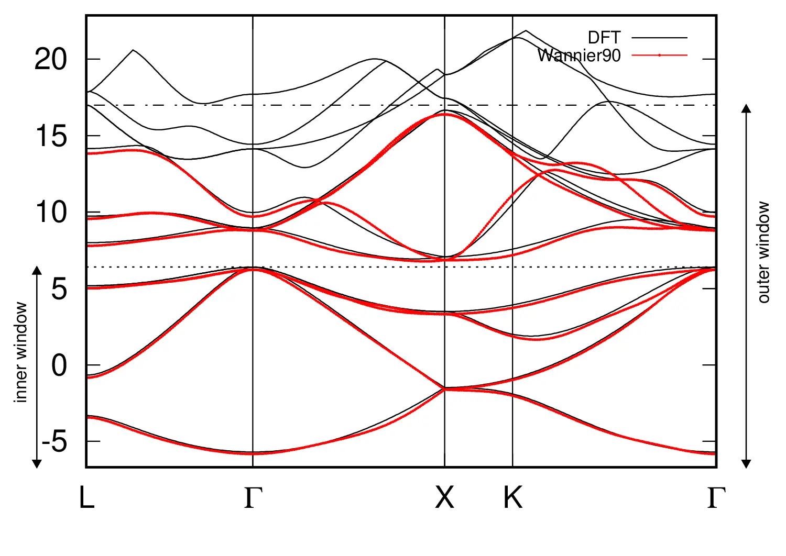
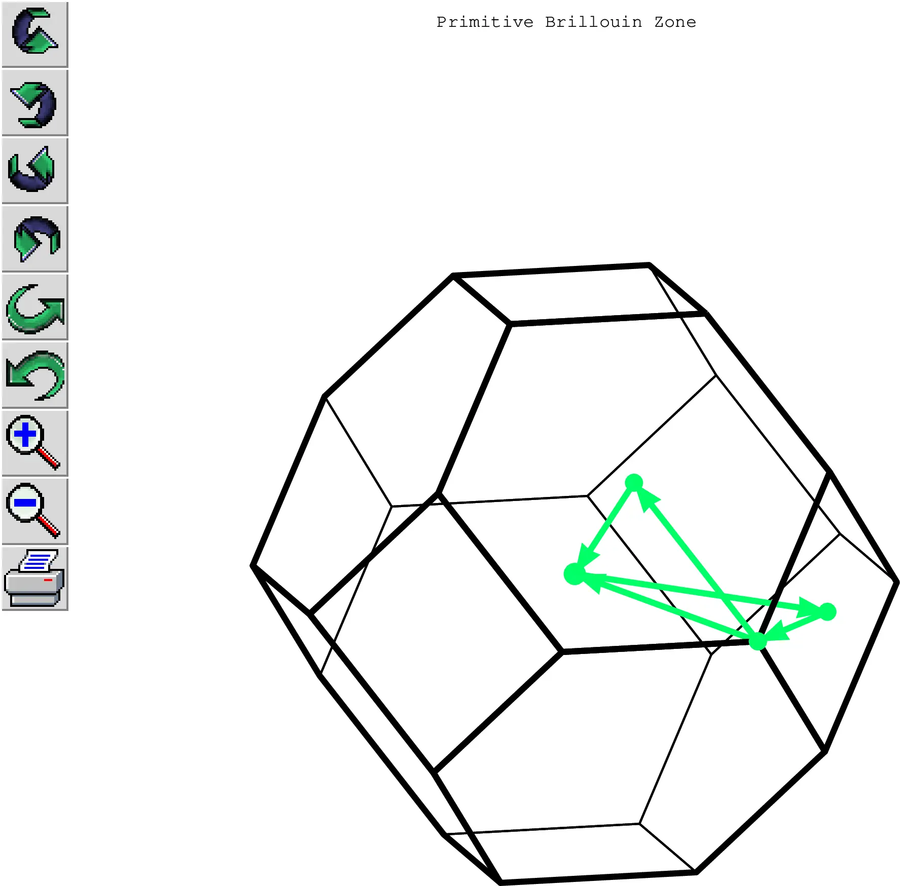
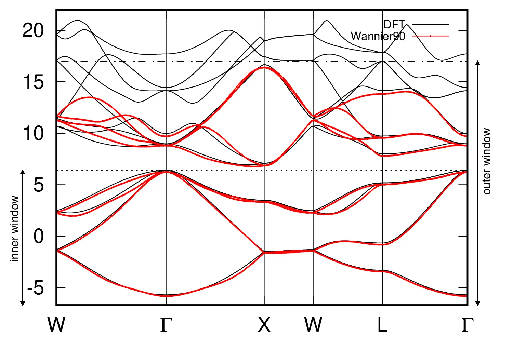

# 3: Silicon &#151; Disentangled MLWFs

- Outline: *Obtain disentangled MLWFs for the valence and low-lying conduction states of Si. Plot the interpolated bandstructure.*

<figure markdown="span">
{ width="250" }
<figcaption markdown="span"  id="fig3-1">Unit cell of Silicon crystal plotted with the XCrySDen program.</figcaption>
</figure>

1. *Inspect the output file `silicon.wout`.*

    Starting from 4 $sp3$ orbitals on each Silicon atom we obtain two sets of 4 WFs, all with the same spread, that show the $sp3$ character one would expect from symmetry considerations. A summary of the wannierisation is given in [Table 1](#tab3-1). At the end of the `.wout` file you should find the info on the final state of the minimization, here we show an extract of the output file

    ```text title="Output file"
     Final State
      WF centre and spread    1  ( -0.460754, -0.460711, -0.460767 )     1.81241746
      WF centre and spread    2  ( -0.460743,  0.460722,  0.460718 )     1.81246400
      WF centre and spread    3  (  0.460703, -0.460761,  0.460685 )     1.81248774
      WF centre and spread    4  (  0.460704,  0.460724, -0.460764 )     1.81244947
      WF centre and spread    5  (  1.810128,  1.810112,  1.810113 )     1.81247628
      WF centre and spread    6  (  1.810097,  0.888662,  0.888617 )     1.81242110
      WF centre and spread    7  (  0.888640,  1.810140,  0.888660 )     1.81240614
      WF centre and spread    8  (  0.888643,  0.888652,  1.810090 )     1.81245230
      Sum of centres and spreads (  5.397417,  5.397539,  5.397353 )    14.49957450

             Spreads (Ang^2)       Omega I      =    11.849193709
            ================       Omega D      =     0.105470243
                                   Omega OD     =     2.544910550
        Final Spread (Ang^2)       Omega Total  =    14.499574503
     ------------------------------------------------------------------------------
    ```

    <a id="tab3-1"></a>
    **Table 1.** Converged values of the components of spread functional and their sum, given in Å$^2$.

    | MP mesh | $\Omega$ | $\Omega_{\text{I}}$ | $\Omega_{\text{OD}}$ | $\Omega_{\text{D}}$ |
    |---|---|---|---|---|
    | $4\times4\times4$ | 14.5 | 11.849 | 2.545 | 0.105 |

2. *Plot the energy bands.*

    As can be seen from DFT bandstructure plot in the `wannier90` tutorial, that we report here, cf. [Figure 2](#fig3-2), the four lower valence bands are separated in energy from the higher conduction states (there is however an indirect band gap). The Fermi level lies inside the gap, making crystalline Silicon a semiconductor.

    The path in $\mathbf{k}$-space given in the tutorial (L-$\Gamma$-X-K-$\Gamma$) and shown in [Figure 3](#fig3-3)-a-top is the following

    ```text
    begin kpoint_path

    L 0.50000  0.50000 0.5000 G 0.00000  0.00000 0.0000

    G 0.00000  0.00000 0.0000 X 0.50000  0.00000 0.5000

    X 0.50000 -0.50000 0.0000 K 0.37500 -0.37500 0.0000

    K 0.37500 -0.37500 0.0000 G 0.00000  0.00000 0.0000

    end kpoint_path
    ```

    which gives the bandstructure shown in [Figure 3](#fig3-3)-a-bottom.

    Extra: *Try plotting along different paths.*

    Another path usually used for Silicon is W-$\Gamma$-X-W-L-$\Gamma$ shown in [Figure 2](#fig3-2)-b-top and the corresponding bands are shown in [Figure 3](#fig3-3)-b-bottom. To obtain this path you need to replace the previous `kpoint_path` block with the following block

    ```text
    begin kpoint_path

    W  0.25000  0.75000  0.50000 G  0.00000   0.00000  0.00000

    G  0.00000  0.00000  0.00000 X  0.50000  0.50000  0.00000

    X  0.50000  0.50000  0.00000 W -0.25000  0.25000 -0.25000

    W -0.25000  0.25000 -0.25000 L  0.00000  0.50000  0.00000

    L  0.00000  0.50000  0.00000 G  0.00000  0.00000  0.00000

    end kpoint_path
    ```

<figure markdown="span">
{ width="600" }
<figcaption markdown="span"  id="fig3-2">Bandstructure of Silicon showing the position of the Fermi level and of the inner and outer windows. Both the 4 valence bands and the 4 low-lying conduction bands are included in the calculation.</figcaption>
</figure>

<figure markdown="span">
<div class="grid-figure" markdown="1">
{ width="200" }
{ width="450" }
</div>
<div class="grid-figure" markdown="1">
{ width="200" }
{ width="450" }
</div>
<figcaption markdown="span"  id="fig3-3">Bandstructure of Silicon showing the position of the Fermi level and of both the inner and outer windows. The 4 valence bands together with the 4 low-lying conduction bands are included in the calculation. a. Interpolation with Wannier90 on the L-$\Gamma$-X-K-$\Gamma$ path in $\mathbf{k}$ space (red dots) and DFT reference bandstructure (solid black), with the corresponding $\mathbf{k}$-path shown in the Brillouin zone above. b. Interpolation with Wannier90 on the W-$\Gamma$-X-W-L-$\Gamma$ path in $\mathbf{k}$ space (red dots) and DFT reference bandstructure (solid black), with the corresponding $\mathbf{k}$-path shown in the Brillouin zone above.</figcaption>
</figure>
