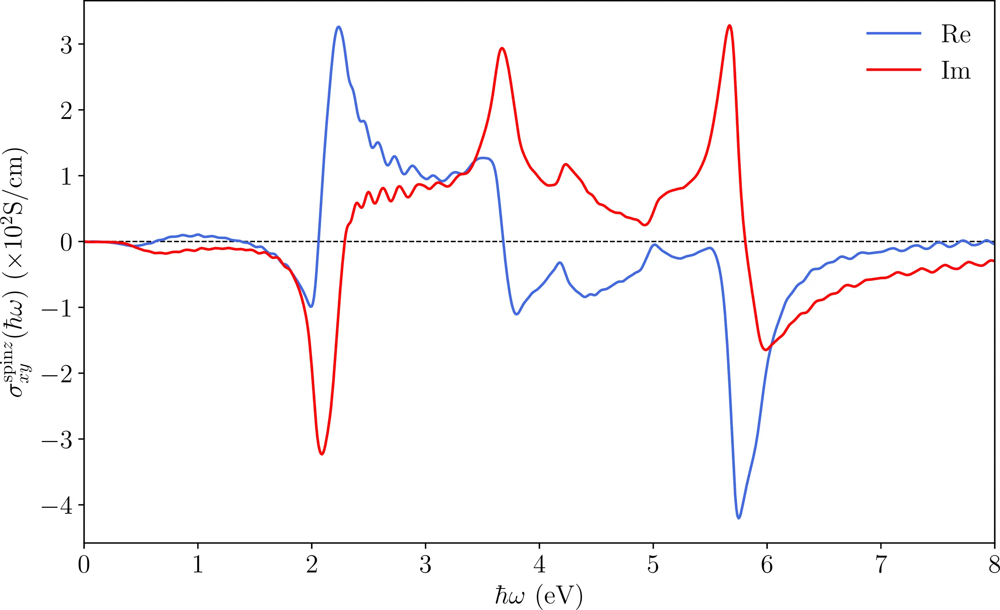
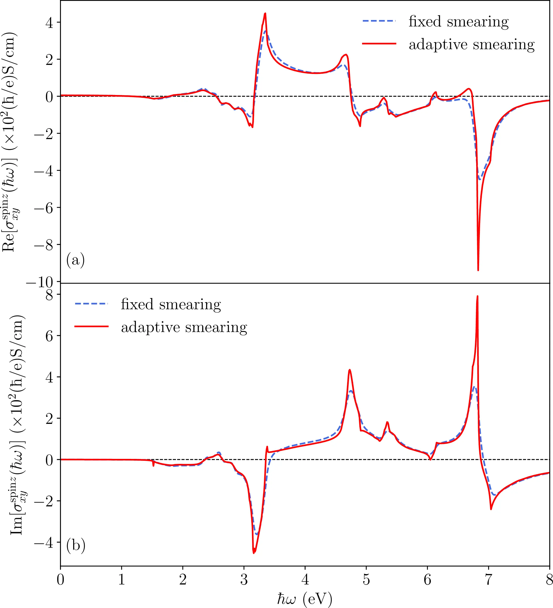

# 30: Gallium Arsenide &#151; Frequency-dependent spin Hall conductivity

- Outline: *Calculate the alternating current (ac) spin Hall conductivity of
    gallium arsenide considering spin-orbit coupling. To gain a better
    understanding of this example, it is suggested to read Ref. [@qiao-prb2018]
    for a detailed description of the theory and Ch. 12.5 of the User Guide.*

- 1-6: *Compute the MLWFs and compute the ac spin Hall conductivity.*

## ac spin Hall conductivity

*The ac SHC of GaAs converges rather slowly with $k$-point sampling, and a
$100 \times 100 \times 100$ kmesh does not yield a well-converged value. To get
a converged SHC value, increase the density of kmesh and then compare the
converged result with those obtained in Refs. [@qiao-prb2018].*

The file `GaAs-shc-freqscan.dat` contains the calculated ac SHC. The snippet
below shows a calculated result with $100\times100\times100$ kmesh, a fixed
smearing width of 0.05 eV and no scissors shift applied.

```text title="100×100×100 kmesh"
#No.   Frequency(eV)   Re(sigma)((hbar/e)*S/cm)   Im(sigma)((hbar/e)*S/cm)
   1     0.000000    -0.68114601E+00    0.00000000E+00
...
 801     8.000000    -0.39471936E+01   -0.29928198E+02
```

The ac SHC is plotted as [Figure 1](#fig30-1).

<figure markdown="span">
{ width="550" }
<figcaption markdown="span"  id="fig30-1">Frequency scan plot for
GaAs ac SHC, using a low kmesh of $100\times100\times100$.</figcaption>
</figure>

If further increasing the density of kmesh to $250\times250\times250$, and using
the adaptive smearing, a nice converged plot could be produced as
[Figure 2](#fig30-2). Note that by using keywords

```vi title="Input file"
shc_bandshift = true
shc_bandshift_firstband = 9
shc_bandshift_energyshift = 1.117
```

a scissors shift of 1.117 eV is applied. [Figure 2](#fig30-2) can be viewed as
[Figure 1](#fig30-1) translated by $\sim1$ eV along the horizontal axis.

<figure markdown="span">
{ width="550" }
<figcaption markdown="span"  id="fig30-2">Frequency scan plots for
GaAs ac SHC, using a dense kmesh of $250\times250\times250$. Two
kinds of smearing are compared.</figcaption>
</figure>
