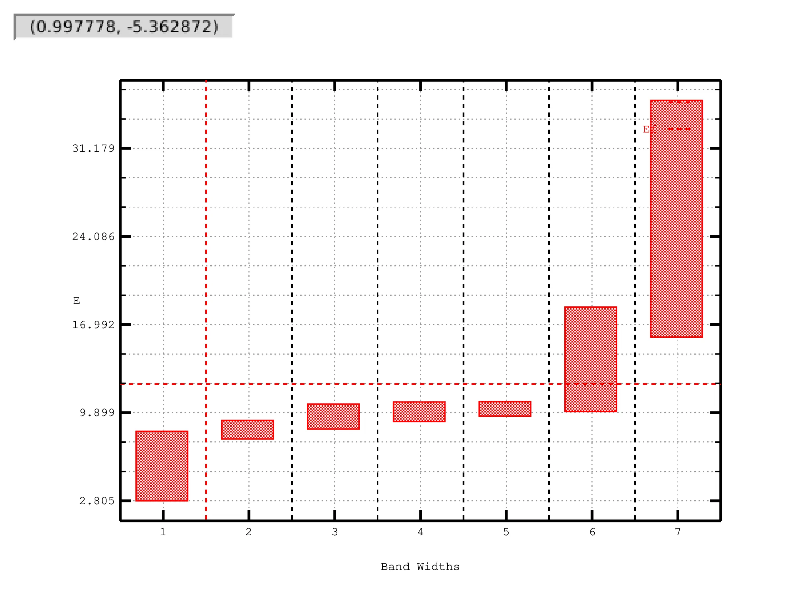
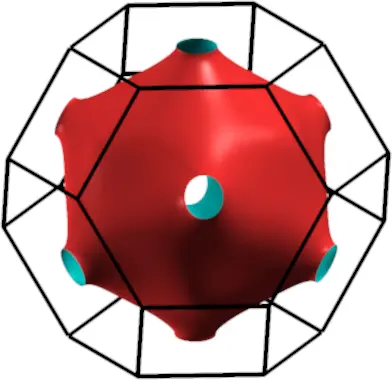
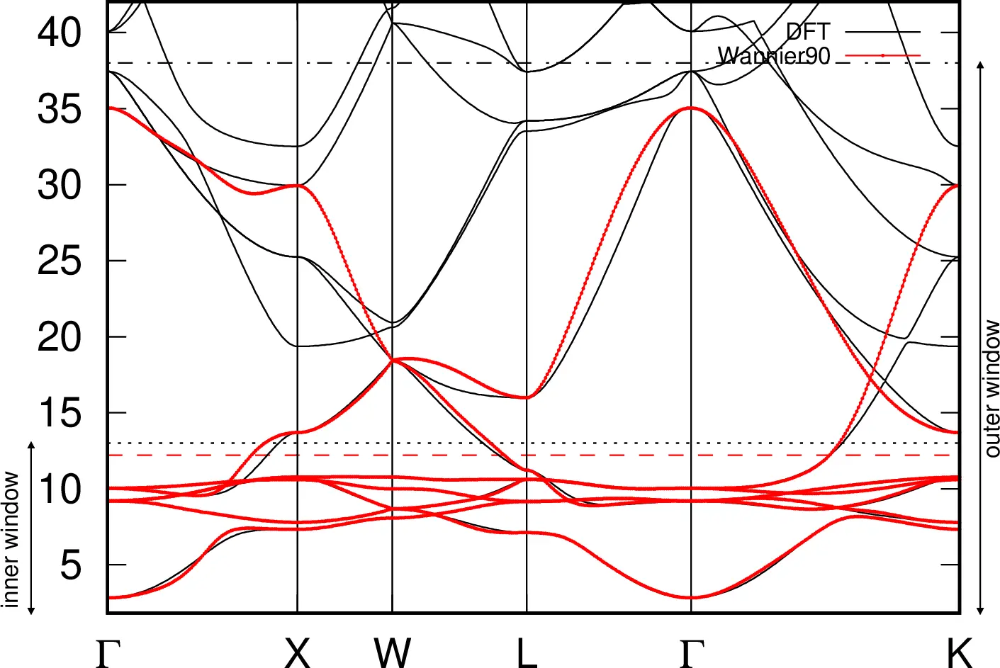
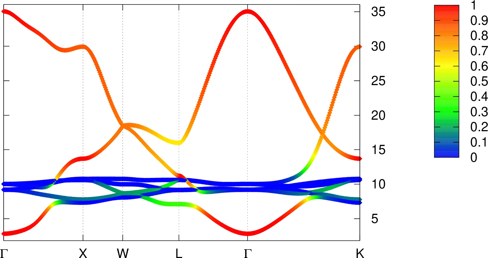
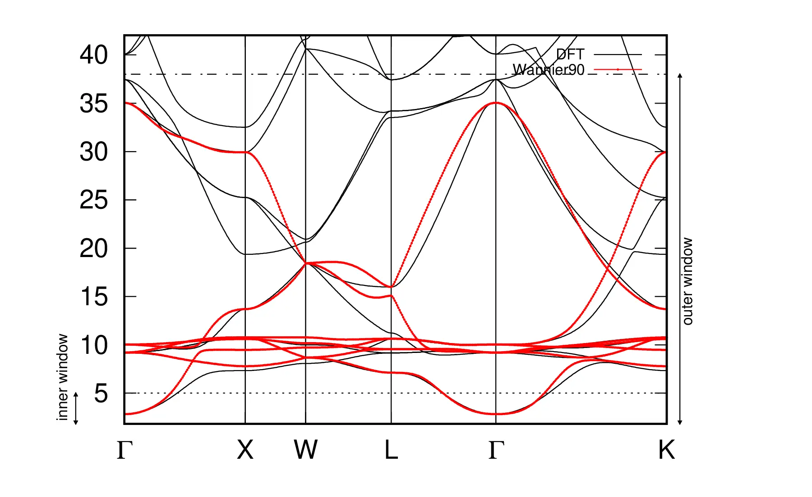
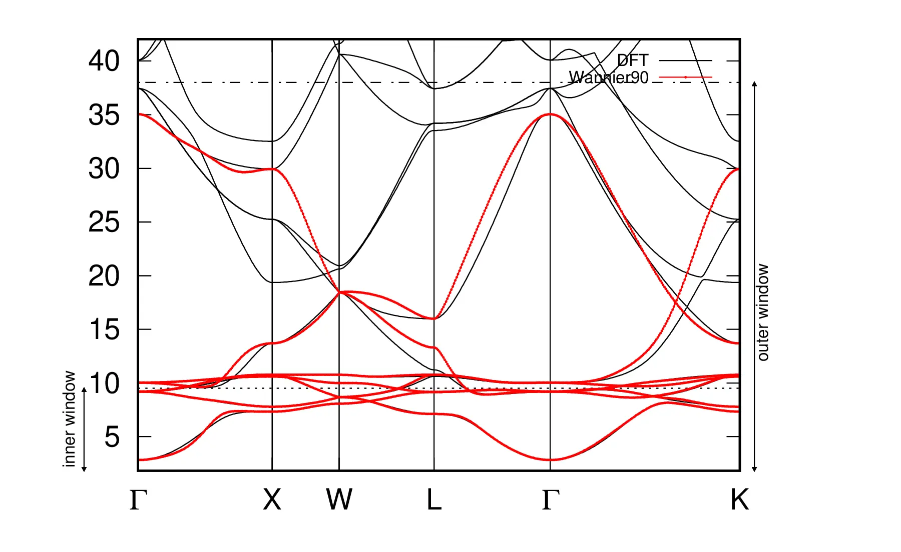
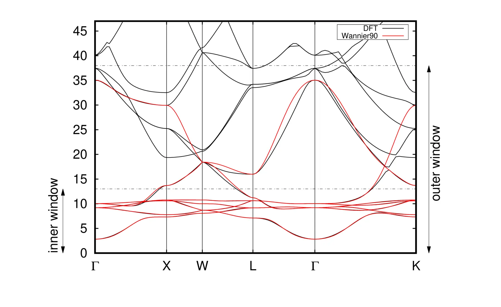
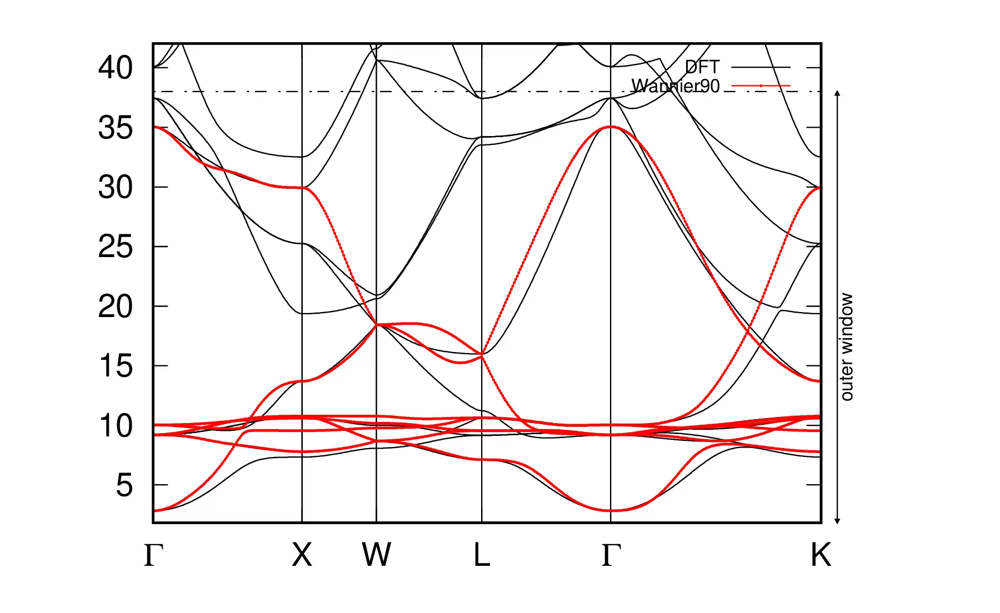
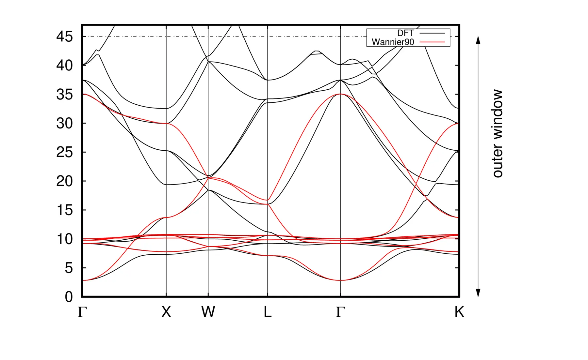

# 4: Copper &#151; Fermi surface, orbital character of energy bands

- Outline: *Obtain MLWFs to describe the states around the Fermi-level in
    copper*

<figure markdown="span">
{ width="250" }
<figcaption markdown="span"  id="fig4-1">Unit cell of Copper
crystal plotted with the XCrySDen program.</figcaption>
</figure>

1. *Run `wannier90` to minimise the MLWFs spread. Inspect the output file
    `copper.wout.`*

    Starting from 5 $d$ orbitals centred on the Copper atom and 2 $s$ orbitals
    in the interstitial regions of the FCC, we obtain the following spreads and
    centres after 200 iterations (extract from the `copper.wout`, a summary of
    the wannierisation is given in [Table 1](#tab4-1).):

    ```text title="Output file"
     Final State
      WF centre and spread    1  ( -0.000000,  0.000000, -0.000000 )     0.40838932
      WF centre and spread    2  ( -0.000000, -0.000000, -0.000000 )     0.30784969
      WF centre and spread    3  ( -0.000000, -0.000000,  0.000000 )     0.30784979
      WF centre and spread    4  ( -0.000000, -0.000000,  0.000000 )     0.40838973
      WF centre and spread    5  (  0.000000, -0.000000, -0.000000 )     0.30784886
      WF centre and spread    6  ( -0.902512,  0.902512,  0.902512 )     1.14385632
      WF centre and spread    7  (  0.902512, -0.902512, -0.902512 )     1.14385635
      Sum of centres and spreads (  0.000000, -0.000000, -0.000000 )     4.02804006

             Spreads (Ang^2)       Omega I      =     3.662691490
            ================       Omega D      =     0.001894482
                                   Omega OD     =     0.363454087
        Final Spread (Ang^2)       Omega Total  =     4.028040058
     ------------------------------------------------------------------------------
    ```

    We can readily see that looking at the individual spreads we find two groups
    of MLWFs, a group of 5 $d$-like MLWFs centred on the Copper atom, whose
    spreads are $0.4084$ Å$^2$ and $0.3078$ Å$^2$ respectively, and a group of 2
    $s$-like MLWFs centred on two opposite (with respect to the origin)
    interstitial points, whose spread is $1.1439$ Å$^2$. The 3+2 $d$-like MLWFs
    are the basis of two representations of the $O_h$ group, with character
    $t2_g$ and $e_g$ respectively.

    <a id="tab4-1"></a>
    **Table 1.** Converged values of the components of spread functional and
    their sum, given in Å$^2$.

    | MP mesh | $\Omega$ | $\Omega_{\text{I}}$ | $\Omega_{\text{OD}}$ | $\Omega_{\text{D}}$ |
    |---|---|---|---|---|
    | $4\times4\times4$ | 4.028 | 3.66 | 0.363 | 0.002 |

2. *Plot the Fermi surface, it should look familiar! The Fermi energy is at
    12.2103 eV.*

    As explained in example 2 of the tutorial, we need to add the following
    lines to the input file (`copper.win`):

    ```text
    restart = plot
    fermi_energy = 12.2103
    fermi_surface_plot = true
    fermi_surface_num_points = 50
    ```

    and re-run the `wannier90` executable. The result will be a file named
    `copper.bxsf`, which contains volumetric data in a format suitable for
    `xcrysden`. There is only one band that crosses the Fermi level (12.2103
    eV), i.e. band 6, as shown in [Figure 2](#fig4-2)-a. The corresponding Fermi
    surface is shown in [Figure 2](#fig4-2)-b.

    <figure markdown="1">

    |  |  |
    |:-:|:-:|
    | { width="320" } | { width="320" } |

    <figcaption markdown="span"  id="fig4-2">Fermi surfaces for
    band 6 in copper. The value of the Fermi energy is 12.2103 eV,
    and it was obtained from DFT calculation, with a
    $4\times4\times4$ $\mathbf{k}$-point mesh. To calculate the
    band energies and to plot Fermi surfaces, Wannier interpolation
    was employed on a dense mesh in the Brillouin zone consisting
    of $50^3$ points.</figcaption>
    </figure>

3. *Plot the interpolated bandstructure.*

    Interpolated bandstructure, with path in k-space given in the tutorial, is
    shown in [Figure 3](#fig4-3).

    <figure markdown="span">
    { width="650" }
    <figcaption markdown="span"  id="fig4-3">Interpolated
    bandstructure of Copper (solid red) showing the position of the
    Fermi level (dashed red) and both inner and outer windows
    (dotted and dashed-dotted respectively). The reference DFT
    bandstructure (solid black) was obtained with Quantum ESPRESSO,
    see procedure in Example 6.</figcaption>
    </figure>

4. *Plot the contribution of the interstitial WF to the bandstructure.*

    The contribution of the 2 $s$-like MLWFs to the band structure is shown in
    [Figure 4](#fig4-4).

    <figure markdown="span">
    { width="700" }
    <figcaption markdown="span"  id="fig4-4">Bandstructure of
    Copper showing the contribution from the 2 $s$-like MLWFs in
    red.</figcaption>
    </figure>

    Extra: *Investigate the effect of the outer and inner energy window on the
    interpolated bands.*

    From now on, we will refer to the inner window energy level as
    $\varepsilon_{\mathrm{in}}$ and to the outer window energy level as
    $\varepsilon_{\mathrm{out}}$. The reference values are in this case
    $\varepsilon_{\mathrm{in}}^0 = 13$ eV and
    $\varepsilon_{\mathrm{out}}^0 = 38$ eV. Hereafter, we will use
    $\varepsilon_{\mathrm{min}}$ to refer to the minimum energy eigenvalue (for
    the chosen path). The value of $\varepsilon_{\mathrm{out}}^0$ must be chosen
    such that there are at least $N_{\mathrm{wannier}}$ (7 in this case) states
    inside the outer energy window for each $\mathbf{k}$-point. This means that
    for a given path in the BZ there exists a lower bound to
    $\varepsilon_{\mathrm{out}}^0$. The actual value depends on the path in the
    BZ and on the choice of the zero for the pseudopotential. The result for
    several values of $\varepsilon_{\mathrm{in}}$ and
    $\varepsilon_{\mathrm{out}}$ are shown in [Figure 5](#fig4-5).

    <figure markdown="1">

    |  |  |
    |:-:|:-:|
    | { width="320" } | { width="320" } |
    | { width="320" } | { width="320" } |
    | { width="320" } | { width="320" } |

    <figcaption markdown="span"  id="fig4-5">Interpolated
    bandstructure of Copper (solid red) with DFT reference (solid
    black) and different values of the inner window. a.
    $\varepsilon_{\mathrm{in}} = 5$ eV,
    $\varepsilon_{\mathrm{out}}=\varepsilon_{\mathrm{out}}^0$. b.
    $\varepsilon_{\mathrm{in}} = 9.5$ eV,
    $\varepsilon_{\mathrm{out}}=\varepsilon_{\mathrm{out}}^0$. c.
    $\varepsilon_{\mathrm{in}} = \varepsilon_{\mathrm{in}}^0$,
    $\varepsilon_{\mathrm{out}}=\varepsilon_{\mathrm{out}}^0$. d.
    $\varepsilon_{\mathrm{in}} = 15$ eV,
    $\varepsilon_{\mathrm{out}}=\varepsilon_{\mathrm{out}}^0$. e.
    $\varepsilon_{\mathrm{in}}=\varepsilon_{\mathrm{min}}$,
    $\varepsilon_{\mathrm{out}}=\varepsilon_{\mathrm{out}}^0$. f.
    $\varepsilon_{\mathrm{in}}=\varepsilon_{\mathrm{min}}$,
    $\varepsilon_{\mathrm{out}}= 45$ eV.</figcaption>
    </figure>
