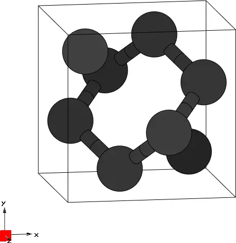
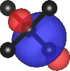
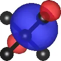
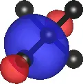

# 5: Diamond &#151; MLWFs for the valence bands

- Outline: *Obtain MLWFs for the valence bands of diamond.*

<figure markdown="span">
{ width="250" }
<figcaption markdown="span"  id="fig5-1">Unit cell of Diamond crystal plotted with the XCrySDen program.</figcaption>
</figure>

1. *Run pwscf to obtain the ground state of diamond.*

    Convergence of the self-consistent field calculation in Quantum Espresso can be checked at the end of the `scf.out` file. At the very end of the file one should find the line confirming that the job has finished without crashing, e.g.

    ```text title="Output file"
    =------------------------------------------------------------------------------=
       JOB DONE.
    =------------------------------------------------------------------------------=
    ```

    Depending on the output verbosity one may or may not find info about WALL times for the calls to the different routines. Just above this block, if present, one may find the info about the convergence of the SCF loop, such as the scf accuracy and the number of iterations to required to achieve it:

    ```text title="Output file"
        !    total energy              =     -22.58128615 Ry
             Harris-Foulkes estimate   =     -22.58128615 Ry
             estimated scf accuracy    <          1.0E-14 Ry


             The total energy is the sum of the following terms:

             one-electron contribution =      11.69117931 Ry
             hartree contribution      =       1.57036314 Ry
             xc contribution           =      -7.58421586 Ry
             ewald contribution        =     -28.25861274 Ry

             convergence has been achieved in   9 iterations
    ```

2. *Run pwscf to obtain the Bloch states on a uniform k-point grid.*

    Similarly for the non-scf calculation one can check that the calculation has been carried out without crashing by looking at the last three line of the `nscf.out` file. A useful information to check is the value of the highest eigenvalue (for insulators and semiconductors) or the value of the Fermi level (for metals). In the diamond we case, we find:

    ```text title="Output file"
    highest occupied level (ev):    19.3978
    ```

3. *Run `wannier90` to compute the MLWFs.*

    The result of the wannierisation, after 20 iterations, may be found at the end of `diamond.wout` file:

    ```text title="Output file"
     Final State
      WF centre and spread    1  ( -0.000000,  0.000000, -0.000000 )     0.58022623
      WF centre and spread    2  ( -0.806995,  0.806995,  0.000000 )     0.58022623
      WF centre and spread    3  ( -0.000000,  0.806995,  0.806995 )     0.58022623
      WF centre and spread    4  ( -0.806995, -0.000000,  0.806995 )     0.58022623
      Sum of centres and spreads ( -1.613990,  1.613990,  1.613990 )     2.32090491

             Spreads (Ang^2)       Omega I      =     1.954619859
            ================       Omega D      =     0.000000000
                                   Omega OD     =     0.366285054
        Final Spread (Ang^2)       Omega Total  =     2.320904912
     ------------------------------------------------------------------------------
    ```

    Extra: *Plot the 4 MLWFs.*

    The resulting 4 $\sigma$-bonding MLWFs are shown in [Figure 2](#fig5-2)

<figure markdown="span">
<div class="grid-figure" markdown="1">
{ width="170" }
{ width="170" }
{ width="170" }
{ width="170" }
</div>
<figcaption markdown="span"  id="fig5-2">4 MLWFs in diamond describing the valence bands plotted using VESTA.</figcaption>
</figure>
