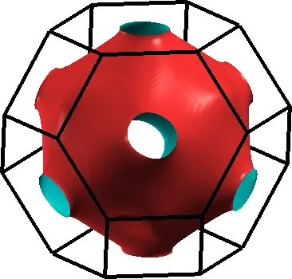
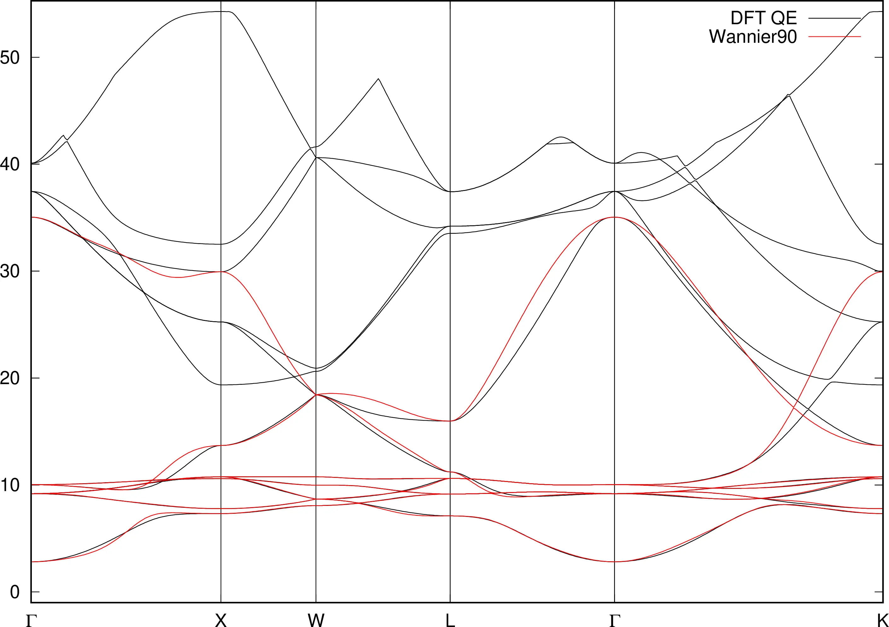
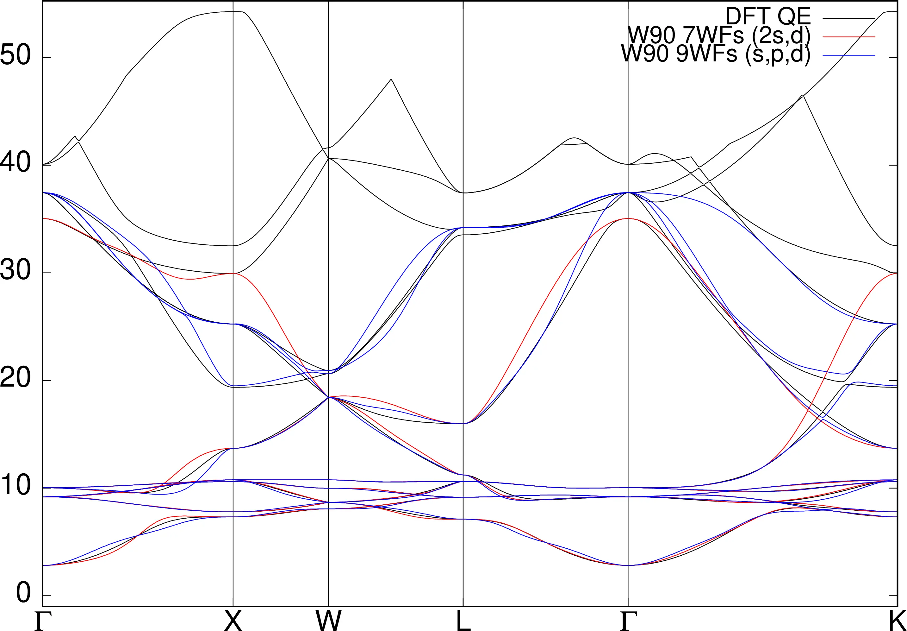
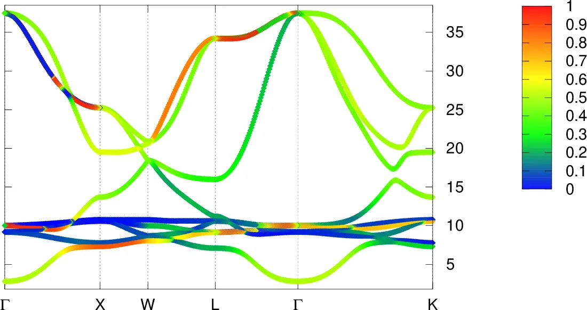

# 6: Copper &#151; Fermi surface

- Outline: *Obtain MLWFs to describe the states around the Fermi-level in
    copper.*

<figure markdown="span">
{ width="250" }
<figcaption markdown="span"  id="fig6-1">Unit cell of Copper
crystal plotted with the XCrySDen program.</figcaption>
</figure>

After checking that the calculations have converged as shown in
[Example 5](tutorial_solution_5.md), one can proceed with other points in the
example.

1. *Use Wannier interpolation to obtain the Fermi surface of copper.*

    To obtain the value of the Fermi energy we can use the `grep` command (only
    for Linux/Unix systems) as:

    ```text
    > grep Fermi nscf.out
    ```

    The output should be:

    ```text
         the Fermi energy is    12.9344 ev
    ```

    Alternatively, one can open the `nscf.out` file with the editor of choice
    and search for "Fermi" inside the file. We can then use this value in the
    `.win` file to compute the Fermi surface as done in
    [Example 2](tutorial_solution_2.md). The interpolated Fermi surface is shown
    in [Figure 2](#fig6-2)-a.

    <figure markdown="1">

    |  |  |
    |:-:|:-:|
    | { width="280" } | { width="500" } |

    <figcaption markdown="span"  id="fig6-2">a. Fermi surface of
    Copper. b. Band structure of Copper along the
    &Gamma;&ndash;X&ndash;W&ndash;L&ndash;&Gamma;&ndash;K computed
    from a non-scf DFT calculation (solid black) and via Wannier
    interpolation (solid red).</figcaption>
    </figure>

2. *Plot the interpolated bandstructure.*

    Bandstructure is shown in [Figure 2](#fig6-2)-b. One way to obtain the DFT
    bandstructure on exactly the same path as the one in the `.win` input file,
    is given by the `bands.x` program available at
    <http://www.tcm.phy.cam.ac.uk/~jry20/bands.html>.

    <figure markdown="1">

    |  |  |
    |:-:|:-:|
    | { width="350" } | { width="420" } |

    <figcaption markdown="span"  id="fig6-3">a. Bandstructure of
    Copper along the
    &Gamma;&ndash;X&ndash;W&ndash;L&ndash;&Gamma;&ndash;K from a
    non-scf DFT calculation (solid black) and via Wannier
    interpolation using two different sets of initial projections,
    namely $2s$ and 5$d$ ($N_w =7$) (solid red) and 1$s$ 3$p$ and
    5$d$ ($N_w=9$) (solid blue). b. $p$ character of bands computed
    using `bands_plot_project = 2,3,4` in the input file. A color
    scheme is used to measure the $p$ *character* of the bands.</figcaption>
    </figure>

## BANDS.X minitutorial

Here we summarize the main steps to produce the bandstructure with the `bands.x`
code:

**Compilation:**

```text
eg. g95 -o bands.x bands.F90

    ifort -o bands.x bands.F90

for NAG

    f95 -o bands.x bands.F90 -DNAG
```

**Usage:** First you need to generate an `copper.inp` file, with the following
structure

```text
! Input file for Copper
!
! First the unit cell (in atomic units = Bohr)
-3.411 0.000 3.411
 0.000 3.411 3.411
-3.411 3.411 0.000

!then the number of points along the 1st special path
100

! then the special kpoints and their labels
G 0.00  0.00  0.00    X 0.50  0.50  0.00
X 0.50  0.50  0.00    W 0.50  0.75  0.25
W 0.50  0.75  0.25    L 0.00  0.50  0.00
L 0.00  0.50  0.00    G 0.00  0.00  0.00
G 0.00  0.00  0.00    K 0.00  0.50 -0.50
```

Then you need to generate the kpoint list by running the `bands.x` program with
the `-pp` flag

```text
> ./bands.x -pp copper
```

This will read data from `copper.inp` and write kpoints into `copper_band.kpt`.

**WARNING**: if you already have a `copper_band.kpt` file from a previous
Wannier90 calculation, running the above command will overwrite it.

Now you need to calculate a non-scf or bands calculation with Quantum ESPRESSO
on the k-points given in `copper_band.kpt`. To do so, copy the `copper.nscf` to
`copper.bands` and modify it accordingly. Run a non-scf calculation

```text
> pw.x < copper.bands > copper.pwscf
```

**WARNING**: the output file must terminate with `.pwscf` in order to be read by
`bands.x`.

Now extract the bands from the `copper.pwscf` file

```text
> bands.x copper
```

The bands are written into `copper_band.dat`. WARNING: if you already have a
`coppper_band.dat` file and a `copper_band.gnu` file from a previous Wannier90
calculation, running the above command will overwrite them.

Plot with gnuplot

```text
> gnuplot --persist copper_band.gnu
```

Extra 1: *Compare the Wannier interpolated bandstructure with the full pwscf
bandstructure. Obtain MLWFs using a denser k-point grid.*

Extra 2: *Investigate the effects of the outer and inner energy windows on the
interpolated bands.*

The effect of different energy windows has already been discussed in the
[Example 4](tutorial_solution_4.md), so it won't be repeated here.

Extra 3: *Instead of extracting a subspace of seven states, we could extract a
nine dimensional space (i.e., with $s$, $p$ and $d$ character). Examine this
case and compare the interpolated bandstructures.*

Using $s,p$, and $d$ orbitals as initial guesses for the MLWFs of Copper, yields
the bandstructure (solid blue) shown in [Figure 3](#fig6-3) (with reference
values for the inner and outer windows). The bandstructure obtained starting
from $2s$ and $5d$ orbitals is shown in red, whereas the DFT reference
bandstructure, computed with the procedure described above, is in black. It is
clear from [Figure 3](#fig6-3)-a, and [Figure 3](#fig6-3)-b that the bands of
interest have very little $p$ character, particularly the 5 flat bands, which
are well very described by $d$ states.
