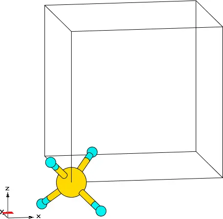

# 7: Silane (SiH₄) &#151; Molecular MLWFs using Γ-point sampling

- Outline: *Obtain MLWFs for the valence bands of silane.*

<figure markdown="span">
{ width="250" }
<figcaption markdown="span"  id="fig7-1">Silane molecule in a periodic cell plotted with the XCrySDen program.</figcaption>
</figure>

1. Convergence of the self-consistent field calculation in Quantum Espresso can be checked at the end of the `scf.out` file. At the very end of the file one should find the line confirming that the job has finished without crashing, e.g.

    ```text title="Output file"
    =------------------------------------------------------------------------------=
       JOB DONE.
    =------------------------------------------------------------------------------=
    ```

    Just above the block reporting the info about WALL times, if present, one may find the info about the convergence of the SCF loop, such as the scf accuracy and the number of iterations required to achieve it:

    ```text title="Output file"
    !    total energy              =     -12.25602944 Ry
         Harris-Foulkes estimate   =     -12.25602944 Ry
         estimated scf accuracy    <          7.0E-11 Ry

             The total energy is the sum of the following terms:

             one-electron contribution =      11.69117931 Ry
             hartree contribution      =       1.57036314 Ry
             xc contribution           =      -7.58421586 Ry
             ewald contribution        =     -28.25861274 Ry

             convergence has been achieved in   9 iterations
    ```

2. Similarly for the non-scf calculation one can check that the calculation has been carried out without crashing by looking at the last three line of the `nscf.out` file. A useful information to check is the value of the highest eigenvalue (for insulators and semiconductors) or the value of the Fermi level (for metals). In the diamond we case, we find:

    ```text title="Output file"
    highest occupied level (ev):    -6.5316
    ```

**5.** The result of the wannierisation, after 20 iterations, may be found at the end of `silane.wout` file:

```text title="Output file"
 Final State
  WF centre and spread    1  (  0.762490,  0.762490,  0.762490 )     1.01124580
  WF centre and spread    2  (  0.762491, -0.762492, -0.762491 )     1.01124445
  WF centre and spread    3  ( -0.762491,  0.762490, -0.762491 )     1.01124473
  WF centre and spread    4  ( -0.762491, -0.762491,  0.762491 )     1.01124420
  Sum of centres and spreads ( -0.000002, -0.000003, -0.000001 )     4.04497917

         Spreads (Ang^2)       Omega I      =     3.920639090
        ================       Omega D      =     0.000000000
                               Omega OD     =     0.124340085
    Final Spread (Ang^2)       Omega Total  =     4.044979175
 ------------------------------------------------------------------------------
```
