# 8: Iron &#151; Spin-polarized WFs, DOS, projected WFs versus MLWFs

- Outline: *Generate both maximally-localized and projected Wannier functions for ferromagnetic bcc Fe. Calculate the total and orbital-projected density of states by Wannier interpolation.*

<figure markdown="span">
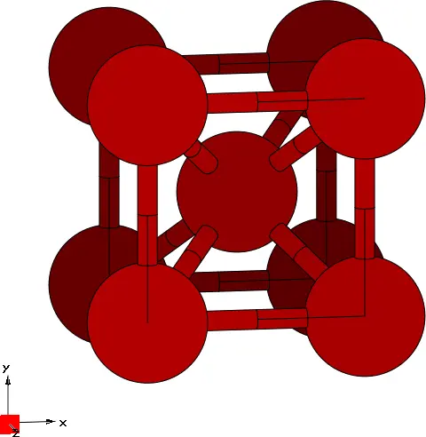{ width="250" }
<figcaption markdown="span"  id="fig8-1">Unit cell of Iron crystal plotted with the XCrySDen program.</figcaption>
</figure>

**1-5.** *Converged values for the total spread functional and its components for both spin channels are shown in [Table 1](#tab8-1).*

The final state for spin-up MLWFs is

```text title="Output file"
 Final State
  WF centre and spread    1  (  0.709852,  0.000108,  0.000131 )     1.08935224
  WF centre and spread    2  (  0.000131,  0.000053, -0.709852 )     1.08935218
  WF centre and spread    3  ( -0.709852, -0.000108, -0.000131 )     1.08935221
  WF centre and spread    4  (  0.000108, -0.709852, -0.000053 )     1.08935218
  WF centre and spread    5  ( -0.000131, -0.000053,  0.709852 )     1.08935226
  WF centre and spread    6  (  0.000000,  0.000000,  0.000000 )     0.43234428
  WF centre and spread    7  ( -0.000000,  0.000000,  0.000000 )     0.43234429
  WF centre and spread    8  ( -0.000108,  0.709852,  0.000053 )     1.08935225
  WF centre and spread    9  (  0.000000,  0.000000, -0.000000 )     0.43234428
  Sum of centres and spreads (  0.000000, -0.000000, -0.000000 )     7.83314616

         Spreads (Ang^2)       Omega I      =     5.948424630
        ================       Omega D      =     0.017027691
                               Omega OD     =     1.867693841
    Final Spread (Ang^2)       Omega Total  =     7.833146162
 ------------------------------------------------------------------------------
```

and for spin-down MLWFs is

```text title="Output file"
 Final State
  WF centre and spread    1  ( -0.685467, -0.000123,  0.000259 )     1.10268580
  WF centre and spread    2  ( -0.000259, -0.000207, -0.685467 )     1.10268617
  WF centre and spread    3  (  0.685468,  0.000123, -0.000259 )     1.10268605
  WF centre and spread    4  ( -0.000123,  0.685467, -0.000207 )     1.10268595
  WF centre and spread    5  (  0.000259,  0.000207,  0.685467 )     1.10268552
  WF centre and spread    6  (  0.000000,  0.000000, -0.000000 )     0.41116646
  WF centre and spread    7  ( -0.000000,  0.000000, -0.000000 )     0.41116648
  WF centre and spread    8  (  0.000123, -0.685467,  0.000207 )     1.10268572
  WF centre and spread    9  (  0.000000,  0.000000,  0.000000 )     0.41116644
  Sum of centres and spreads (  0.000000, -0.000000,  0.000000 )     7.84961460

         Spreads (Ang^2)       Omega I      =     5.946718376
        ================       Omega D      =     0.014524283
                               Omega OD     =     1.888371944
    Final Spread (Ang^2)       Omega Total  =     7.849614603
 ------------------------------------------------------------------------------
```

As it is clear from the output file snippets above, the $s,p$ and $d$ orbitals hybridize to give rise to two groups of functions for both spin channels. A first group made of 6 MLWFs coming from the hybridisation of $sp^3$ and $d_{e_g}$ MLWFs, with a total spread of 1.089(1.103) Å$^2$ for spin-up(down). A second group made of 3 MLWFs with a $d_{t_{2g}}$ character, with a total spread of 0.432(0.4112) Å$^2$ for spin-up(down). Two sample MLWFs, one for each group, are shown in [Figure 2](#fig8-2).

<figure markdown="span">
<div class="grid-figure" markdown="1">
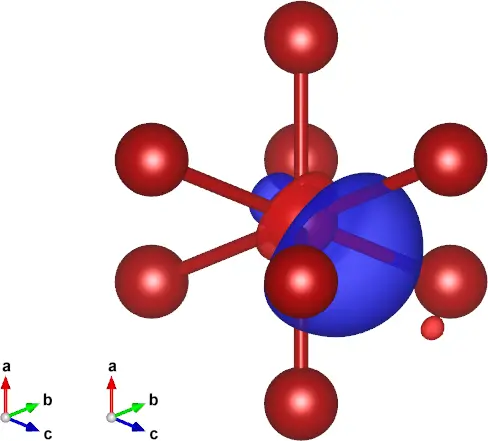{ width="300" }
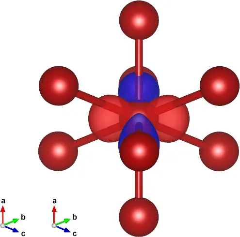{ width="300" }
</div>
<figcaption markdown="span"  id="fig8-2">2 representative MLWFs from the wannierisation of 9 spin-up bands of iron. a. A representative of the hybrid ($sp^3$ and $d_{e_g}$) group of MLWFs. b. A representative of the $d_{t_{2g}}$ group of MLWFs.</figcaption>
</figure>

<a id="tab8-1"></a>
**Table 1.** Converged values of the components of spread functional and their sums for both spin chanels for ferromagnetic bcc Fe, given in Å$^2$.

| spin | $\Omega$ | $\Omega_{\text{I}}$ | $\Omega_{\text{OD}}$ | $\Omega_{\text{D}}$ | $N_{\mathrm{iter}}$ |
|---|---|---|---|---|---|
| up | 7.8331 | 5.9484 | 1.8677 | 0.0170 | 400 |
| down | 7.8496 | 5.9467 | 1.8884 | 0.0145 | 400 |

## Density of states

- *run `postw90` and plot the DOS with `gnuplot`*

<figure markdown="span">
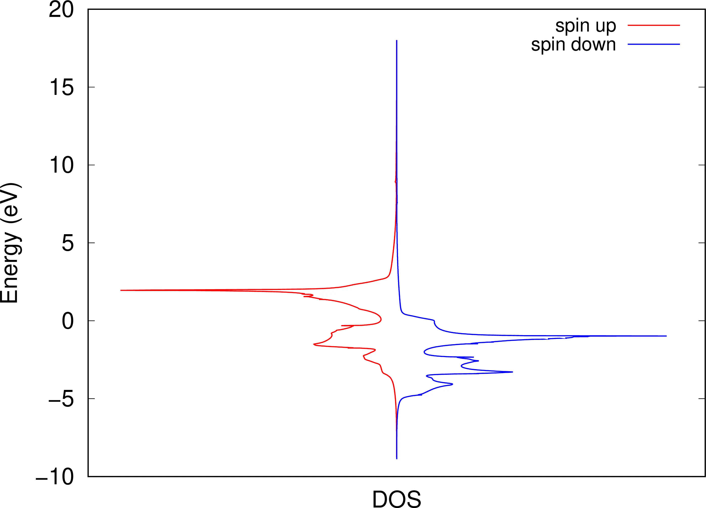{ width="550" }
<figcaption markdown="span"  id="fig8-3">Interpolated DOS of bcc iron on a $25\times25\times25$ $\mathbf{k}$-mesh. Up-spin channel (solid red). Down-spin channel (solid blue).</figcaption>
</figure>

- *Check the convergence by repeating the DOS calculations with more k-points.*

    Plots of the DOS calculated with different k-point mesh densities for the spin-down channel are shown in [Figure 4](#fig8-4), panel a. In [Figure 4](#fig8-4), panels b, c and d we show the convergence of the DOS for the spin-down channel, spin-up channel and both spin channels respectively. The convergence is assessed by looking at the number of states $N$ computed by integrating the DOS up to the Fermi level using the formula

    $$N_{\uparrow/\downarrow} = \int_{-\infty}^{\epsilon_F}\!\! \mathrm{d}\epsilon\,\, f_{\text{MV}}(\epsilon,\uparrow/\downarrow)\, g(\epsilon,\uparrow/\downarrow),$$

    where $f_{\text{MV}}(\epsilon,\uparrow) = \int_{-\infty}^{\epsilon} \mathrm{d}\epsilon'\,\widetilde{\delta}(\epsilon')$ is the Marzari-Vanderbilt occupation number function, with

    $$\widetilde{\delta}(x) = \frac{2}{\sqrt{\pi}}e^{-[x-(1/\sqrt{2})]^2}(2\,-\,\sqrt{2}x), \quad x=\frac{\mu-\epsilon}{\sigma},$$

    where $\epsilon_F$ is the Fermi energy ($12.6256$ eV) and $\sigma$ is the smearing ($0.02$ eV). $g(\epsilon,\uparrow)$ is the DOS from `wannier90` interpolation.

    <figure markdown="span">
    <div class="grid-figure" markdown="1">
    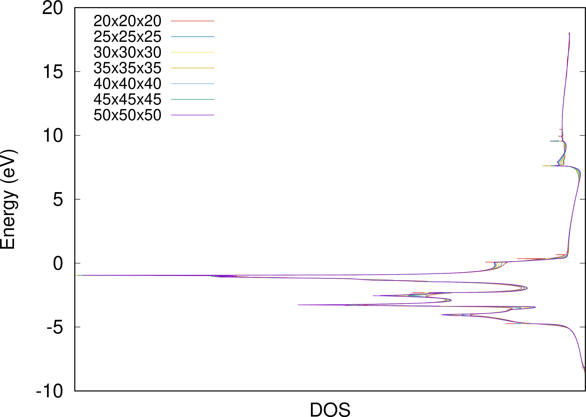{ width="320" }
    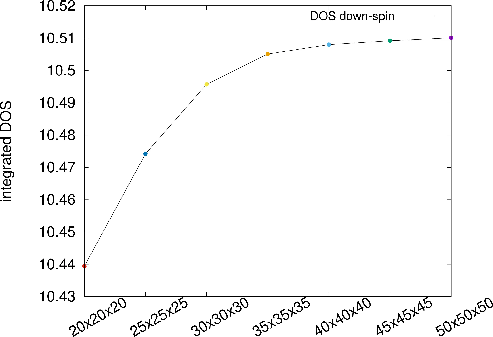{ width="320" }
    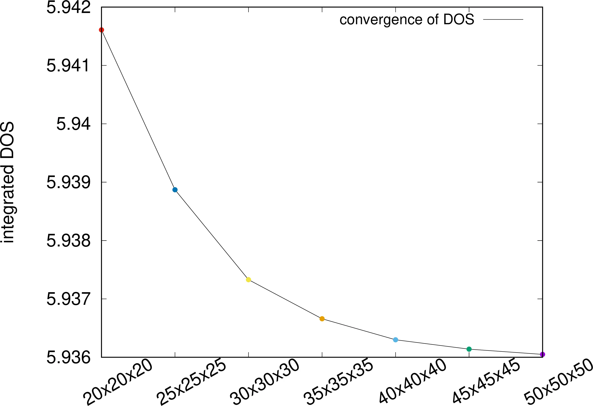{ width="320" }
    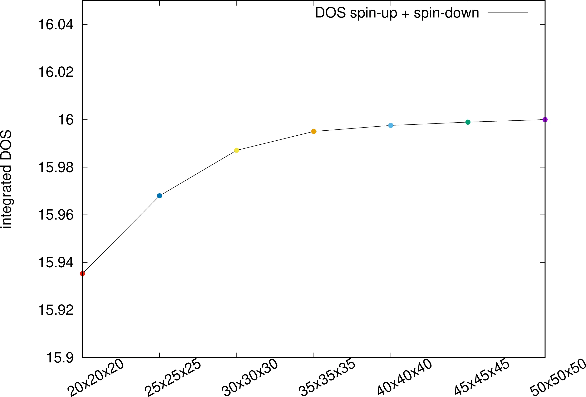{ width="320" }
    </div>
    <figcaption markdown="span"  id="fig8-4">a. Interpolated DOS for the down-spin channel of bcc iron for different $\mathbf{k}$-mesh sizes. b. Corresponding integrated DOS ($N_\downarrow$). c. Integrated DOS for the up-spin channel ($N_\uparrow$). d. Integrated DOS for both channels ($N_{\uparrow+\downarrow}$), scaled such as the final value is equal to the total number of electrons. The integral of the DOS is used as a convergence criterion.</figcaption>
    </figure>

## Projected versus maximally-localized Wannier functions

- *Open one of the `.wout` files and search for "Initial state"; those are the projected WFs.*

    For the spin-up channel one finds

    ```text title="Output file"
     Initial State
      WF centre and spread    1  ( -0.000000, -0.000000, -0.000000 )     2.25930561
      WF centre and spread    2  ( -0.000000,  0.000000, -0.000000 )     2.32454089
      WF centre and spread    3  (  0.000000,  0.000000, -0.000000 )     2.32428592
      WF centre and spread    4  (  0.000000, -0.000000, -0.000000 )     2.32428592
      WF centre and spread    5  ( -0.000000,  0.000000, -0.000000 )     0.54443303
      WF centre and spread    6  (  0.000000, -0.000000, -0.000000 )     0.51353680
      WF centre and spread    7  (  0.000000,  0.000000, -0.000000 )     0.51353680
      WF centre and spread    8  (  0.000000,  0.000000, -0.000000 )     0.54447716
      WF centre and spread    9  (  0.000000,  0.000000,  0.000000 )     0.51347734
      Sum of centres and spreads (  0.000000, -0.000000, -0.000000 )    11.86187946
    ```

    It is clear from the spreads and the centres that these are the projected WFs. In particular, WF 1 is the $s$-projected WF. WF 2-4 are the $p$-projected WFs and WF 5-9 are the $d$-projected WF, with $e_g$ (5,8) and $t2_g$ (6,7,9) charachter, respectively (see [Figure 5](#fig8-5)).

    <figure markdown="span">
    <div class="grid-figure" markdown="1">
    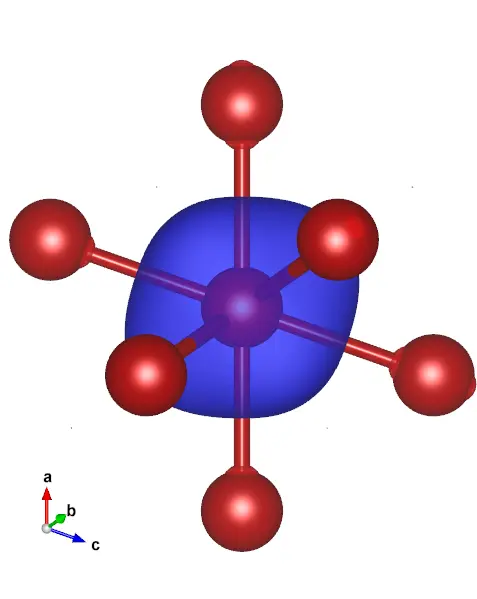{ width="240" }
    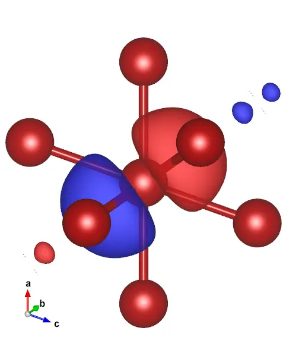{ width="240" }
    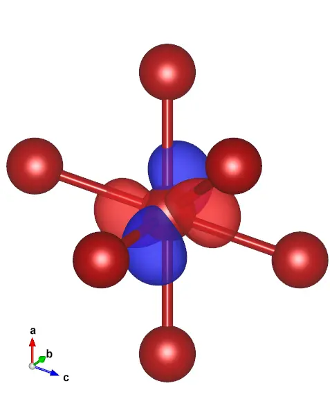{ width="240" }
    </div>
    <figcaption markdown="span"  id="fig8-5">3 representative MLWFs from the wannierisation via projections of 9 spin-up bands of iron. a. MLWF from projection onto 1 $s$ orbital. b. A representative of the MLWFs from projection onto $p$ orbitals. c. A representative of the MLWFs from projection onto $d$ orbitals.</figcaption>
    </figure>

- The Wannier spreads have re-organized in two groups, 6+3; moreover, the six more diffuse WFs are off-centred: the initial atomic-like orbitals hybridized with one another, becoming more localized in the process.

    ```text title="Output file"
     Final State
      WF centre and spread    1  ( -0.709852,  0.000191,  0.000015 )     1.08935227
      WF centre and spread    2  ( -0.000015, -0.000041, -0.709852 )     1.08935223
      WF centre and spread    3  (  0.709852, -0.000191, -0.000015 )     1.08935227
      WF centre and spread    4  ( -0.000191, -0.709852,  0.000041 )     1.08935226
      WF centre and spread    5  (  0.000015,  0.000041,  0.709852 )     1.08935227
      WF centre and spread    6  ( -0.000000, -0.000000,  0.000000 )     0.43234437
      WF centre and spread    7  (  0.000000,  0.000000,  0.000000 )     0.43234440
      WF centre and spread    8  (  0.000191,  0.709852, -0.000041 )     1.08935228
      WF centre and spread    9  ( -0.000000,  0.000000,  0.000000 )     0.43234438
      Sum of centres and spreads ( -0.000000, -0.000000, -0.000000 )     7.83314672
    ```

- *The first plateau corresponds to atom-centred WFs of separate s, p, and d character, and the sharp drop signals the onset of the hybridization. With hindsight, we can redo steps 4 and 5 more efficiently using trial orbitals with the same character as the final MLWFs,*

    ```text
    Fe : sp3d2;dxy;dxz;dyz
    ```

    With this choice the minimization converges much more rapidly as can be seen in [Figure 6](#fig8-6), panel a.

- *Let us recompute the DOS using, instead of MLWFs, the WFs obtained by projecting onto s, p, and d-type trial orbitals.*

    <figure markdown="span">
    <div class="grid-figure" markdown="1">
    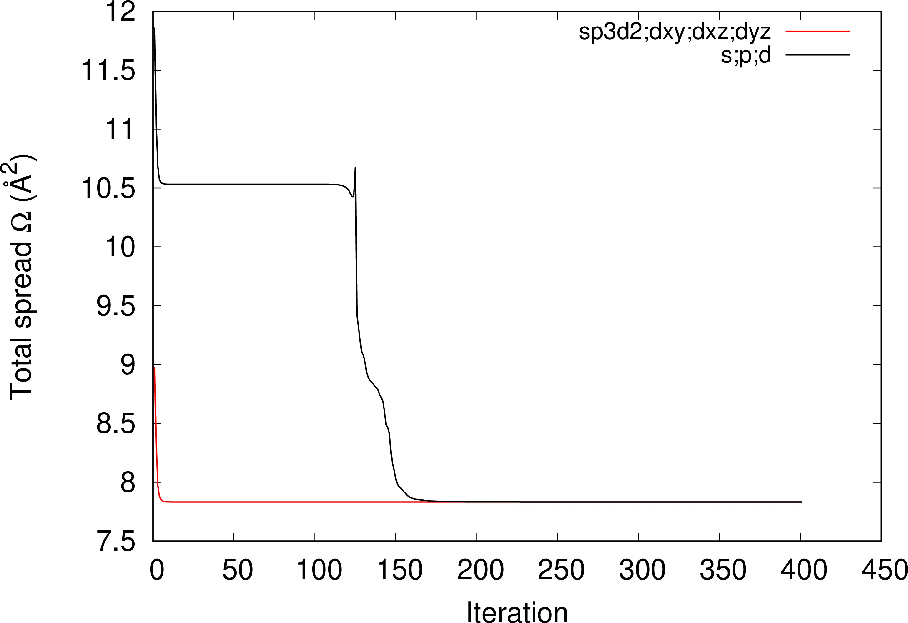{ width="380" }
    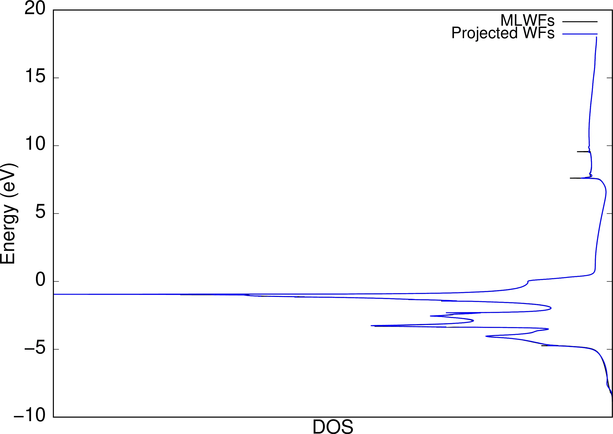{ width="380" }
    </div>
    <figcaption markdown="span"  id="fig8-6">a. Convergence of $\Omega$ for two different sets of initial projections: $s;p;d$ (solid black) and $sp_3d_2;d_{xy};d_{xz};d_{yz}$ (solid red). b. DOS with MLWFs (solid black) and projected $s;p;d$ Wannier functions (solid blue).</figcaption>
    </figure>

## Orbital-projected DOS and exchange splitting

*In order to obtain the partial DOS projected onto the $p$-type WFs, add to the `.win` files*

```text
dos_project = 2,3,4
```

*and re-run `postw90`.*

- *Plot the projected DOS for both up- and down-spin bands. Repeat for the $s$ and $d$ projections.*

    Results are shown in [Figure 7](#fig8-7).

    <figure markdown="span">
    <div class="grid-figure" markdown="1">
    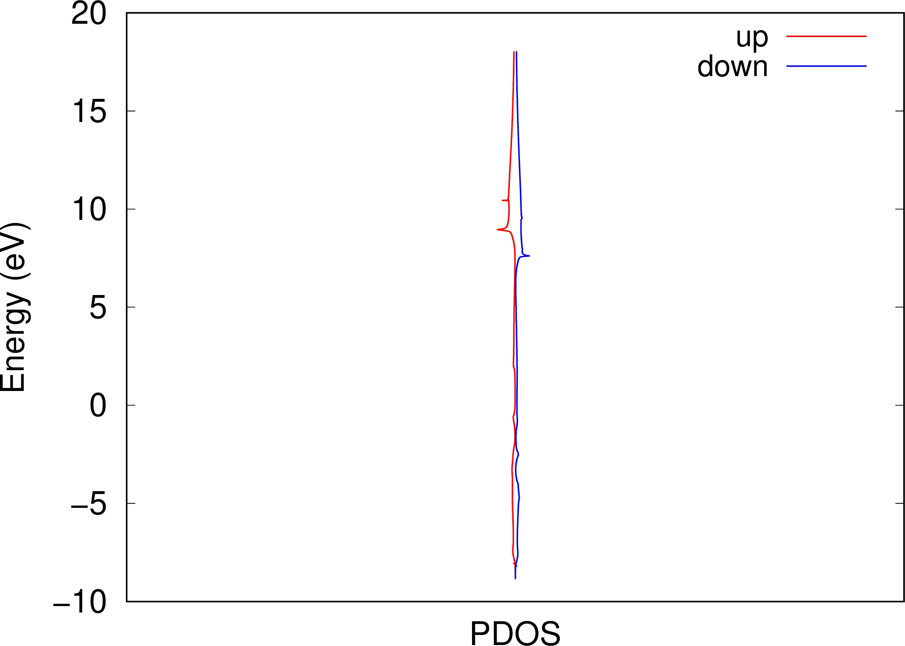{ width="300" }
    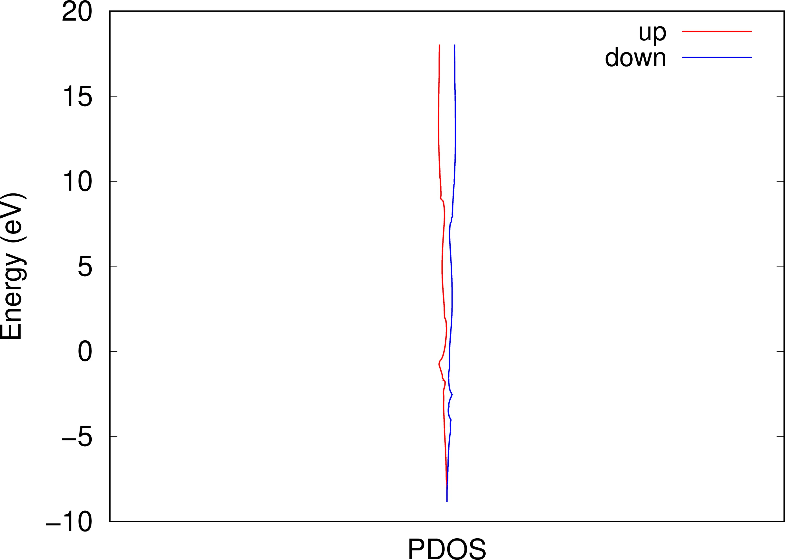{ width="300" }
    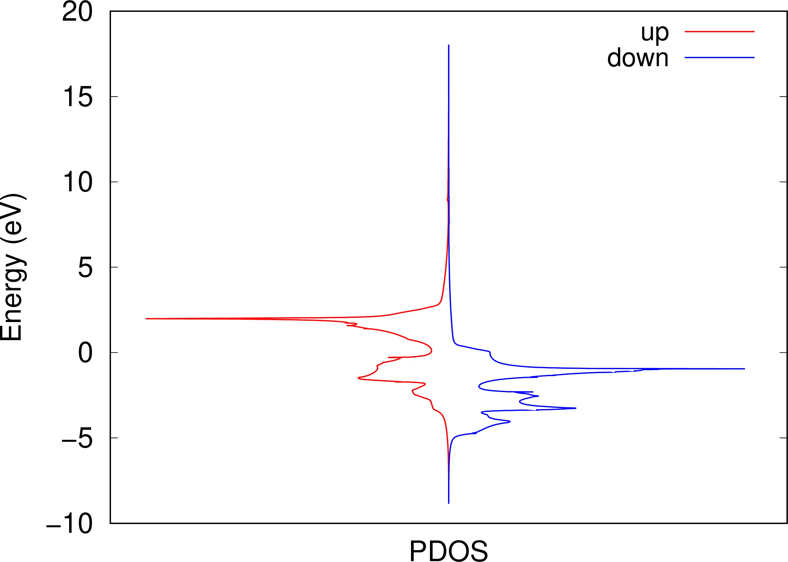{ width="300" }
    </div>
    <figcaption markdown="span"  id="fig8-7">Partial DOS projected onto a. 1 $s$-like WF, b. 3 $p$-like WFs and c. 5 $d$-like WFs.</figcaption>
    </figure>

- *The difference between corresponding values of the on-site energies $\langle \mathbf{0}n\vert H \vert \mathbf{0}n \rangle$ in `iron_up.wout` and in `iron_dn.wout` gives the exchange splittings for the individual orbitals.*

    Results are shown in [Table 2](#tab8-2).

    <a id="tab8-2"></a>
    **Table 2.** Exchange splittings for individual orbitals in eV.

    | n | character | $\langle \mathbf{0}n\vert H \vert \mathbf{0}n \rangle$ for $\downarrow$ [eV] | $\langle \mathbf{0}n \vert H \vert \mathbf{0}n \rangle$ for $\uparrow$ [eV] | $\Delta$ [eV] |
    |---|---|---|---|---|
    | 1 | $s$ | 21.307132 | 22.074648 | 0.767516 |
    | 2 | $p$ | 26.353088 | 26.817526 | 0.464438 |
    | 3 | $p$ | 26.352956 | 26.817207 | 0.464251 |
    | 4 | $p$ | 26.352956 | 26.817207 | 0.464251 |
    | 5 | $d$ | 10.531720 | 13.206631 | 2.67491 |
    | 6 | $d$ | 10.775917 | 12.808277 | 2.03236 |
    | 7 | $d$ | 10.775917 | 12.808277 | 2.03236 |
    | 8 | $d$ | 10.532108 | 13.207139 | 2.67503 |
    | 9 | $d$ | 10.775177 | 12.807388 | 2.03221 |

- Compare their magnitudes with the splittings displayed by the orbital-projected DOS plots.
