# 9: Cubic BaTiO₃

- Outline: *Obtain MLWFs for a perovskite.*

<figure markdown="span">
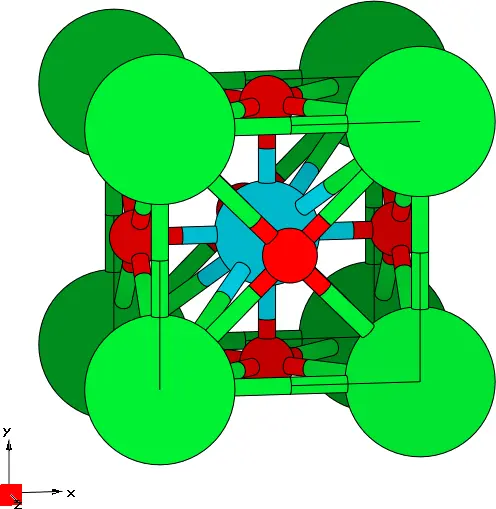{ width="250" }
<figcaption markdown="span"  id="fig9-1">Unit cell of cubic BaTiO₃ crystal plotted with the XCrySDen program.</figcaption>
</figure>

**1-5.** *Compute the MLWFs.*

Converged values for the total spread functional and its components are shown in [Table 1](#tab9-1).

**Table 1.** Converged values of the components of spread functional and their sums for cubic BaTiO₃ in Å$^2$.

| $\Omega$ | $\Omega_{\text{I}}$ | $\Omega_{\text{OD}}$ | $\Omega_{\text{D}}$ | $N_{\mathrm{iter}}$ |
|---|---|---|---|---|
| 12.7187 | 12.5662 | 0.1525 | 0.000 | 50 |

- *Plot the second MLWF.*

    The result is shown in [Figure 2](#fig9-2).

    <figure markdown="span">
    

    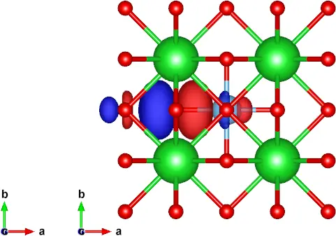{ width="260" }
    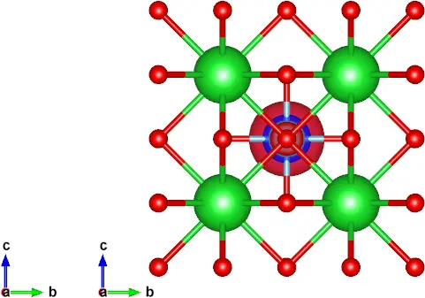{ width="260" }
    

    <figcaption markdown="span"  id="fig9-2">Top-view (a) and side-view (b) of the second MLWF in BaTiO₃.</figcaption>
    </figure>

- *We can now simulate the ferroelectric phase by displacing the Ti atom. Regenerate the MLWFs (i.e., compute the ground-state charge density and Bloch states using pwscf, etc.) and look at the change in the second MLWF.*

    The result is shown in [Figure 3](#fig9-3).

    <figure markdown="span">
    

    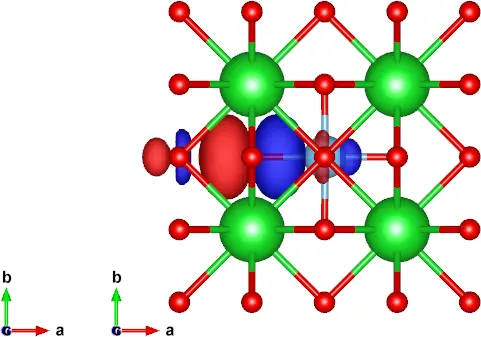{ width="260" }
    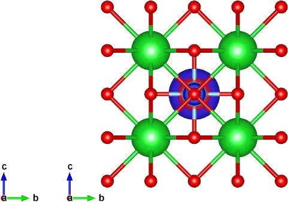{ width="260" }
    

    <figcaption markdown="span"  id="fig9-3">Top-view (a) and side-view (b) of the second MLWF in BaTiO₃ with the Ti atom displaced.</figcaption>
    </figure>

## Further ideas

- *Look at MLWFs for other groups of bands.*

    Plots of MLWFs for other group of bands are shown in [Figure 4](#fig9-4).

    <figure markdown="span">
    

    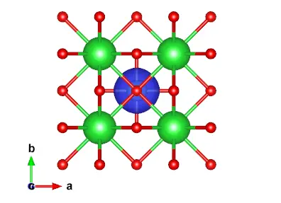{ width="220" }
    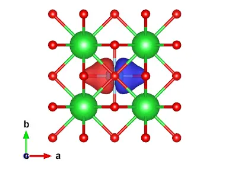{ width="220" }
    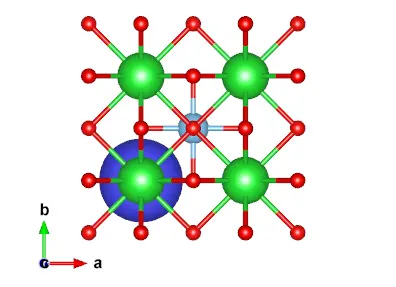{ width="220" }
    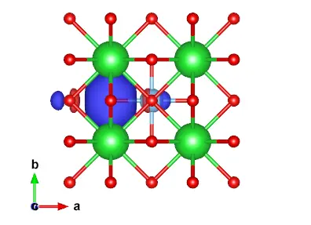{ width="220" }
    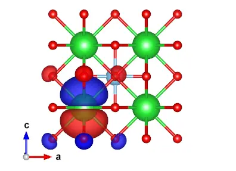{ width="220" }
    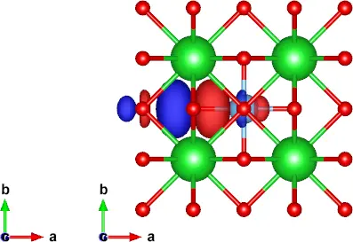{ width="220" }
    

    <figcaption markdown="span"  id="fig9-4">MLWFs for other group of bands: a. Ti 3s (exclude bands = 2-20), b. Ti 3p (exclude bands = 1,5-20), c. Ba 5s (exclude bands = 1-4,6-20), d. O 2s (exclude bands = 1-5,9-20), e. Ba 5p (exclude bands = 1-8,12-20), f. O 2p (exclude bands = 1-11).</figcaption>
    </figure>

- *What happens if you form MLWFs for the whole valence manifold?*

    Some representative MLWFs from the wannierisation of the whole valence bands are shown in [Figure 5](#fig9-5).

    <figure markdown="span">
    

    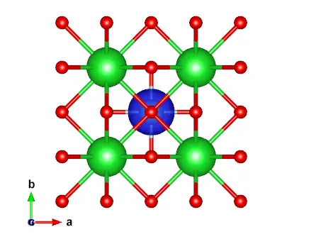{ width="220" }
    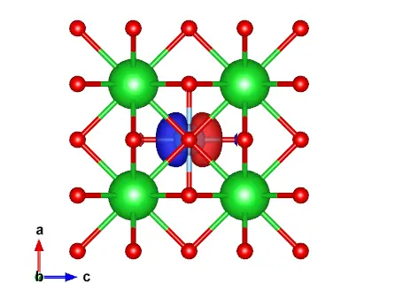{ width="220" }
    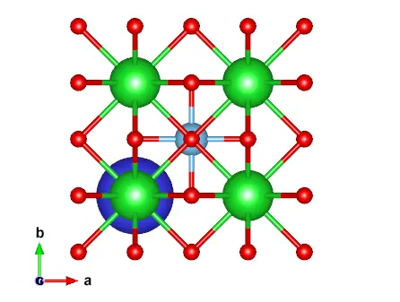{ width="220" }
    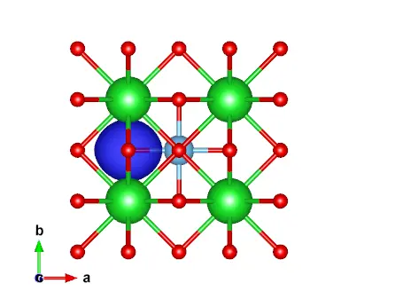{ width="220" }
    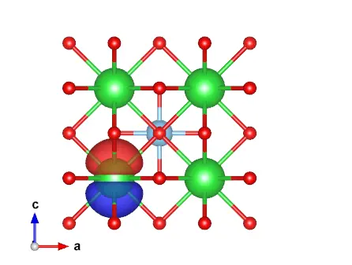{ width="220" }
    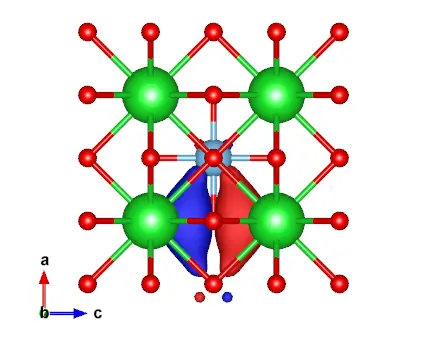{ width="220" }
    

    <figcaption markdown="span"  id="fig9-5">MLWFs formed from the whole valence manifold, i.e. from 20 bands: a. Ti 3s, b. Ti 3p, c. Ba 5s, d. O 2s, e. Ba 5p, f. O 2p.</figcaption>
    </figure>
